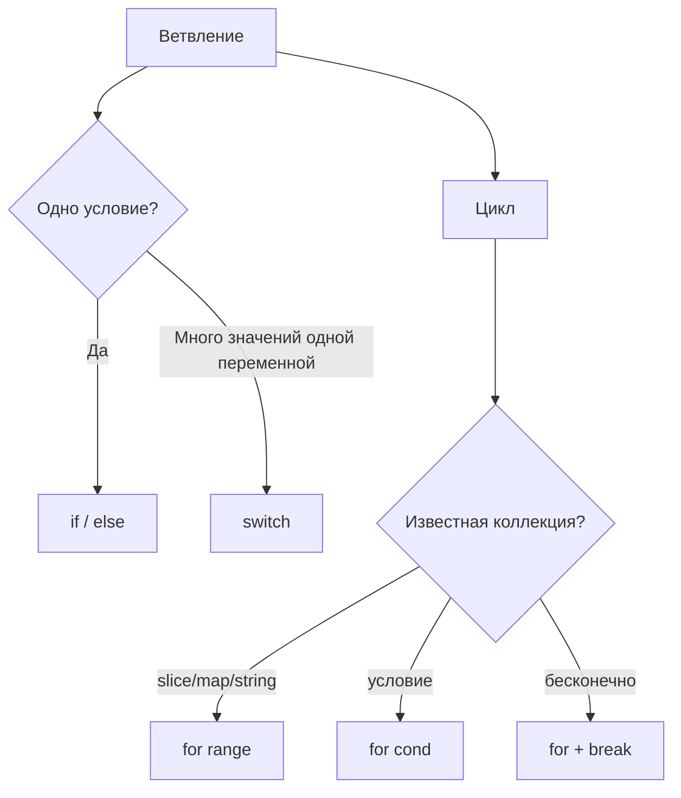

# 16. Управление потоком: `if`, `for`, `switch`, `range`

## Что вы узнаете

- `if` / `else`, **инициализация** в `if`, guard clauses.
- Цикл **`for`** — единственный; эмуляция `while`.
- **`switch`** по значению и без выражения; `fallthrough`.
- **`range`** по slice, map, string, channel (preview).
- Идиомы Go: ранний return, `for { }` с break.

## `if`: условие только `bool`

```go
score := 85
if score >= 90 {
	fmt.Println("A")
} else if score >= 80 {
	fmt.Println("B")
} else {
	fmt.Println("C")
}
```

В Go **нет** неявного приведения к bool:

```go
// ОШИБКА компиляции:
// if len(items) { }
// if name { }

if len(items) > 0 { }
if name != "" { }
```

### Инициализация в `if`

```go
if err := save(order); err != nil {
	return err
}
// err недоступен здесь — scope только внутри if
```

Идиома **проверки ошибки** — основа всего Go-кода.

### Guard clauses

```go
func process(order *Order) error {
	if order == nil {
		return fmt.Errorf("nil order")
	}
	if order.Status == "cancelled" {
		return nil
	}
	if len(order.Items) == 0 {
		return fmt.Errorf("empty order")
	}
	// основная логика без глубокой вложенности
	return nil
}
```

## `for`: единственный цикл

### Классический счётчик

```go
for i := 0; i < len(items); i++ {
	fmt.Println(i, items[i])
}
```

### Как `while`

```go
for queue.Len() > 0 {
	job := queue.Pop()
	process(job)
}
```

```go
for {
	resp, err := poll()
	if err != nil {
		break
	}
	handle(resp)
}
```

`for { }` — бесконечный цикл; выход через `break`, `return`, `panic`.

**Нет** `do…while`, `for…in`.

## `range`: итерация по коллекциям

### Slice и array

```go
nums := []int{10, 20, 30}
for i, v := range nums {
	fmt.Println(i, v)
}

for _, v := range nums {
	fmt.Println(v)
}

for i := range nums {
	fmt.Println(i)
}
```

**Копия значения:** в `for _, v := range` переменная `v` — **копия** элемента. Для struct с pointer fields часто нужен индекс:

```go
for i := range users {
	users[i].Active = true
}
```

С Go 1.22+ в `for range` по числу создаётся **отдельная** переменная на итерацию — классический closure-bug в goroutines упрощён.

### Map

```go
for sku, qty := range inventory {
	fmt.Println(sku, qty)
}
```

Порядок ключей **случайный**.

### String (preview)

```go
for i, r := range "Привет" {
	fmt.Println(i, r) // r — rune (int32)
}
```

### Channel (preview)

```go
for msg := range ch {
	handle(msg)
}
```

Закрытие channel завершает range.

## `switch`

### По значению

```go
func handleCommand(cmd string) {
	switch cmd {
	case "start":
		startWorker()
	case "stop":
		stopWorker()
	case "pause", "hold":
		pauseWorker()
	default:
		fmt.Println("unknown:", cmd)
	}
}
```

**Автоматический break:** после case выполнение **не** проваливается в следующий (в отличие от C, где `break` нужен явно).

### `fallthrough`

```go
switch n {
case 1:
	fmt.Println("one")
	fallthrough
case 2:
	fmt.Println("two") // выполнится и для n==1
}
```

Используйте **редко** и с комментарием `// fallthrough intentional`.

### Switch без выражения

```go
switch {
case score >= 90:
	grade = "A"
case score >= 80:
	grade = "B"
default:
	grade = "F"
}
```

Эквивалент цепочки `if else if` — читаемо для многих веток.

### Type switch (preview)

```go
switch v := x.(type) {
case int:
	fmt.Println("int", v)
case string:
	fmt.Println("string", v)
default:
	fmt.Println("other")
}
```

## `break` и `continue`

```go
for _, id := range ids {
	if id == "" {
		continue
	}
	if id == "STOP" {
		break
	}
	process(id)
}
```

Метки (`break Outer`) — редко; предпочтите функцию с `return`.

## Тернарного оператора нет

```go
// В Go нет: cond ? a : b
max := a
if b > a {
	max = b
}
```

Или вспомогательная функция / `max` из пакета при сравнимых типах.

## Диаграмма: выбор конструкции



## Типичные ошибки

| Ошибка | Корневая причина | Исправление |
|--------|------------------|-------------|
| `if len(s)` | не bool | `len(s) > 0` |
| Мутация `v` в `range` slice struct | копия | индекс `i` |
| Ожидать порядок map range | random | sort keys |
| `fallthrough` без нужды | копипаста C | убрать |
| `switch` на float без epsilon | `==` float | округление или int cents |
| Бесконечный `for {}` без exit | забыли break | таймаут / context позже |

## В продакшене

- **Switch** по enum-строкам статуса заказа + `default` с метрикой unknown.
- **Guard** в начале каждого handler — nil, пустой ID, отменённый контекст.
- Линтер `gosimple`, `staticcheck` — упрощение if/switch.

## Резюме

**`if`** принимает только **`bool`**; короткая форма `if err := …; err != nil` — стандарт. **`for`** — единственный цикл (`for`, `for cond`, `for range`, `for {}`). **`switch`** без провала между case; **`fallthrough`** — исключение. **`range`** по slice, map, string; для map порядок не гарантирован. Нет тернарника и truthy-условий — явность важнее краткости.

## Чек-лист

- Почему `if items { }` не компилируется?
- Как написать `while` в Go?
- Гарантирован ли порядок `range` по map?
- Что делает `fallthrough`?
- Почему в `for _, v := range structs` мутация `v` может не работать?
- Зачем `if err := f(); err != nil` объявляет `err` внутри `if`?

Следующий урок: [17. Строки и runes](17-strings-runes.md).
