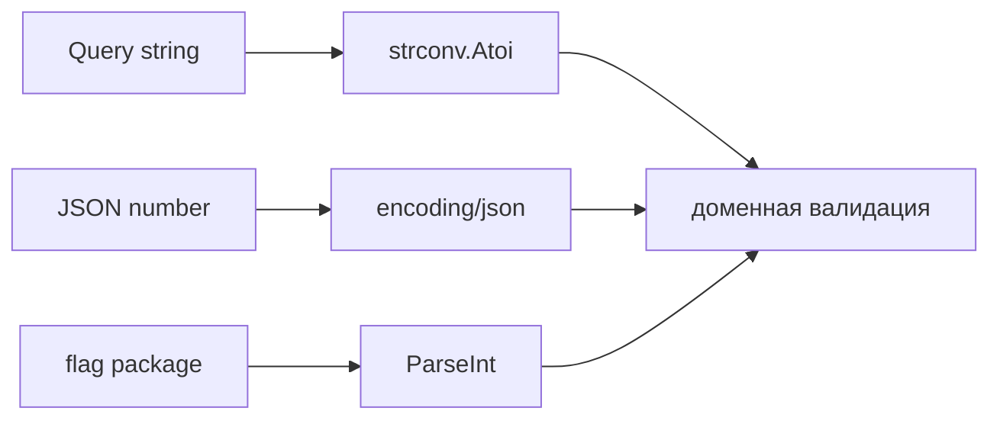

# 19. Преобразование типов: явные конверсии и `strconv`

## Что вы узнаете

- **Numeric conversions** между числовыми типами.
- **Преобразование string ↔ числа** через **`strconv`**.
- Разницу **conversion** и **assertion**.
- Почему нет `+"5"` и truthy coercion.
- Типичные баги парсинга HTTP query и JSON.

## Явность: нет неявного приведения

```go
var i int = 42
var f float64 = float64(i) // ok — явная конверсия

// var f2 float64 = i     // ошибка компиляции
```

```go
s := "42"
// n := s + 1            // ошибка
n, err := strconv.Atoi(s)
if err != nil {
	// handle
}
_ = n + 1
```

## Числовые конверсии

```go
var (
	a int32 = 100
	b int64 = int64(a)
	c int   = int(b)
	d float64 = float64(c)
	e uint  = uint(d) // осторожно: отрицательное — большое положительное
)
```

**Правила:**

- Между **числовыми** типами — конверсия `T(v)`, если `T` и тип `v` оба numeric.
- **Усечение** при float → int: дробная часть отбрасывается (не округление).
- **Переполнение** при больших значениях — молча по модулю размера типа (для констант компилятор может предупредить).

```go
fmt.Println(int(3.99)) // 3
```

### Целочисленное деление

```go
fmt.Println(5 / 2)       // 2, не 2.5
fmt.Println(5.0 / 2)   // 2.5
fmt.Println(float64(5) / 2) // 2.5
```

Деньги в копейках (`int`) vs рубли (`float64`) — в API держите **int cents**.

## `strconv`: string ↔ числа

Импорт: `import "strconv"`.

### Целые

```go
n, err := strconv.Atoi("42")        // int, base 10
n64, err := strconv.ParseInt("ff", 16, 64) // 255 в hex
u, err := strconv.ParseUint("42", 10, 32)

s := strconv.Itoa(42)
s2 := strconv.FormatInt(int64(n), 10)
```

| Функция | Назначение |
|---------|------------|
| `Atoi` | string → int |
| `Itoa` | int → string |
| `ParseInt(s, base, bitSize)` | гибкий парсинг |
| `FormatInt` | int64 → string в base |

**Всегда проверяйте `err`:**

```go
qty, err := strconv.Atoi(input)
if err != nil {
	return fmt.Errorf("invalid qty: %w", err)
}
```

### Дробные

```go
f, err := strconv.ParseFloat("3.14", 64)
out := strconv.FormatFloat(f, 'f', 2, 64) // "3.14"
```

Для JSON и API предпочтительны **строковые** или **целые** деньги, не `float64` binary rounding.

### Bool

```go
b, err := strconv.ParseBool("true") // t, true, 1, 0, f, false
```

## String ↔ byte / rune

```go
b := []byte("hello")
s := string(b)

r := []rune("Привет")
s2 := string(r)
```

Конверсия `string` ↔ `[]byte` **копирует** данные (если не оптимизация compiler для const). Для zero-copy в performance-коде — `unsafe` (не в basic курсе).

Отдельно: **`string(rune)`** даёт UTF-8 одного символа:

```go
fmt.Println(string('A'))  // "A"
fmt.Println(string(65))   // "A" — rune value
```

## Преобразование vs type assertion

```go
var x any = 42
i := x.(int)        // panic если не int
i, ok := x.(int)    // comma ok

// не то же самое, что:
var n int = int(x.(int)) // assertion + уже совместимый тип
```

**Conversion** `T(v)` — между совместимыми **конкретными** типами. **Assertion** — из interface `any` к конкретному.

## `fmt` для форматирования

```go
s := fmt.Sprintf("%d", 42)
s2 := fmt.Sprintf("%.2f", 3.14159)
s3 := fmt.Sprintf("%q", "hi\n") // экранированная строка
```

`Sprintf` **не** парсинг — только вывод. Парсинг — `strconv`.

## Пайплайн: query parameter → int

```go
func parsePage(q string) (int, error) {
	if q == "" {
		return 1, nil // default
	}
	page, err := strconv.Atoi(q)
	if err != nil {
		return 0, fmt.Errorf("page: %w", err)
	}
	if page < 1 {
		return 0, fmt.Errorf("page must be >= 1")
	}
	return page, nil
}
```

Два уровня: **синтаксис** (Atoi) и **домен** (page >= 1).

## Unicode и string

`strconv` не парсит «строки как числа» в Unicode-цифрах (`１２３`). Нормализация — отдельно. Для ID и SKU — обычно ASCII.

## Диаграмма: откуда пришло значение



## Типичные ошибки

| Ошибка | Корневая причина | Исправление |
|--------|------------------|-------------|
| `qty, _ := strconv.Atoi(s)` | игнор err | проверка err |
| `5 / 2 == 2.5` | int division | `float64(5)/2` |
| `int(f)` ожидали round | truncate | `math.Round` |
| `string(65)` ждали `"65"` | rune → char | `strconv.Itoa(65)` |
| Сравнить `int` и `int64` без конверсии | разные типы | явный `int64(i)` |
| Парсить float для денег | rounding | int cents |

## В продакшене

- HTTP handlers: парсите query/path **один раз**, валидируйте диапазон, возвращайте 400 с понятным телом.
- Не используйте `float64` для денег; конверсия валют — decimal library.
- Линтер: проверка `errcheck` на все `strconv.*`.

## Резюме

Go требует **явных** конверсий `T(v)` между числовыми типами и отдельного **`strconv`** для string ↔ number. **`if`** только с `bool` — нет truthy. Ошибки парсинга **нельзя** игнорировать. Целочисленное деление отдельно от float. Явные конверсии — осознанный дизайн для предсказуемости в backend shop/API.

## Чек-лист

- Почему `var f float64 = 3` не компилируется без `float64(3)` в строгом присваивании?
- Чем `strconv.Atoi` отличается от `x.(int)`?
- Что вернёт `5 / 2` и `5.0 / 2`?
- Что произойдёт при `qty, _ := strconv.Atoi("")`?
- Как напечатать число 42 в строку без `fmt`?
- Почему деньги лучше хранить в `int`, а не парсить в `float64`?

Следующий урок: [20. Interfaces](20-interfaces.md).
