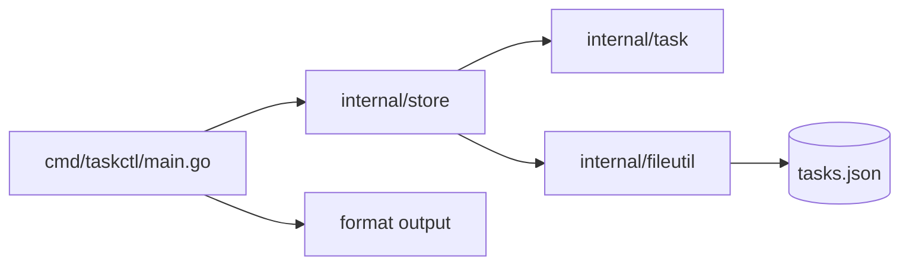

# 37. Capstone: Task Tracker CLI (4–6 часов)

## Введение: зачем capstone

До этой главы вы учили **фрагменты** языка: struct в уроке 07, errors в 21, JSON в 32, файлы в 34. Capstone заставляет **собрать** их в одну программу, которую можно показать коллеге или положить в портфолио.

Сейчас важно: **пакеты**, **модель**, **ошибки**, **JSON persistence**, **table-driven tests**, **`flag`** (cobra не требуется).

Если застряли — возвращайтесь к урокам из таблицы «Когда смотреть», а не копируйте готовое решение из интернета.

**Оценка времени:** 4–6 часов чистой работы (2–3 сессии по 2 часа).

---

## Задача

Консольное приложение **учёта задач** с сохранением в JSON-файл — **без HTTP**, только файловая БД и CLI.

---

## Функциональные требования

### Модель `Task`

| Поле | Тип Go | JSON | Правила |
|------|--------|------|---------|
| `ID` | `string` | `id` | уникальный (uuid или incremental) |
| `Title` | `string` | `title` | 1–200 символов, не пустой |
| `Status` | `string` | `status` | `"todo"` или `"done"`, по умолчанию `todo` |
| `CreatedAt` | `time.Time` | `created_at` | при создании, UTC, RFC3339 |
| `Tags` | `[]string` | `tags,omitempty` | опционально, по умолчанию пустой slice |
| `DueDate` | `*time.Time` | `due_date,omitempty` | опционально (расширение A) |

Константы статуса (рекомендуется):

```go
const (
	StatusTodo = "todo"
	StatusDone = "done"
)
```

### `TaskStore`

| Метод | Сигнатура (идея) | Поведение |
|-------|------------------|-----------|
| `NewTaskStore` | `func NewTaskStore(path string) *TaskStore` | путь к JSON |
| `Load` | `func (s *TaskStore) Load() error` | нет файла → пустой store |
| `Save` | `func (s *TaskStore) Save() error` | атомарная запись |
| `Add` | `func (s *TaskStore) Add(title string, opts AddOptions) (Task, error)` | валидация, id, CreatedAt |
| `List` | `func (s *TaskStore) List(filter ListFilter) []Task` | фильтры status, tag, search |
| `MarkDone` | `func (s *TaskStore) MarkDone(id string) (Task, error)` | смена status |
| `Remove` | `func (s *TaskStore) Remove(id string) error` | удаление по id |

- При старте CLI — `Load()`.
- После каждой мутации (`Add`, `MarkDone`, `Remove`) — `Save()` (или явный `Flush` — задокументируйте в README).

`List` возвращает **копию** данных, не внутренний slice.

### CLI-интерфейс (`flag`, не cobra)

Минимум через подкоманды как **первый позиционный аргумент** после флагов:

```bash
go run ./cmd/taskctl add "Buy milk" -tags home,food
go run ./cmd/taskctl list
go run ./cmd/taskctl list -status todo
go run ./cmd/taskctl done <id>
go run ./cmd/taskctl remove <id>
go run ./cmd/taskctl search milk
```

Глобальные флаги:

```bash
-data data/tasks.json   # путь к файлу (default: data/tasks.json)
```

**Альтернатива:** интерактивное меню на `bufio.Scanner` — допустимо, если аргументы тоже поддержаны.

### Вывод и коды выхода

- `list` / `search` — табличный вывод (id укороченный, title, status, tags).
- Успех — exit code `0`.
- Ошибка валидации, «task not found», битый JSON при load — `1`, сообщение в **stderr**.

```go
fmt.Fprintln(os.Stderr, "error:", err)
os.Exit(1)
```

---

## Нефункциональные требования

| Требование | Зачем |
|------------|-------|
| Разбиение на пакеты | [26-packages.md](26-packages.md) |
| Явные `error`, sentinel или typed errors | [21-errors.md](21-errors.md), [25-errors-is-as.md](25-errors-is-as.md) |
| `writeAtomic` для JSON | [34-files-io.md](34-files-io.md) |
| Table-driven tests для `task` и `store` | [28-testing.md](28-testing.md) |
| `go vet` / `go test ./...` без падений | [30-tooling.md](30-tooling.md) |
| README в `examples/capstone/` с примерами команд | для проверяющего |

**Не требуется:** cobra, viper, HTTP, goroutines.

---

## Целевая структура модуля

```text
courses/go-basic/examples/capstone/
├── README.md
├── go.mod                    # или общий examples/go.mod с replace
├── cmd/
│   └── taskctl/
│       └── main.go           # flag, разбор args, os.Exit
├── data/
│   └── tasks.json            # создаётся при первом save
└── internal/
    ├── task/
    │   ├── task.go           # Task, Validate, NewTask
    │   └── task_test.go
    ├── store/
    │   ├── store.go          # TaskStore, Load/Save, CRUD
    │   └── store_test.go
    ├── errors/
    │   └── errors.go         # ErrNotFound, ErrValidation
    └── fileutil/
        ├── atomic.go         # writeAtomic
        └── atomic_test.go
```

Опционально пакет `internal/cli/format.go` — форматирование таблицы.



**Импорт path:** если один `go.mod` в `examples/`, module path из [`go.mod`](examples/go.mod) + `/capstone/internal/...`.

---

## Пошаговый план (рекомендуемый)

### Сессия 1 (~2 ч): модель и store в памяти

1. `internal/task/task.go`: `NewTask(title, opts)`, `Validate()`, генерация id (`google/uuid` или `crypto/rand` hex — или incremental int как string).
2. `internal/store/store.go`: slice или `map[string]Task` в памяти, методы без файла.
3. В `main` временно вызовите `Add` + `List` — проверьте логику.
4. **Критерий:** пустой title → `ErrValidation` (или обёртка).

**Уроки:** [07-structs.md](07-structs.md), [21-errors.md](21-errors.md), [12-maps.md](12-maps.md).

### Сессия 2 (~2 ч): персистентность и пакеты

1. `Load()`: `os.IsNotExist` → пустой store; битый JSON → ошибка наверх.
2. `Save()`: `json.MarshalIndent` + `writeAtomic`.
3. Обёртка файла:

```go
type fileData struct {
	SchemaVersion int   `json:"schema_version"`
	Tasks         []Task `json:"tasks"`
}
```

4. **Критерий:** перезапуск `taskctl list` показывает те же задачи.

**Уроки:** [32-json.md](32-json.md), [34-files-io.md](34-files-io.md), [35-lab-json-files.md](35-lab-json-files.md).

### Сессия 3 (~1–2 ч): CLI, тесты, полировка

1. `flag` для `-data`; `flag.Parse()`; `flag.Args()` для подкоманд.
2. Парсинг `-tags home,food` через `flag` или ручной split после `flag.Parse()`.
3. Table-driven tests: валидация title, `MarkDone` not found, `List` filter.
4. README с примерами и поведением повторного `done`.

**Уроки:** [28-testing.md](28-testing.md), [16-control-flow.md](16-control-flow.md).

---

## Подсказки по реализации

### Генерация id

```go
import "github.com/google/uuid"

func newID() string {
	return uuid.NewString()
}
```

Или без зависимости:

```go
import "crypto/rand"
import "encoding/hex"

func newID() string {
	var b [16]byte
	_, _ = rand.Read(b[:])
	return hex.EncodeToString(b[:])
}
```

### Парсинг тегов из `-tags home,food`

```go
func parseTags(raw string) []string {
	if raw == "" {
		return nil
	}
	parts := strings.Split(raw, ",")
	out := make([]string, 0, len(parts))
	for _, p := range parts {
		p = strings.TrimSpace(p)
		if p != "" {
			out = append(out, p)
		}
	}
	return out
}
```

### Поиск

```go
func matchesSearch(t task.Task, keyword string) bool {
	k := strings.ToLower(keyword)
	if strings.Contains(strings.ToLower(t.Title), k) {
		return true
	}
	for _, tag := range t.Tags {
		if strings.Contains(strings.ToLower(tag), k) {
			return true
		}
	}
	return false
}
```

### Атомарное сохранение

```go
func writeAtomic(path string, data []byte, perm os.FileMode) error {
	if err := os.MkdirAll(filepath.Dir(path), 0o755); err != nil {
		return err
	}
	tmp := path + ".tmp"
	if err := os.WriteFile(tmp, data, perm); err != nil {
		return err
	}
	return os.Rename(tmp, path)
}
```

### Скелет main с flag

```go
func main() {
	dataPath := flag.String("data", "data/tasks.json", "path to tasks JSON")
	flag.Parse()

	store := store.NewTaskStore(*dataPath)
	if err := store.Load(); err != nil {
		fmt.Fprintln(os.Stderr, err)
		os.Exit(1)
	}

	args := flag.Args()
	if len(args) == 0 {
		usage()
		os.Exit(1)
	}

	var err error
	switch args[0] {
	case "add":
		err = runAdd(store, args[1:])
	// ...
	default:
		usage()
		os.Exit(1)
	}
	if err != nil {
		fmt.Fprintln(os.Stderr, err)
		os.Exit(1)
	}
}
```

### Пример table-driven test

```go
func TestValidateTask(t *testing.T) {
	tests := []struct {
		name    string
		title   string
		wantErr bool
	}{
		{name: "ok", title: "Buy milk", wantErr: false},
		{name: "empty", title: "", wantErr: true},
		{name: "too long", title: strings.Repeat("a", 201), wantErr: true},
	}
	for _, tc := range tests {
		t.Run(tc.name, func(t *testing.T) {
			err := task.ValidateTitle(tc.title)
			if (err != nil) != tc.wantErr {
				t.Fatalf("got err=%v wantErr=%v", err, tc.wantErr)
			}
		})
	}
}
```

---

## Расширения (опционально)

| Уровень | Задача | Часы |
|---------|--------|------|
| A | Поле `DueDate`, сортировка `list` по сроку | +1 |
| B | `list -format csv` | +1 |
| C | Бенчмарк `BenchmarkList` на 10k tasks | +0.5 |
| D | Интеграционный тест: temp dir + Load/Save roundtrip | +1 |

---

## Критерии приёмки (самопроверка)

- [ ] `add` → `list` → перезапуск бинарника → задача на месте
- [ ] `done <id>` меняет status; повторный `done` — ошибка **или** идемпотентность (опишите в README)
- [ ] `remove` несуществующего id — exit 1, stderr
- [ ] Нет одного файла на 400+ строк — пакеты по ответственности
- [ ] `go test ./...` и `go vet ./...` проходят
- [ ] В репозитории есть `capstone/README.md`
- [ ] JSON в `data/tasks.json` читаемый (`MarshalIndent`)

---

## Типичные ошибки

1. **Путь к `tasks.json` от cwd** — запуск из другого каталога ломает путь. Документируйте флаг `-data` или фиксируйте cwd в README.

2. **Мутация `List()` снаружи** — `store.List().Append` портит store. Возвращайте копию.

3. **Забыли `Save()` после мутации** — данные только в RAM.

4. **Игнор ошибки `json.Unmarshal`** — тихий пустой store при битом файле.

5. **Неэкспортируемые поля в JSON** — `title` вместо `Title` без тега на неправильном поле.

6. **Сравнение id по полному uuid в UI** — в таблице показывайте первые 8 символов, в командах принимайте полный id **или** префикс (расширение — задокументируйте).

7. **Тесты пишут в реальный `data/tasks.json`** — используйте `t.TempDir()`.

---

## Когда смотреть уроки

| Проблема | Урок |
|---------|------|
| struct tags / JSON | 32 |
| CreatedAt / DueDate | 33 |
| ReadFile / atomic write | 34 |
| shop lab pattern | 35 |
| table-driven tests | 28 |
| sentinel errors | 25 |
| layout пакетов | 26 |

---

## Сдача и демо

Минимальный сценарий для ревьюера:

```bash
cd courses/go-basic/examples/capstone
go test ./...
go run ./cmd/taskctl add "Learn Go interfaces" -tags study
go run ./cmd/taskctl list
go run ./cmd/taskctl list -status todo
go run ./cmd/taskctl done <id-from-list>
go run ./cmd/taskctl search interfaces
cat data/tasks.json
```

---

## После capstone

1. Пройдите [interview-cheatsheet.md](interview-cheatsheet.md) ещё раз **без подглядывания** в главы.
2. Опционально: ветка GitHub с `capstone/` — артефакт для резюме.

Поздравляем — **go-basic** завершён.
