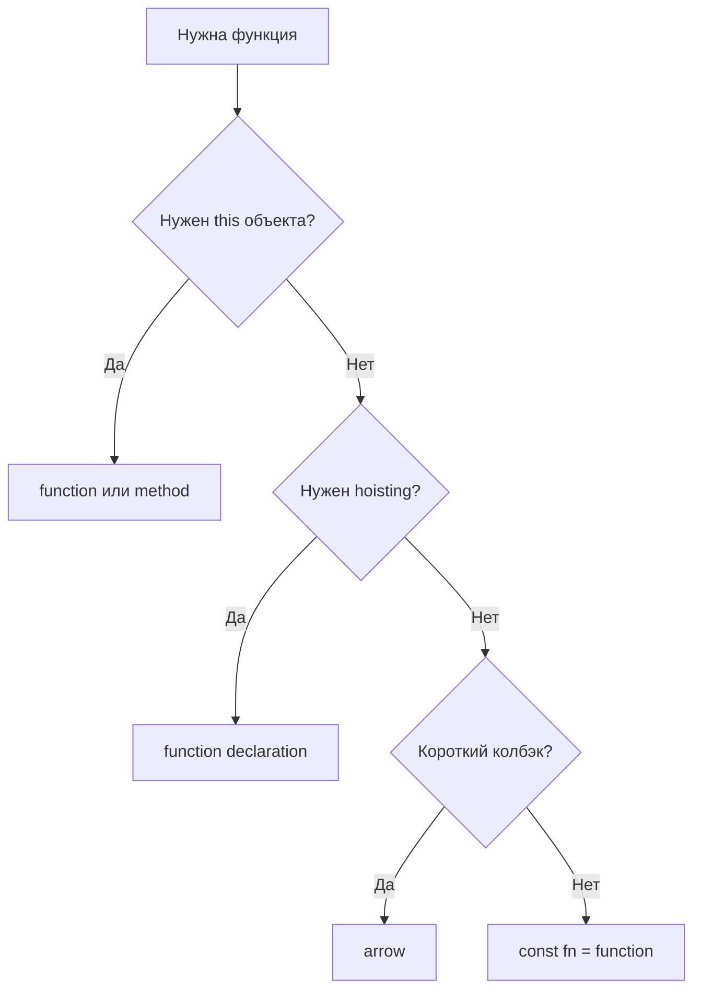

# 10. Функции: declaration, expression, arrow

## Введение: «почему `this` undefined в колбэке?»

Вы пишете модуль авторизации для внутренней админки. Коллега вынес повторяющуюся логику в функцию `validateToken`, а обработчик клика оформил стрелкой «для краткости». После деплоя кнопка «Выйти» перестала работать: в логах `TypeError: Cannot read properties of undefined`. На code review выясняется, что стрелка «унаследовала» `this` из модуля (там `undefined` в strict mode), а не из объекта `authService`. Параллельно в legacy-файле `var`-функция вызывается **до** объявления и «магически» работает — а `const handler = function(){}` падает с ReferenceError. **Функции в JavaScript — не просто «кусок кода»**: это объекты первого класса с правилами поднятия (hoisting), собственным `this` и тремя разными синтаксисами объявления. Эта глава — фундамент для замыканий ([12](12-closures.md)), `this` ([14](14-this.md)) и всего асинхронного кода ([25](25-callbacks.md)–[27](27-async-await.md)).

## Что вы узнаете

- Три способа объявить функцию и **когда** выбирать каждый.
- Разницу **function declaration** и **function expression** с точки зрения hoisting.
- Особенности **стрелочных функций**: лексический `this`, отсутствие `arguments`, запрет `new`.
- **Параметры по умолчанию**, **rest** (`...args`) и замену устаревшего `arguments`.
- **Колбэки**, чистые функции и роль функций в архитектуре приложения.
- Типичные production-баги и их корневые причины.

## Функция — значение первого класса

В JavaScript функция — **полноценное значение**, как число или объект. Её можно:

1. Присвоить переменной.
2. Передать аргументом в другую функцию.
3. Вернуть из функции.
4. Хранить в объекте или массиве.

```javascript
function greet(name) {
  return `Hello, ${name}`;
}

const greet2 = function (name) {
  return `Hello, ${name}`;
};

const greet3 = (name) => `Hello, ${name}`;

const fns = [greet, greet2, greet3];
fns.forEach((fn) => console.log(fn("World")));
```

**Почему это важно:** весь Node.js и браузерный API построены на колбэках и функциях высшего порядка (`map`, `filter`, middleware в Express). Если вы понимаете, что функция — это значение, становится естественным паттерн «передать поведение как аргумент».

## Три синтаксиса: обзор

| Синтаксис | Пример | Hoisting | Имя в стеке ошибок |
|-----------|--------|----------|-------------------|
| Declaration | `function foo() {}` | Да, целиком | `foo` |
| Expression | `const foo = function() {}` | Нет (TDZ для `const`) | `foo` или анонимное |
| Arrow | `const foo = () => {}` | Нет | `foo` или анонимное |

Дальше разберём каждый и объясним **почему** разница в hoisting приводит к разному поведению.

## Function declaration: поднимается целиком

```javascript
sayHi(); // "hi" — вызов ДО строки объявления работает

function sayHi() {
  console.log("hi");
}
```

### Пошагово: что делает движок

1. На фазе **создания** контекста выполнения движок регистрирует имя `sayHi` и связывает его с телом функции.
2. На фазе **выполнения** строка `sayHi()` уже находит готовую функцию.
3. Поэтому порядок строк в файле для declaration не критичен (в пределах одной области видимости).

**Когда использовать:** верхнеуровневые утилиты в модуле, взаимно рекурсивные функции, когда нужен hoisting внутри функции:

```javascript
function walk(node) {
  if (!node) return;
  visit(node);
  walk(node.left);  // declaration walk уже известен
  walk(node.right);
}
```

Подробнее о механизме поднятия — в [11](11-scope-hoisting.md).

## Function expression: только переменная в TDZ

```javascript
// sayBye(); // ReferenceError: Cannot access 'sayBye' before initialization

const sayBye = function () {
  console.log("bye");
};
```

Здесь поднимается **binding** `sayBye` (в TDZ), но не значение-функция. До строки присвоения обращение к `sayBye` — ошибка.

**Почему так сделано:** защита от использования функции до полной инициализации модуля; предсказуемый порядок выполнения при чтении файла сверху вниз.

### Именованное function expression (NFE)

```javascript
const factorial = function fact(n) {
  if (n <= 1) return 1;
  return n * fact(n - 1); // рекурсия через внутреннее имя fact
};
// fact снаружи недоступен
```

Внутреннее имя `fact` видно только внутри функции — удобно для рекурсии без засорения внешней области.

## Стрелочные функции (arrow)

Краткий синтаксис для **функциональных** колбэков:

```javascript
const double = (x) => x * 2;
const sum = (a, b) => a + b;

// Возврат объекта — скобки вокруг литерала
const makePoint = (x, y) => ({ x, y });

// Несколько строк — фигурные скобки и явный return
const logAndReturn = (msg) => {
  console.log(msg);
  return msg;
};
```

### Сравнение с обычной `function`

| Свойство | `function` | Arrow `=>` |
|----------|------------|------------|
| `this` | Определяется **вызовом** | **Лексический** (из окружения) |
| `arguments` | Есть (псевдомассив) | Нет — используйте rest |
| `new` | Можно (конструктор) | **Нельзя** — SyntaxError |
| `prototype` | Есть | Нет |
| `super` | Есть в методах класса | Нет |

**Почему у стрелки нет своего `this`:** она задумана для колбэков, где «лишний» динамический `this` мешает (например, `setInterval` внутри метода). Подробно — [14](14-this.md).

**Правило для production-кода:**

- Методы объектов и классов, которым нужен `this` объекта — **обычная** `function` или короткий синтаксис метода `method() {}`.
- Колбэки, где важны внешние переменные и не нужен свой `this` — **стрелка**.

```javascript
// Плохо: стрелка как метод
const auth = {
  token: "abc",
  getHeader: () => `Bearer ${this.token}`, // this не auth!
};

// Хорошо
const auth2 = {
  token: "abc",
  getHeader() {
    return `Bearer ${this.token}`;
  },
};
```

## Параметры по умолчанию

ES6 позволяет задавать значения для `undefined`:

```javascript
function connect(host = "localhost", port = 3000, tls = false) {
  return { host, port, tls };
}

connect();                    // localhost:3000
connect("api.example.com");     // api.example.com:3000
connect(undefined, 8080);       // localhost:8080 — default только для undefined
connect(null, 8080);            // null:8080 — null НЕ заменяется default
```

**Почему только `undefined`:** явная передача `null` часто означает «значение отсутствует намеренно» в API; `undefined` — «аргумент не передали».

Выражения в default вычисляются **в момент вызова**:

```javascript
function createId(prefix = crypto.randomUUID()) {
  return prefix;
}
```

Для опций объектов удобна деструктуризация ([17](17-destructuring-spread.md)):

```javascript
function init({ host = "localhost", port = 3000 } = {}) {
  return `${host}:${port}`;
}
```

## Rest-параметры: замена `arguments`

```javascript
function sum(...nums) {
  return nums.reduce((acc, n) => acc + n, 0);
}

sum(1, 2, 3); // 6
```

| | `arguments` | Rest `...nums` |
|---|-------------|----------------|
| Тип | Псевдомассив | Настоящий массив |
| В arrow | Недоступен | Rest в параметрах |
| Явность | Скрытые аргументы | Видны в сигнатуре |

**Почему rest лучше:** читаемая сигнатура, работает со spread при вызове, дружит с TypeScript.

```javascript
const nums = [1, 5, 3];
Math.max(...nums); // spread при вызове
```

## Колбэки: основа экосистемы

```javascript
function repeat(times, action) {
  for (let i = 0; i < times; i++) {
    action(i);
  }
}

repeat(3, (i) => console.log(`tick ${i}`));
```

Колбэк — функция, переданная «вызывай меня, когда будешь готов». Так работают:

- `array.map` / `filter` / `forEach` ([08](08-arrays.md));
- обработчики событий в DOM;
- `fs.readFile(path, callback)` и позже Promises ([26](26-promises.md));
- middleware в Express/Fastify (в nodejs-курсе).

### Ошибка «callback hell»

Глубокая вложенность колбэков без именованных функций:

```javascript
loadUser(id, (err, user) => {
  loadOrders(user.id, (err, orders) => {
    loadItems(orders[0].id, (err, items) => {
      // ...
    });
  });
});
```

**Почему это больно:** чтение справа-налево, сложная обработка ошибок, общий `err` на каждом уровне. Решение — именованные функции, Promises, async/await — но колбэки никуда не делись (event listeners, `setTimeout`).

## Чистые функции и побочные эффекты

**Чистая функция:**

- При одинаковых аргументах всегда один результат.
- Не меняет внешнее состояние и не мутирует аргументы (для объектов).

```javascript
function addTax(price, rate) {
  return price * (1 + rate);
}

function addTaxMutating(cart, rate) {
  cart.total *= 1 + rate; // side effect — мутация аргумента
  return cart;
}
```

| Побочный эффект | Пример |
|-----------------|--------|
| Запись в глобал | `window.config = …` |
| Сеть / БД | `fetch`, `fs.writeFile` |
| Логирование | `console.log` (для строгого FP — тоже эффект) |
| Мутация аргумента | `arr.push(x)` внутри функции |

**Почему стремятся к чистоте:** проще тестировать, проще рассуждать в React (предсказуемый render), легче распараллеливать. В реальном коде чистые функции смешивают с тонким слоем I/O на границе приложения.

## IIFE: изоляция до модулей

```javascript
(function () {
  const apiKey = "secret";
  // apiKey не попадает в global
})();

(() => {
  console.log("arrow IIFE");
})();
```

**Зачем было нужно:** до ES modules ([30](30-es-modules.md)) единственный способ не засорять `window`. Сейчас предпочтительнее `export` / `import` — тот же file scope без вызова «на месте».

## Диаграмма: выбор синтаксиса



## Как это связано с курсом

| Урок | Связь |
|------|-------|
| [02. Переменные](02-variables-strict.md) | `const fn = …` и TDZ |
| [11. Scope и hoisting](11-scope-hoisting.md) | Почему declaration «виден» раньше |
| [12. Замыкания](12-closures.md) | Функция, возвращающая функцию |
| [14. `this`](14-this.md) | Arrow vs обычная function |
| [17. Деструктуризация](17-destructuring-spread.md) | Параметры-объекты, rest/spread |
| [25–27. Async](25-callbacks.md) | Колбэки → Promises → await |
| [30. ES modules](30-es-modules.md) | `export function` вместо IIFE |

В TypeScript-курсе сигнатуры функций получат явные типы; в React — колбэки станут обработчиками и хуками.

## Типичные ошибки

| Ошибка | Корневая причина | Исправление |
|--------|------------------|-------------|
| Стрелка как метод с `this.data` | У стрелки нет своего `this` | `method() {}` или обычная function |
| `() => { key: 1 }` парсится как блок с меткой | `{}` — тело функции, не объект | `() => ({ key: 1 })` |
| `const fn = () => fn()` до присвоения | `fn` в TDZ на момент создания | Именованная function declaration |
| Default `port = 3000` не сработал для `null` | Default только для `undefined` | Явная проверка или `??` ([19](19-optional-nullish.md)) |
| Мутация объекта-аргумента «для удобства» | Объекты по ссылке ([07](07-objects.md)) | Возвращать новый объект |
| Рекурсия через внешнее имя до `const` | Expression не hoisted | NFE или declaration |

## В продакшене

- **Именуйте** колбэки в длинных цепочках: `users.filter(isActive).map(toDto)` — функции `isActive`, `toDto` в том же файле.
- **Не** передавайте метод объекта как колбэк без `bind` — см. [15-lab-this](15-lab-this.md).
- В **strict mode** и ES modules «голый» вызов функции даёт `this === undefined` — учитывайте при утилитах.
- Линтер (ESLint `prefer-arrow-callback`, `no-invalid-this`) ловит часть ошибок до runtime.

## Резюме

Функции в JavaScript — **значения первого класса** с тремя синтаксисами. **Declaration** поднимается целиком; **expression** и **arrow** — нет. **Стрелки** берут `this` из окружения и не подходят как методы объектов. **Rest** заменяет `arguments`; **default** срабатывает только для `undefined`. Колбэки — клей всего runtime; чистые функции упрощают тесты и UI. Выбор синтаксиса — не вкусовщина, а вопрос `this`, hoisting и читаемости.

## Чек-лист

- Назовите три способа объявить функцию и отличие по hoisting.
- Почему `const g = obj.method; g()` ломает `this`? (намёк на [14](14-this.md))
- Когда arrow **нельзя** использовать как конструктор?
- Чем rest `...args` лучше `arguments`?
- Что вернёт `connect(null, 8080)` при `host = "localhost"`?
- Зачем скобки в `() => ({ x: 1 })`?

Следующий урок: [11. Scope и hoisting](11-scope-hoisting.md).
