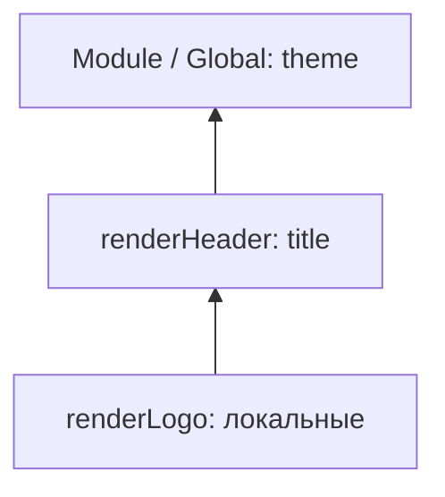

# 11. Scope, hoisting, TDZ

## Введение: «почему в консоли три раза 3?»

Джуниор добавил на страницу каталога кнопки «Добавить в корзину» в цикле `for (var i = 0; i < products.length; i++)` и повесил `onClick` через `function() { addToCart(products[i]) }`. В проде все кнопки добавляют **последний** товар. Параллельно в другом PR ревьюер ругается на `console.log(config); const config = loadConfig();` — «ReferenceError в staging, но у меня локально работало» (нет, не работало — просто не дошли до этой строки). Оба бага — про **область видимости** и **временную мёртвую зону**. JavaScript не «ищет переменную по всему файлу наугад»: у каждого идентификатора есть scope, цепочка окружений и правила hoisting. Без этой главы замыкания ([12](12-closures.md)) и `this` ([14](14-this.md)) останутся магией.

## Что вы узнаете

- Три уровня scope: **global**, **function**, **block**.
- **Лексическое окружение** и scope chain — как движок находит переменную.
- **Hoisting** для `var`, `function`, `let`, `const` — одинаковое слово, разное поведение.
- **Temporal Dead Zone (TDZ)** — почему `let` безопаснее `var`.
- **Shadowing** и отличие от мутации объекта.
- Классический баг `var` в цикле с асинхронными колбэками.
- Как читать панель Scope в DevTools.

## Global, function и block scope

```javascript
const globalApiUrl = "https://api.shop.local"; // module scope (не truly global в ESM)

function registerHandlers() {
  var legacyFlag = true;       // function scope
  const maxRetries = 3;      // function scope (const не «блочный» здесь — блок = вся функция)

  if (legacyFlag) {
    let attempt = 0;           // block scope — только внутри if
    while (attempt < maxRetries) {
      const delay = attempt * 100; // block scope — тело while
      attempt++;
    }
    // console.log(delay); // ReferenceError
  }
  // console.log(attempt); // ReferenceError
}
```

| Объявление | Область | Переприсвоение |
|------------|---------|----------------|
| `var` | функция или global | да |
| `let` | блок `{ }` | да |
| `const` | блок `{ }` | нет (binding) |
| `function` declaration | функция (или block в strict/sloppy по-разному для вложенных) | — |
| Параметры | function scope | да |

**Почему `let`/`const` по умолчанию:** предсказуемость. Переменная живёт ровно там, где вы её визуально объявили.

Подробнее про `var` vs `let` — [02. Переменные](02-variables-strict.md).

## Лексическое окружение и scope chain

**Лексическая** область — определяется **местом в коде**, не местом вызова.

```javascript
const theme = "dark";

function renderHeader() {
  const title = "Shop";
  function renderLogo() {
    console.log(theme, title); // ищет: renderLogo → renderHeader → module
  }
  renderLogo();
}
```

### Пошагово: поиск переменной `title`

1. Есть ли `title` в локальном окружении `renderLogo`? Нет.
2. Поднимаемся в окружение `renderHeader` — есть `title = "Shop"`.
3. Используем его. До global не доходим.

Внутренняя функция **замыкает** внешние binding'и — основа [12. Замыкания](12-closures.md).



## Hoisting: одно слово — три механизма

**Hoisting** — формальная фаза, на которой движок регистрирует объявления до выполнения строк.

### `function` declaration — тело поднимается

```javascript
ping(); // "pong"

function ping() {
  console.log("pong");
}
```

Эквивалент мысленной модели (упрощённо):

```javascript
function ping() { console.log("pong"); }
ping();
```

### `var` — имя поднимается как `undefined`

```javascript
console.log(score); // undefined (не ReferenceError!)
var score = 100;
console.log(score); // 100
```

Мысленная модель:

```javascript
var score;
console.log(score); // undefined
score = 100;
```

**Почему это опасно:** код «между» объявлением и присвоением видит «пустую» переменную, а не ошибку.

### `let` / `const` — подняты, но в TDZ

```javascript
{
  // console.log(items); // ReferenceError — TDZ
  let items = [];
}
```

От начала блока до `let items = …` переменная **зарезервирована**, но читать/писать нельзя.

```javascript
let tmp = tmp + 1; // ReferenceError на правой части — tmp ещё в TDZ
```

**Зачем TDZ:** запретить использование до инициализации, в том числе в выражении справа от `=`.

## Temporal Dead Zone — разбор по шагам

```javascript
function demo() {
  console.log("step 1");
  // const id = getId();
  // console.log(cache); // если раскомментировать — ReferenceError
  const cache = new Map();
  console.log("step 2");
}
```

| Момент | `var x` | `let x` |
|--------|---------|---------|
| До строки объявления | `undefined` | ReferenceError (TDZ) |
| После `let x = 1` | любое значение | `1` |
| Повторное `let x` в том же блоке | разрешено (плохо) | SyntaxError |

## Shadowing: затенение имён

```javascript
const port = 443;

function listen() {
  const port = 3000; // новый binding, внешний port не тронут
  console.log(port); // 3000
}

listen();
console.log(port); // 443
```

**Shadowing ≠ мутация:**

```javascript
const config = { port: 443 };
function patch() {
  const config = { port: 3000 }; // другой объект, другой binding
}
```

```javascript
const config2 = { port: 443 };
function mutate() {
  config2.port = 3000; // мутация того же объекта — внешний config2 изменится
}
```

Путаница shadowing с общим объектом — частый источник багов в shared state.

## `var` в цикле и асинхронность

```javascript
const funcs = [];
for (var i = 0; i < 3; i++) {
  funcs.push(() => console.log(i));
}
funcs[0](); // 3
funcs[1](); // 3
funcs[2](); // 3
```

### Пошагово: почему три раза 3

1. `var i` — **одна** переменная на всю функцию-обёртку (или global).
2. Цикл доводит `i` до `3` (условие `i < 3` ложно при `i === 3`).
3. Три стрелки замыкают **один и тот же** `i`.
4. Вызов позже читает финальное значение `3`.

### Исправление с `let`

```javascript
for (let j = 0; j < 3; j++) {
  funcs.push(() => console.log(j));
}
// 0, 1, 2
```

**Почему работает:** на **каждой** итерации создаётся новый binding `j` в блочном scope тела цикла.

### Исправление с factory (если нужен `var`)

```javascript
for (var k = 0; k < 3; k++) {
  funcs.push(((n) => () => console.log(n))(k));
}
```

IIFE / factory фиксирует значение `k` в параметре `n` замыкания.

Практика — [13-lab-closures](13-lab-closures.md).

## Вложенные функции и память

```javascript
function outer() {
  const big = new Array(1_000_000).fill("x");
  function inner() {
    return big.length;
  }
  return inner;
}
```

`inner` держит ссылку на окружение `outer` → `big` не соберётся GC, пока живёт `inner`. Осознанно не замыкайте лишнее ([12](12-closures.md)).

## Модули ES и изоляция scope

Каждый файл `.js` с `import`/`export` — **отдельный module scope**:

```javascript
// config.js
const secret = process.env.API_KEY;
export const apiUrl = "/api";
```

`secret` не попадает в global. Раньше для этого использовали IIFE ([10](10-functions.md)); сейчас — [30. ES modules](30-es-modules.md).

## Отладка: панель Scope в DevTools

1. Поставьте breakpoint внутри вложенной функции.
2. Откройте **Scope** → увидите Local, Closure, Module/Global.
3. `ReferenceError: x is not defined` — опечатка или переменная вне цепочки.
4. `Cannot access 'x' before initialization` — TDZ.

## `typeof` и необъявленная переменная

```javascript
console.log(typeof notDeclared); // "undefined" — без ошибки
console.log(notDeclared);        // ReferenceError
```

**Почему:** историческое исключение для `typeof`; на необъявленные имена полагаться нельзя — включайте strict mode ([02](02-variables-strict.md)).

## Как это связано с курсом

| Тема | Урок |
|------|------|
| `let` / `const` / `var` | [02](02-variables-strict.md) |
| Функции и hoisting declaration | [10](10-functions.md) |
| Замыкания и приватное состояние | [12](12-closures.md) |
| `this` не из scope переменных | [14](14-this.md) |
| Блочный scope в `switch` / `for` | [16](16-control-flow.md) |
| Module scope | [30](30-es-modules.md) |

В **typescript-basic** область видимости дополняется типами; лишний shadowing линтер помечает как confusing.

## Типичные ошибки

| Ошибка | Корневая причина | Исправление |
|--------|------------------|-------------|
| Все колбэки в цикле с одним `i` | `var` — function scope | `let` или factory |
| `console.log(a); let a = 1` | TDZ | Объявлять до использования |
| Думать, что `if (true) var x = 1` изолирует | `var` не блочный | `let` / `const` |
| Shadowing `error` в catch и внешнего `error` | Одинаковые имена в nested scope | Переименовать внутренний |
| Импортировать и сразу использовать до объявления const | TDZ в модуле | Порядок объявлений сверху вниз |
| `for (const x of arr) { const x = 1 }` | Повторное объявление в том же блоке | Другое имя |

## В продакшене

- В новом коде **запретите `var`** через ESLint `no-var`.
- В React `let` в теле компонента пересоздаётся на каждый render — для стабильных ссылок используйте `useRef` (react-курс).
- Не полагайтесь на hoisting function внутри `if` для кросс-браузерных трюков — явные объявления читаемее.
- Code review: любой `var` в цикле с колбэком — красный флаг.

## Резюме

**Scope** определяет, где живёт имя; **лексическая** цепочка — как внутренняя функция находит внешние переменные. **Hoisting** регистрирует объявления рано, но для `let`/`const` действует **TDZ** до инициализации. **`var`** в циклах с колбэками даёт один общий счётчик — классический баг; **`let`** создаёт binding на итерацию. Модули ES дают file scope без загрязнения global. Понимание scope — обязательная база для замыканий и отладки.

## Чек-лист

- Что выведет `console.log(a); var a = 1` и почему не ReferenceError?
- Что такое TDZ и чем отличается от «переменной не существует»?
- Почему `let` в `for` исправляет баг с `setTimeout`?
- Чем shadowing отличается от мутации объекта?
- Какие три уровня scope вы назовёте для кода внутри `function` с `if` и `let`?
- Где в DevTools смотреть Closure?

Следующий урок: [12. Замыкания](12-closures.md).
