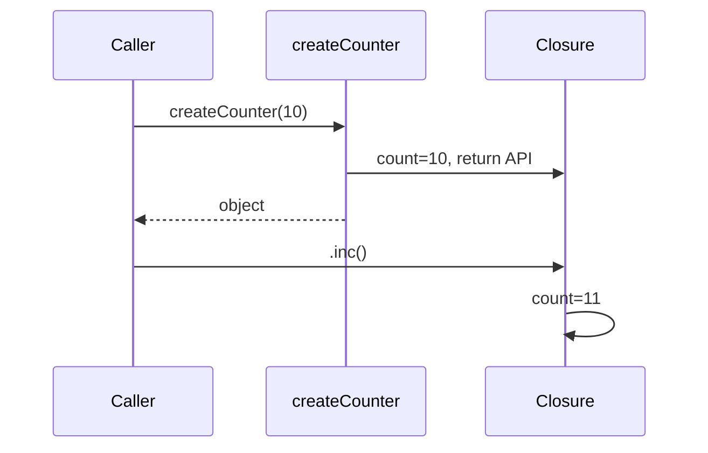

# 12. Замыкания (closures)

## Введение: «счётчик лайков сбрасывается при каждом клике»

На лендинге каждая карточка товара должна показывать своё число лайков. Разработчик написал `let likes = 0` в компоненте и в обработчике делает `likes++` — но при перерисовке списка счётчик обнуляется. Другой разработчик вынес логику в `function createLikeButton()` с `let count = 0` внутри и вернул `{ click() { count++ } }` — у каждой кнопки **свой** счётчик, состояние переживает вызовы. Это **замыкание**: внутренняя функция «помнит» переменные внешней функции, даже когда внешняя уже завершилась. Без замыканий не существуют фабрики middleware, мемоизация, приватные поля до классов и половина паттернов в Node.js. Эта глава связывает scope ([11](11-scope-hoisting.md)) с реальными API.

## Что вы узнаете

- Точное определение **closure** и что именно «захватывается».
- Паттерны: счётчик, фабрика, **модульный паттерн**, мемоизация.
- Баг **цикла с `var`** и несколько способов исправления.
- **Память и утечки** — когда замыкание мешает GC.
- Отличие closure от `this` ([14](14-this.md)).
- Типичные вопросы на собеседовании с рабочими ответами.

## Определение: функция + окружение

**Замыкание** — функция вместе с ссылкой на **лексическое окружение**, в котором она была создана. Внутренняя функция имеет доступ к binding'ам внешней функции **после** того, как внешняя вернула управление.

```javascript
function makeGreeter(prefix) {
  return function greet(name) {
    return `${prefix}, ${name}!`;
  };
}

const sayHi = makeGreeter("Hi");
const sayHey = makeGreeter("Hey");

sayHi("Ann");  // "Hi, Ann!"
sayHey("Bob"); // "Hey, Bob!"
```

`prefix` для `sayHi` и `sayHey` — **разные** ячейки в памяти. Вызов `makeGreeter` завершился, но binding `prefix` жив, пока жива возвращённая функция.

### Что захватывается

Захватывается не «значение на момент создания» для `let` в цикле с отдельным binding на итерацию, а **ссылка на binding** (ячейку). Для неизменяемого `const` это выглядит как фиксированное значение:

```javascript
function makeConstant() {
  const x = 42;
  return () => x;
}
```

Для `let` в цикле — отдельная ячейка на каждую итерацию ([11](11-scope-hoisting.md)).

## Классический счётчик: приватное состояние

```javascript
function createCounter(start = 0) {
  let count = start;

  return {
    inc() {
      count += 1;
      return count;
    },
    dec() {
      count -= 1;
      return count;
    },
    value() {
      return count;
    },
  };
}

const cartItems = createCounter(0);
cartItems.inc(); // 1
cartItems.inc(); // 2
// count снаружи недоступен — нет глобальной переменной
```

**Почему это работает:** методы `inc`/`dec`/`value` — функции, замыкающие `count`. Снаружи нет имени `count` — только публичный API объекта.

До ES2022 private fields (`#count` в [21](21-classes.md)) это был стандартный способ инкапсуляции.

## Пошагово: жизненный цикл `createCounter(10)`

1. Вызывается `createCounter`, создаётся окружение с `count = 10`.
2. Создаётся объект с тремя функциями; каждая ссылается на это окружение.
3. `createCounter` возвращает объект; **локальное имя** `count` больше не видно в вызывающем коде.
4. Окружение **не уничтожается** — на него ссылаются методы.
5. `cartItems.inc()` находит `count` через scope chain, увеличивает, возвращает новое значение.



## Фабрики и частичное применение

```javascript
function multiplier(factor) {
  return (n) => n * factor;
}

const double = multiplier(2);
const triple = multiplier(3);

double(5);  // 10
triple(5);  // 15
```

**Зачем в проде:** конфигурируемые хелперы без классов.

```javascript
function createLogger(namespace) {
  return (level, message) => {
    console.log(`[${namespace}] ${level}: ${message}`);
  };
}

const authLog = createLogger("auth");
authLog("INFO", "login ok");
```

В nodejs-курсе тот же приём — middleware `function authMiddleware(secret) { return (req, res, next) => { … } }`.

## Мемоизация через closure

```javascript
function memoize(fn) {
  const cache = new Map();
  return function (...args) {
    const key = JSON.stringify(args);
    if (cache.has(key)) return cache.get(key);
    const result = fn(...args);
    cache.set(key, result);
    return result;
  };
}
```

`cache` — приватная переменная замыкания; снаружи к Map не подобраться. Практика — [13-lab-closures](13-lab-closures.md).

**Ограничение:** `JSON.stringify` плох как ключ для объектов с разным порядком ключей; для курса достаточно понимания идеи.

## Замыкания в циклах: ловушка и исправления

### Проблема

```javascript
const handlers = [];
for (var i = 0; i < 3; i++) {
  handlers.push(() => console.log("click", i));
}
handlers[0](); // click 3
```

**Корневая причина:** одна переменная `i`, все функции читают её в момент **вызова**, не создания.

### Решение 1: `let`

```javascript
for (let i = 0; i < 3; i++) {
  handlers.push(() => console.log("click", i));
}
// click 0, click 1, click 2
```

### Решение 2: factory с параметром

```javascript
for (var i = 0; i < 3; i++) {
  handlers.push(((id) => () => console.log("click", id))(i));
}
```

### Решение 3: `bind` / отдельная функция

```javascript
function makeHandler(id) {
  return () => console.log("click", id);
}
for (var i = 0; i < 3; i++) {
  handlers.push(makeHandler(i));
}
```

**Почему factory учат на собесах:** явно показывает отдельное окружение на каждую итерацию.

## Модульный паттерн (до ES modules)

```javascript
const tokenStore = (function () {
  let token = null;

  return {
    setToken(t) {
      token = t;
    },
    getAuthHeader() {
      return token ? `Bearer ${token}` : "";
    },
    clear() {
      token = null;
    },
  };
})();
```

IIFE создаёт scope один раз; возвращённый объект — единственный публичный интерфейс. Сегодня предпочтительнее:

```javascript
// auth-store.js
let token = null;
export function setToken(t) { token = t; }
export function getAuthHeader() { return token ? `Bearer ${token}` : ""; }
```

Module scope ([30](30-es-modules.md)) даёт ту же изоляцию без IIFE.

## Память и утечки

Замыкание держит **всё окружение**, если хотя бы одна переменная из него ещё нужна внутренней функции:

```javascript
function leakExample() {
  const huge = new Array(1_000_000).fill("data");
  const tiny = 1;
  return () => tiny; // huge всё равно удерживается — общее окружение
}
```

**Почему:** движок не выкидывает отдельные переменные из окружения по одной — живёт весь lexical environment (оптимизации в V8 иногда делают «вырезание» неиспользуемых, но полагаться нельзя).

### Практические рекомендации

- Не замыкайте большие DOM-деревья в event listeners — снимайте слушатели при unmount.
- В Node не копите массив middleware closures на глобальный `requests` без очистки.
- В долгоживущих `setInterval` не захватывайте весь `req` из HTTP-обработчика.

## Closure и `this` — разные механизмы

```javascript
const obj = {
  value: 10,
  getValueArrow: () => this?.value,
  getValue() {
    return this.value;
  },
};
```

Замыкание даёт доступ к **переменным** (идентификаторам). `this` — отдельная «слот»-привязка, зависящая от вызова ([14](14-this.md)). Стрелка в методе не «замыкает `this` объекта» — она берёт `this` снаружи метода.

## Currying (обзор)

```javascript
function add(a) {
  return (b) => a + b;
}
const add5 = add(5);
add5(3); // 8
```

Цепочка замыканий — основа функциональных библиотек (Ramda, lodash/fp). В прикладном JS чаще встречается «один уровень» — `multiplier(factor)`.

## На собеседовании

**«Что такое closure?»**  
Функция, которая помнит лексическое окружение, где была создана, и может читать/менять его переменные после завершения внешней функции.

**«Зачем?»**  
Инкапсуляция состояния, фабрики, колбэки, мемоизация, модульная изоляция.

**«Пример бага?»**  
`var` в цикле с асинхронными handlers — все видят финальный индекс.

## Как это связано с курсом

| Урок | Связь |
|------|-------|
| [11. Scope](11-scope-hoisting.md) | Лексическая цепочка |
| [10. Функции](10-functions.md) | Функции как возвращаемые значения |
| [13. Лаба](13-lab-closures.md) | rate limiter, stack, memoize |
| [14. `this`](14-this.md) | Не путать с захватом `this` |
| [21. Классы](21-classes.md) | Private fields как альтернатива |
| [30. Modules](30-es-modules.md) | Замена module pattern |
| nodejs-basic | Middleware как closure на `secret` |

## Типичные ошибки

| Ошибка | Корневая причина | Исправление |
|--------|------------------|-------------|
| Один handler на все элементы списка | Общий `var i` | `let` или factory |
| Ожидать «снимок» `let` без нового binding | Непонимание цикла for | `makeHandler(i)` |
| Хранить в closure весь `response` | Ссылка на большой объект | Достать только нужные поля |
| Рекурсия без NFE | Имя `fn` в TDZ | `function fact(n)` внутри или declaration |
| Думать, что closure копирует объект глубоко | Захват ссылки | Иммутабельность или копия при записи |

## В продакшене

- **React hooks** (`useState`, `useEffect`) — замыкания на каждый render; stale closure — частая тема react-intermediate.
- **Debounce/throttle** — классический closure с `timerId` ([13-lab](13-lab-closures.md)).
- **Тесты:** изолированные `createCounter()` на каждый test case — нет shared state между тестами.

## Резюме

**Замыкание** — функция плюс её лексическое окружение. Позволяет **приватное состояние**, фабрики и колбэки с «памятью». Баг с циклом и `var` — все функции делят один индекс; `let` или factory создают отдельное окружение на итерацию. Замыкания удерживают память — не захватывайте лишнее. Это не `this`: переменные и контекст вызова — разные оси.

## Чек-лист

- Объясните вывод `handlers[0]()` в примере с `var`.
- Как closure даёт «приватный» `count` без классов?
- Назовите три способа исправить цикл с колбэками.
- Почему `return () => tiny` может удерживать `huge`?
- Чем замыкание отличается от привязки `this`?
- Где вы встретите closure в Express middleware?

Следующий урок: [13. Лаба: closures](13-lab-closures.md).
