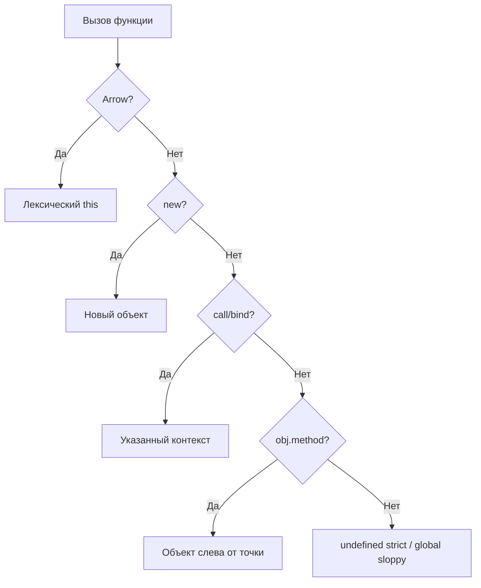

# 14. `this`, call, apply, bind

## Введение: «кнопка Сохранить не видит форму»

В админке на Django-бэкенд ([deploy/django](../../deploy/django/README.md)) вы пишете клиент на чистом JS. Объект `formSaver` с методом `save()` читает `this.fields` и шлёт PATCH. В шаблоне: `button.addEventListener("click", formSaver.save)`. В Network — пустое тело, в консоли `Cannot read properties of undefined (reading 'fields')`. Метод **отвязан** от объекта: `this` при вызове как колбэка — не `formSaver`. Параллельно коллега в том же PR ставит стрелку `save: () => { this.fields… }` — `this` берётся из модуля (`undefined` в strict). **`this` в JavaScript — не ссылка на «текущий объект из кода»** и не замыкание ([12](12-closures.md)); его значение определяется **тем, как вызвали функцию**. Эта глава снимает главный класс багов до React hooks и классов.

## Что вы узнаете

- Правила вычисления `this` для разных способов вызова.
- **Потерю контекста** при передаче метода как колбэка.
- `call`, `apply`, `bind` — когда и зачем.
- Стрелочные функции и **лексический** `this`.
- `this` в классах и исторический контекст React class components.
- Optional chaining вызова `obj.method?.()`.

## Что такое `this`

`this` — **не** аргумент функции и **не** переменная из scope. Это внутренняя ссылка, которую движок устанавливает при **каждом** вызове обычной функции.

| Способ вызова | `this` (sloppy / браузер) | `this` (strict / ES module) |
|---------------|---------------------------|-----------------------------|
| `fn()` | `globalThis` (`window`) | `undefined` |
| `obj.method()` | `obj` | `obj` |
| `new Fn()` | новый объект | новый объект |
| `fn.call(ctx, …)` | `ctx` | `ctx` |
| `fn.apply(ctx, …)` | `ctx` | `ctx` |
| `boundFn()` | зафиксированный | зафиксированный |
| Arrow | из окружающего scope | из окружающего scope |

В **ES modules** и `"use strict"` «голый» вызов даёт `undefined` — меньше случайной записи в `window`.

## Пошагово: `user.greet()` vs `const g = user.greet; g()`

```javascript
const user = {
  name: "Ann",
  greet() {
    console.log(`Hi, ${this.name}`);
  },
};

user.greet(); // Hi, Ann — шаг 1: вызов как метод

const g = user.greet;
g(); // Hi, undefined — шаг 2: вызов как обычная функция
```

### Шаг 1 — вызов через точку

1. Выражение слева от `.` — объект `user`.
2. Движок вызывает `greet` с `this = user`.
3. `this.name` → `"Ann"`.

### Шаг 2 — ссылка на функцию без объекта

1. `g` — та же функция, но вызов `g()` без базы.
2. В strict mode `this = undefined`.
3. `undefined.name` → ошибка или `undefined` в шаблоне.

**Почему так:** `this` привязан к **вызову**, не к месту объявления метода в объекте.

## Потеря контекста в асинхронном коде

```javascript
setTimeout(user.greet, 100);        // this не user
setTimeout(() => user.greet(), 100); // OK — явный вызов метода
setTimeout(user.greet.bind(user), 100); // OK — зафиксированный this
```

Тот же баг в:

- `array.map(obj.transform)` — нужно `(x) => obj.transform(x)` или `bind`;
- обработчиках DOM;
- колбэках `fs.readFile`, `then` (если метод объекта).

Практика — [15-lab-this](15-lab-this.md).

## `call`, `apply`, `bind`

Все три — у `Function.prototype`; позволяют явно задать `this`.

```javascript
function introduce(greeting, punct) {
  console.log(`${greeting}, ${this.name}${punct}`);
}

const ann = { name: "Ann" };
const bob = { name: "Bob" };

introduce.call(ann, "Hello", "!");   // Hello, Ann!
introduce.apply(bob, ["Hi", "."]);   // Hi, Bob.

const greetAnn = introduce.bind(ann, "Hey");
greetAnn("?"); // Hey, Ann?
```

| Метод | Действие | Аргументы функции |
|-------|----------|-------------------|
| `call` | вызов сразу | список через запятую |
| `apply` | вызов сразу | массив (удобно для `Math.max`) |
| `bind` | **новая** функция | частичное применение + фикс `this` |

### Пошагово: `bind`

```javascript
const bound = introduce.bind(ann, "Hello");
bound("!");
```

1. Создаётся новая функция без собственного `this`.
2. При любом вызове `this` будет `ann`.
3. Первый аргумент `"Hello"` уже «вшит»; остаётся передать `punct`.

**Почему `bind` важен исторически:** в React class components обработчики передавали в JSX — без bind `this` терялся. В функциональных компонентах с hooks `this` у обработчиков нет.

```javascript
// React 16 class (устаревший стиль)
class Form extends React.Component {
  constructor(props) {
    super(props);
    this.handleSubmit = this.handleSubmit.bind(this);
  }
  handleSubmit(e) {
    e.preventDefault();
    this.setState({ sent: true });
  }
}
```

## Стрелочные функции и лексический `this`

Стрелка **не** имеет своего `this`; берёт из ближайшей **обычной** функции (или module/global).

```javascript
const timer = {
  seconds: 0,
  start() {
    setInterval(() => {
      this.seconds += 1; // this = timer (из start)
      console.log(this.seconds);
    }, 1000);
  },
};
```

### Пошагово: почему стрелка внутри `start` работает

1. `start` вызывается как `timer.start()` → `this = timer`.
2. Стрелка в `setInterval` не переопределяет `this`.
3. Лексически `this` — тот же, что у `start` в момент создания стрелки.

### Антипаттерн: стрелка как метод

```javascript
const bad = {
  name: "Shop",
  greet: () => {
    console.log(this.name); // this не bad — module/undefined
  },
};
bad.greet();
```

**Правило:** методы объекта, которым нужен `this` объекта — `method() {}` или `function`, не стрелка ([10](10-functions.md)).

## `this` в классах

```javascript
class Counter {
  value = 0;

  inc() {
    this.value += 1;
    return this.value;
  }
}

const c = new Counter();
c.inc(); // 1

const inc = c.inc;
inc(); // TypeError в strict или тихая запись в global в sloppy
```

Поле `value = 0` — на экземпляре; `inc` на прототипе. Извлечённый метод теряет связь с экземпляром — тот же механизм, что у литерала объекта.

**Почему class fields + методы:** методы на прототипе (одна копия на класс), поля на экземпляре. Подробнее — [21](21-classes.md).

## `new` и `this`

```javascript
function User(name) {
  this.name = name;
}

const u = new User("Ann");
```

При `new`:

1. Создаётся пустой объект.
2. `this` указывает на него внутри `User`.
3. Если функция не возвращает свой объект, результат — этот `this`.

Стрелки с `new` — SyntaxError.

## Optional chaining вызова

```javascript
const api = {
  fetchUser(id) {
    return { id, name: "Ann" };
  },
};

api.fetchUser?.(42);     // OK
api.fetchAdmin?.(1);     // undefined, без TypeError
null?.method?.();       // undefined
```

`?.` останавливает цепочку на `null`/`undefined` — см. [19](19-optional-nullish.md).

## Диаграмма: определение `this`



## Как это связано с курсом

| Урок | Связь |
|------|-------|
| [10. Функции](10-functions.md) | Arrow vs function |
| [12. Замыкания](12-closures.md) | Closure ≠ this |
| [15. Лаба](15-lab-this.md) | calculator, timer, emitter |
| [20–21. Прототипы и классы](20-prototypes.md) | `new`, методы на прототипе |
| [29. fetch](29-fetch.md) | Колбэки без потери контекста реже — стрелки |
| react-basic | Hooks без `this`; class components — bind |

В **browser-platform** — `this` у DOM handlers (`button` как `this` в sloppy inline handlers — legacy).

## Типичные ошибки

| Ошибка | Корневая причина | Исправление |
|--------|------------------|-------------|
| `onClick={obj.save}` | Метод без вызова | `() => obj.save()` или bind |
| Стрелка-метод в литерале | Лексический this | `save() {}` |
| `const f = obj.m; f()` | Вызов без базы | `f.call(obj)` |
| Двойной bind | bind возвращает новую fn | Хранить один bound |
| Ожидать `this` в top-level module | Голый вызов → undefined | Не использовать this на верхнем уровне |
| `JSON.parse` с reviver и this | Отдельные правила | Обычная function в reviver |

## В продакшене

- Предпочитайте **стрелки в колбэках** внутри методов, где нужен `this` объекта — меньше bind.
- В **TypeScript** `this` параметры в типах функций документируют контекст.
- **Линтер** `no-invalid-this`, `@typescript-eslint/unbound-method`.
- Публичные API библиотек не должны требовать «вызывайте только как метод» без документации — лучше явные аргументы.

## Резюме

**`this`** определяется **способом вызова**, не местом объявления. Передача метода как колбэка **теряет** объект. **`call`/`apply`** вызывают с явным `this`; **`bind`** создаёт функцию с фиксированным контекстом. **Стрелки** не имеют своего `this` — удобны внутри методов, **плохи** как сами методы. В modules strict «голый» вызов → `undefined`. Понимание `this` обязательно до классов и event-driven кода.

## Чек-лист

- Результат `const f = obj.m; f()` в strict mode?
- Три способа исправить `setTimeout(obj.m, 0)`?
- Чем `call` отличается от `bind`?
- Почему `greet: () => this.name` в объекте — баг?
- Что будет при `new` с обычной function?
- Зачем в React class bindили handlers?

Следующий урок: [15. Лаба: `this`](15-lab-this.md).
