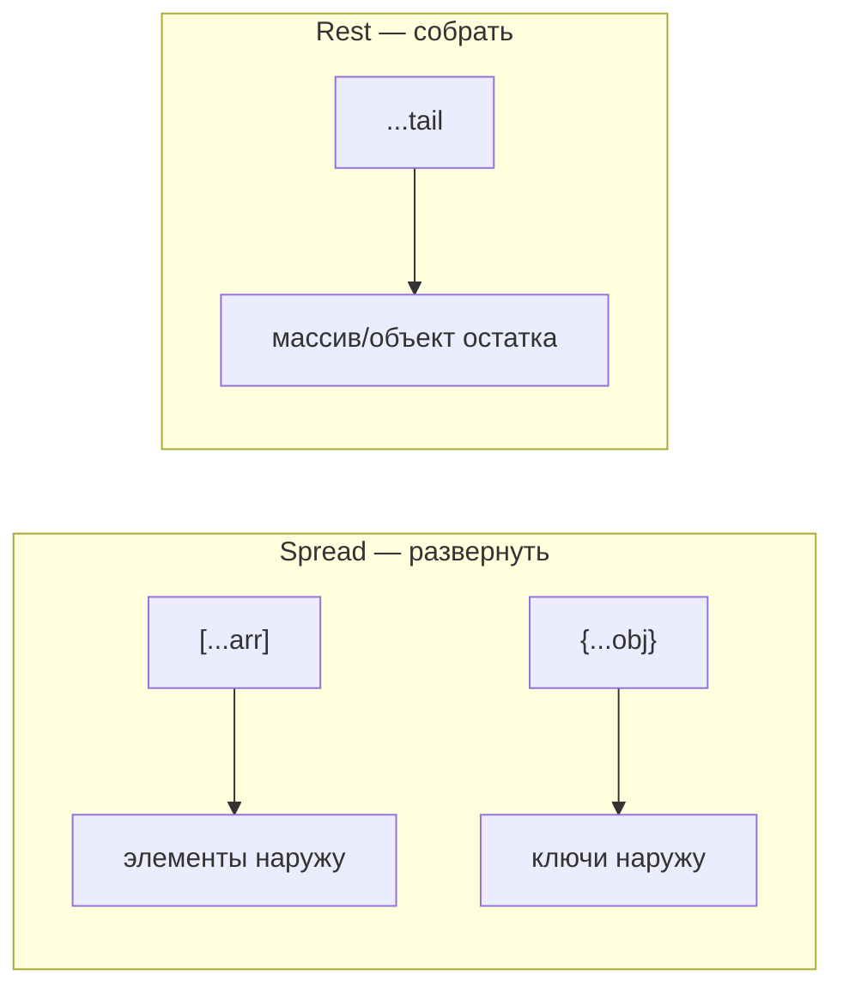

# 17. Деструктуризация, spread, rest

## Введение: «конфиг перезаписал прод»

BFF на Node ([javascript-path](../javascript-path.md)) мержит дефолты с переменными окружения: `Object.assign(config, process.env)` — и внезапно в проде `debug: "true"` (строка из env) и мутированный `base` у всех воркеров. Другой разработчик распаковывает ответ FastAPI: `const title = response.data.items[0].name` — при пустом `items` падает весь render. Современный JS решает это **деструктуризацией**, **spread** и **rest**: читаемые параметры, неизменяемые обновления состояния и безопасные копии без `Object.assign` вручную. Эта глава — ежедневный синтаксис React и конфигов; дальше его дополнят `?.` и `??` ([19](19-optional-nullish.md)).

## Что вы узнаете

- Деструктуризацию **массивов** и **объектов**, в том числе в параметрах функций.
- **Spread** `...` для копий и слияния (shallow).
- **Rest** `...` в параметрах и при деструктуризации.
- Вложенную деструктуризацию и её риски.
- Паттерны: `mergeConfig`, иммутабельный `setState`, `pick`/`omit`.
- Отличие shallow copy от глубокого клонирования ([07](07-objects.md)).

## Деструктуризация массива

```javascript
const [first, second, ...rest] = [1, 2, 3, 4];
// first=1, second=2, rest=[3, 4]

const [, , third] = [10, 20, 30]; // пропуск позиций
```

### Swap без временной переменной

```javascript
let a = 1;
let b = 2;
[a, b] = [b, a];
```

**Почему работает:** справа вычисляется кортеж значений, слева — присвоение по позициям.

### Значения по умолчанию

```javascript
const [x = 0, y = 0] = [5];
// x=5, y=0
```

Default срабатывает только для `undefined` (как параметры функций — [10](10-functions.md)).

## Деструктуризация объекта

```javascript
const user = { id: 1, name: "Ann", role: "admin" };

const { name, role } = user;
const { name: userName, age = 18 } = user; // переименование + default
const { id, ...profile } = user; // rest: profile = { name, role }
```

| Синтаксис | Результат |
|-----------|-----------|
| `{ name }` | `name === user.name` |
| `{ name: userName }` | переменная `userName` |
| `{ age = 18 }` | 18 если `age` отсутствует или `undefined` |
| `{ id, ...rest }` | `rest` без `id` |

### В параметрах функции

```javascript
function printUser({ name, role = "guest" }) {
  console.log(name, role);
}

printUser({ name: "Ann" }); // Ann guest
```

**Почему удобно:** сигнатура документирует форму объекта; дефолт для всего объекта:

```javascript
function connect({ host = "localhost", port = 3000, tls = false } = {}) {
  return { host, port, tls };
}
connect(); // без аргумента — не TypeError
```

Пустой `= {}` защищает от вызова `connect()` без объекта.

## Spread `...` — разворачивание

### Копия массива (shallow)

```javascript
const original = [1, 2];
const extended = [...original, 3];
original.push(99);
console.log(extended); // [1, 2, 3] — не затронут
```

### Копия объекта (shallow)

```javascript
const defaults = { host: "localhost", port: 3000, retries: 3 };
const config = { ...defaults, port: 8080 };
// { host: "localhost", port: 8080, retries: 3 }
```

**Порядок важен:** поля справа перекрывают левые.

```javascript
const override = { port: 9000, host: "api.prod" };
const merged = { ...defaults, ...override };
```

**Почему не мутировать `defaults`:** один объект в памяти на всё приложение — классический баг воркеров.

### Spread в вызове функции

```javascript
const nums = [3, 1, 4, 1, 5];
Math.max(...nums);
```

Эквивалент `Math.max(3, 1, 4, 1, 5)`.

## Rest `...` — сбор остатка

### В параметрах

```javascript
function log(level, ...messages) {
  console.log(level, messages.join(" "));
}

log("ERROR", "auth", "failed", "user=42");
```

Заменяет `arguments` ([10](10-functions.md)) — настоящий массив, работает с arrow если rest в объявлении внешней function.

### В деструктуризации

```javascript
const { id, createdAt, ...updatable } = payload;
// отправить в PATCH только updatable
```

**Правило:** rest **последний** в паттерне:

```javascript
// const { ...rest, id } = obj; // SyntaxError
```

## Пошагово: shallow merge конфига

```javascript
function mergeConfig(base, override) {
  return { ...base, ...override };
}

const base = { host: "localhost", port: 3000, meta: { v: 1 } };
const result = mergeConfig(base, { port: 8080 });
```

1. `{ ...base }` — новый объект, ключи верхнего уровня скопированы.
2. `{ ...override }` — `port` перезаписан.
3. `base.meta` и `result.meta` — **одна ссылка** (shallow).

Для вложенных полей — отдельный spread уровня или `structuredClone` ([07](07-objects.md)).

## Вложенная деструктуризация

```javascript
const response = {
  data: {
    items: [{ id: 1, name: "Tea" }],
  },
};

const {
  data: {
    items: [firstItem],
  },
} = response;

console.log(firstItem.name); // Tea
```

**Риск:** если `data` или `items` — `undefined`, TypeError. Комбинируйте с `?.` и дефолтами ([19](19-optional-nullish.md)):

```javascript
const first = response?.data?.items?.[0];
const name = first?.name ?? "Unknown";
```

### Пошагово: безопасное извлечение

1. `response?.data` — undefined если нет response.
2. `?.items?.[0]` — не падаем на пустом массиве/отсутствии поля.
3. `?? "Unknown"` — дефолт только для null/undefined.

## Иммутабельное обновление состояния

Паттерн React (preview для react-basic):

```javascript
function reducer(state, action) {
  switch (action.type) {
    case "increment":
      return { ...state, count: state.count + 1 };
    case "setUser":
      return { ...state, user: { ...state.user, ...action.payload } };
    default:
      return state;
  }
}
```

**Почему spread:** новая ссылка на объект — React сравнивает shallow и перерисовывает. Мутация `state.count++` без нового объекта — баг.

## `pick` и `omit` через rest

```javascript
function pick(obj, keys) {
  return Object.fromEntries(keys.map((k) => [k, obj[k]]));
}

function omit(obj, keys) {
  const exclude = new Set(keys);
  return Object.fromEntries(
    Object.entries(obj).filter(([k]) => !exclude.has(k))
  );
}
```

Альтернатива omit — rest после деструктуризации известных ключей (лаба [18](18-lab-modern-syntax.md)).

## Spread и async

```javascript
const urls = ["/api/a", "/api/b"];
const results = await Promise.all(urls.map((u) => fetch(u)));
```

**Ошибка:**

```javascript
const promises = urls.map((u) => fetch(u));
await promises; // бессмысленно — не Promise
```

Spread массива Promise **не ждёт** — нужен `Promise.all` ([27](27-async-await.md)).

## Клонирование: что spread не делает

```javascript
const a = { nested: { x: 1 } };
const b = { ...a };
b.nested.x = 99;
console.log(a.nested.x); // 99
```

| Метод | Глубина |
|-------|---------|
| `{ ...obj }` | shallow |
| `Object.assign({}, obj)` | shallow |
| `structuredClone(obj)` | deep (ограничения) |
| `JSON.parse(JSON.stringify(obj))` | deep без Date, undefined, fn |

## Диаграмма: rest vs spread



Один символ `...`, разная позиция: **справа / в вызове** — spread; **слева в паттерне / последний параметр** — rest.

## Как это связано с курсом

| Урок | Связь |
|------|-------|
| [07. Объекты](07-objects.md) | Shallow vs deep copy |
| [08. Массивы](08-arrays.md) | map + spread |
| [10. Функции](10-functions.md) | Rest параметры, defaults |
| [16. Циклы](16-control-flow.md) | `for (const [k,v] of Object.entries())` |
| [18. Лаба](18-lab-modern-syntax.md) | mergeConfig, pick, parseLog |
| [19. `?.` / `??`](19-optional-nullish.md) | Безопасная вложенная деструктуризация |
| react-basic | `setState`, props spread |

## Типичные ошибки

| Ошибка | Корневая причина | Исправление |
|--------|------------------|-------------|
| `const { ...r, id } = o` | rest не последний | Порядок ключей |
| Думать, что spread глубокий | Shallow copy | Вложенный spread или clone |
| `const { user } = null` | Деструктуризация null | Guard или default `= {}` |
| Мутировать `base` после merge | assign вместо spread | `{ ...base, ...over }` |
| `...obj` в null/undefined | Не итерируемо | `{ ...(obj ?? {}) }` |
| Забыть `= {}` в параметрах | undefined не деструктурируется | `({ a } = {})` |

## В продакшене

- **Env merge:** `{ ...defaults, ...pickEnv(process.env) }` — не мутируйте shared defaults.
- **API DTO:** деструктуризация в handler + явные поля для ответа — меньше утечек.
- **ESLint** `prefer-const` + деструктуризация снижает `let` шум.
- TypeScript: типы для rest (`Omit<T, "id">`) — typescript-basic.

## Резюме

**Деструктуризация** извлекает поля и элементы в переменные; **spread** копирует и сливает (shallow); **rest** собирает остаток. В параметрах функций — самодокументируемые опции. Порядок в merge: сначала база, потом override. Вложенная форма без `?.` хрупкая. Spread не заменяет глубокое клонирование. Паттерн `{ ...prev, field: new }` — основа иммутабельных обновлений в UI.

## Чек-лист

- Результат `const { a, ...b } = { a: 1, c: 2 }`?
- Чем rest в параметрах отличается от `arguments`?
- Зачем `{ ...defaults, port: 8080 }` перед отдельным присвоением `defaults.port`?
- Почему `mergeConfig` может случайно менять вложенный объект в `base`?
- Как безопасно вызвать `connect()` без аргументов?
- Когда нужен `Promise.all`, а не spread Promise?

Следующий урок: [18. Лаба: современный синтаксис](18-lab-modern-syntax.md).
