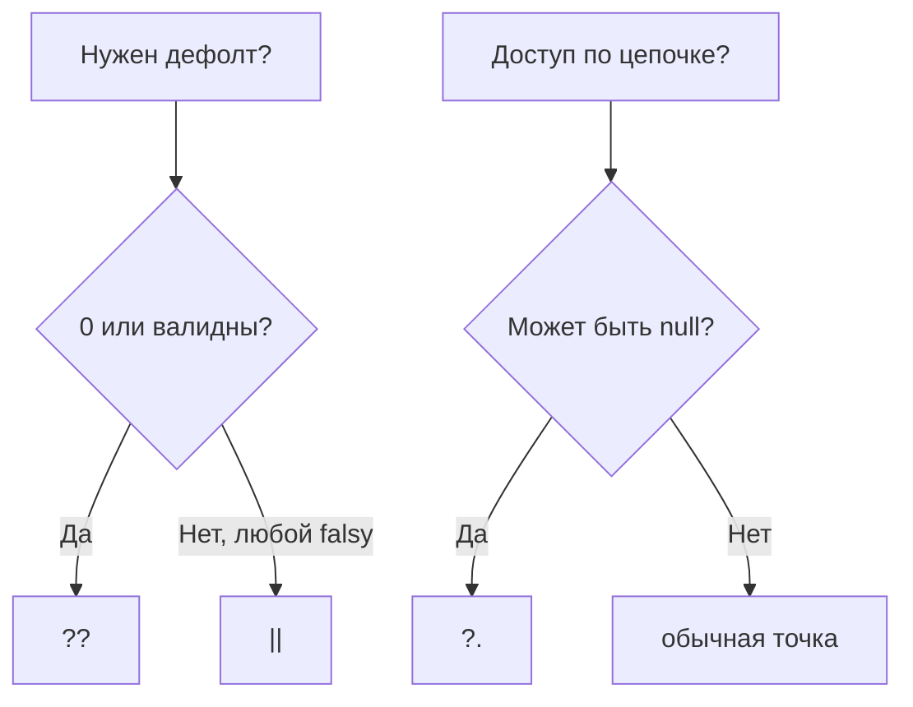

# 19. Optional chaining (`?.`) и nullish coalescing (`??`)

## Введение: «Cannot read properties of undefined (reading 'city')»

Карточка пользователя в SPA ренерится до завершения `fetch` к FastAPI. Код `user.address.city` падает на staging, хотя в dev данные всегда полные. Разработчик оборачивает всё в `if (user && user.address && user.address.city)` — 40 строк вложенности. Другой пишет `const port = config.port || 3000` — в проде порт **0** (динамический assign в Docker) заменяется на 3000, сервис недоступен. ES2020 добавил **`?.`** и **`??`**: короткий безопасный доступ и дефолты **только** для `null`/`undefined`. Вместе с деструктуризацией ([17](17-destructuring-spread.md)) это стандарт чтения API-ответов и конфигов.

## Что вы узнаете

- **Optional chaining** `?.` для свойств, вызовов, индексов.
- Что `?.` **не** проверяет (пустая строка, 0).
- **Nullish coalescing** `??` vs логическое `||`.
- Комбинации `?.` + `??` в реальных выражениях.
- Логическое присвоение `??=`, `||=`, `&&=`.
- Ограничения синтаксиса и совместимость.

## Optional chaining: безопасный доступ

```javascript
const city = user?.address?.city;
```

Если на любом шаге слева `null` или `undefined` — всё выражение **`undefined`**, без TypeError.

| Выражение | Если `user` null | Если `address` отсутствует |
|-----------|------------------|----------------------------|
| `user.address.city` | TypeError | TypeError |
| `user?.address?.city` | `undefined` | `undefined` |

**Почему не «просто try/catch»:** короче, предсказуемо для рендера, не маскирует другие ошибки.

## Вызов, индексация, optional call

```javascript
callback?.();
obj.method?.(arg1, arg2);
arr?.[0];
const key = "id";
obj?.[key];
```

Если `callback` — `null`, вызов не выполняется, результат `undefined`.

```javascript
delete user?.temp; // no-op если user null
```

## Пошагово: разбор `response?.data?.items?.[0]?.name ?? "Unknown"`

1. `response` nullish? → весь результат `undefined`, переходим к `??`.
2. Иначе `response.data` — если nullish, стоп, `undefined`.
3. `items` — если nullish или не массив, `?.[0]` даёт `undefined` (не ошибка на отсутствии items).
4. `[0]` — если массив пуст, `undefined`.
5. `name` — если элемента нет, `undefined`.
6. `?? "Unknown"` — подставляет строку только если слева `null` или `undefined`.

```javascript
const title = response?.data?.title ?? "Untitled";
```

Читается: «возьми title, не падай на пустом data, иначе Untitled».

## Что `?.` не делает

```javascript
const len = items?.length; // 0 если items=[] — это 0, не undefined
const name = user?.name;   // "" остаётся "" — пустое имя валидно
```

Для дефолта пустой строки нужен `??`:

```javascript
const displayName = user?.name ?? "Guest";
```

Если `name === ""`, останется `""` — осознанное решение продукта.

## Nullish coalescing `??`

Дефолт **только** при `null` или `undefined`:

```javascript
const port = config.port ?? 3000;

0 ?? 3000;        // 0
"" ?? "default";  // ""
false ?? true;    // false
null ?? "x";      // "x"
undefined ?? "x"; // "x"
```

### Сравнение с `||`

```javascript
0 || 3000;   // 3000 — 0 falsy
0 ?? 3000;   // 0

"" || "default";  // "default"
"" ?? "default";  // ""

null || "x";  // "x"
null ?? "x";  // "x"
```

| Значение | `\|\|` (falsy → right) | `??` (nullish → right) |
|----------|------------------------|-------------------------|
| `0` | right | `0` |
| `""` | right | `""` |
| `false` | right | `false` |
| `null` | right | right |
| `undefined` | right | right |

**Почему `??` для конфигов:** `0`, `false`, `""` часто **валидные** значения (порт 0 в тестах, флаг `false`, пустой slug).

Подробнее falsy — [05](05-coercion-comparison.md), [16](16-control-flow.md).

## Комбинации в циклах и рендере

```javascript
for (const item of order?.items ?? []) {
  process(item);
}
```

Если `order` или `items` отсутствуют — итерируем пустой массив, цикл не выполняется.

```javascript
function UserCard({ user }) {
  const city = user?.address?.city ?? "—";
  return `<p>${city}</p>`;
}
```

## Логическое присвоение

```javascript
const opts = {};

opts.timeout ??= 5000;   // присвоить если null/undefined
opts.retries ||= 3;      // присвоить если falsy
opts.enabled &&= true;   // присвоить если текущее truthy
```

| Оператор | Условие записи |
|----------|----------------|
| `??=` | слева null/undefined |
| `\|=` | слева falsy |
| `&&=` | слева truthy |

**Почему `??=` в конфиге:** не перезапишет явный `0` или `false`.

```javascript
function initConfig(partial) {
  const config = { ...partial };
  config.port ??= 3000;
  config.host ??= "localhost";
  return config;
}
```

## Синтаксис: скобки с `&&` / `||`

```javascript
// a ?? b || c; // SyntaxError без скобок
(a ?? b) || c;
a ?? (b || c);
```

Правило: **не смешивайте** `??` с `&&`/`||` без явных скобок — так требует грамматика.

## С TypeScript и сужением типов

```typescript
function len(s: string | null) {
  return s?.length ?? 0; // number
}
```

В TypeScript `?.` и `??` сужают union — тема typescript-basic.

## Совместимость

ES2020. Node.js 14+, современные браузеры, Vite по умолчанию. Для старых сред — Babel plugin (в курсе не требуется).

## Пошагово: разбор ответа `fetch`

Типичный паттерн после [29. fetch](29-fetch.md):

```javascript
async function loadProduct(slug) {
  const res = await fetch(`/api/products/${slug}`);
  if (!res.ok) {
    throw new Error(`HTTP ${res.status}`);
  }
  const data = await res.json();
  return {
    title: data?.title ?? "Без названия",
    price: data?.price ?? 0,
    tags: data?.tags ?? [],
  };
}
```

1. `res.ok` — проверка HTTP-статуса; `?.` здесь не заменяет проверку 404/500.
2. `data` может быть `null` при пустом теле — optional на полях не даёт упасть рендеру.
3. `?? []` гарантирует итерируемый массив для `map` в UI, даже если `tags` отсутствует в JSON.
4. `price ?? 0` сохраняет бесплатный товар (`0`), в отличие от `price || 0` (то же для нуля, но `||` сломает другие falsy).

Если API гарантирует контракт OpenAPI, валидация на границе (Zod в typescript-basic) дополняет, а не заменяет защитный рендер.

## Диаграмма: выбор оператора



## Как это связано с курсом

| Урок | Связь |
|------|-------|
| [05. Coercion](05-coercion-comparison.md) | Falsy vs nullish |
| [14. `this`](14-this.md) | `obj.method?.()` |
| [16. Циклы](16-control-flow.md) | `order?.items ?? []` |
| [17. Деструктуризация](17-destructuring-spread.md) | Безопасное извлечение |
| [18. Лаба](18-lab-modern-syntax.md) | parseLog, merge |
| [29. fetch](29-fetch.md) | `res.json()` + optional chain |
| [32. Ошибки](32-error-handling.md) | `?.` не заменяет обработку 500 |

В **OpenAPI-клиентах** (react-intermediate) optional поля в схеме соответствуют `| null` и `?.` на клиенте.

## Типичные ошибки

| Ошибка | Корневая причина | Исправление |
|--------|------------------|-------------|
| `port \|\| 3000` при валидном 0 | 0 falsy | `port ?? 3000` |
| Думать, что `?.` ловит пустой массив | Только null/undefined | `items?.length` + проверка |
| `a ?? b \|\| c` без скобок | SyntaxError | Скобки |
| Цепочка из 20 `?.` | Нечитаемость | Промежуточная переменная или helper |
| `??` для «пустой строки нет» | `""` не nullish | `\|\|` или `.trim()` + проверка |
| `optional?.mutate()` скрывает баг | Тихий skip | Явный guard если mutate обязателен |

## В продакшене

- **Конфиги:** `Number(process.env.PORT) ?? 3000` — помните, `Number("")` → `0`, не NaN; валидируйте env (nodejs-basic).
- **Логирование:** не логируйте `user?.password` — optional не делает поле безопасным.
- **Метрики:** считайте долю `undefined` после chain — сигнал смены контракта API.
- **Тесты:** отдельные кейсы `null`, `undefined`, `0`, `""` для дефолтов.

## Резюме

**`?.`** останавливает цепочку на `null`/`undefined` и возвращает `undefined` вместо TypeError. **`??`** подставляет дефолт только для nullish, сохраняя `0` и `""`. Вместе они заменяют глубокие `&&` и опасный `||` в конфигах. **`??=`** инициализирует поля без перезаписи валидных falsy. Не смешивайте `??` с `||` без скобок. Optional chaining не заменяет валидацию бизнес-правил на границе API.

## Чек-лист

- Результат `null?.foo` и `undefined?.foo`?
- `0 ?? 1` vs `0 || 1`?
- Зачем `??=` в объекте конфигурации?
- Почему `items?.length === 0` не значит «items отсутствует»?
- Как итерировать `order?.items` безопасно?
- Когда всё ещё нужен явный `if (x === null)`?

Следующий урок: [20. Прототипы](20-prototypes.md).
