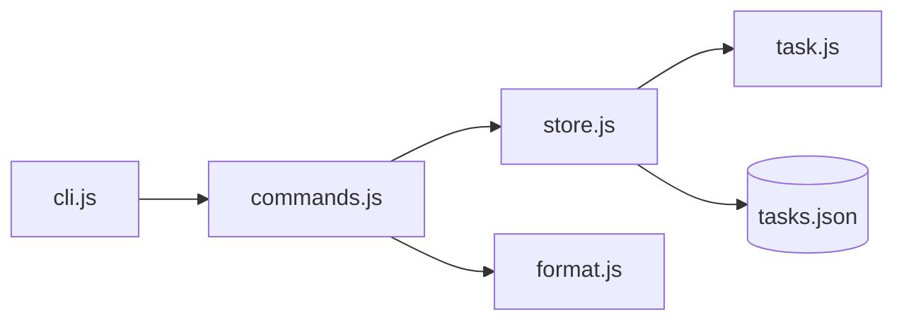

# 39. Capstone: Task Tracker CLI (4–6 часов)

## Введение: зачем capstone

До этой главы вы учили **фрагменты** языка: типы в уроке 04, closures в 12, Promises в 26. Capstone заставляет **собрать** их в одну программу, которую можно показать коллеге или положить в портфолио. Аналог в backend-треке — [fastapi/42-capstone](../fastapi/42-capstone.md): там API на шесть часов; здесь — CLI на четыре–шесть, без фреймворков, только Node и ваш код.

Если застряли — это нормально. Возвращайтесь к урокам из таблицы «Когда смотреть» ниже, а не копируйте готовое решение из интернета.

**Оценка времени:** 4–6 часов чистой работы (2–3 сессии по 2 часа).

---

## Задача

Консольное приложение **учёта задач** с сохранением в JSON-файл. Тот же домен «tasks», что в FastAPI capstone, но пока **без HTTP** — только файловая БД и CLI.

Позже в `nodejs-basic` вы замените `TaskStore` на HTTP-клиент к `http://localhost:8090/api/v1/...`; в `react-basic` — на UI. Сейчас важно: **модули**, **модель**, **ошибки**, **персистентность**.

---

## Функциональные требования

### Модель `Task`

| Поле | Тип | Правила |
|------|-----|---------|
| `id` | string (uuid или incremental) | уникальный |
| `title` | string | 1–200 символов, не пустой |
| `status` | `"todo"` \| `"done"` | по умолчанию `todo` |
| `createdAt` | string ISO 8601 | при создании |
| `tags` | string[] | опционально, по умолчанию `[]` |
| `dueDate` | string ISO \| null | опционально (расширение C) |

### `TaskStore`

- `add(title, options?)` → Task
- `list({ status?, tag?, search? })` → Task[]
- `markDone(id)` → Task
- `remove(id)` → void
- `load()` / `save()` — чтение/запись `data/tasks.json`
- При старте — `load()`; после каждой мутации — `save()` (или явный `flush` — задокументируйте)

### CLI-интерфейс

Минимум через аргументы:

```bash
node capstone/cli.js add "Buy milk" --tags home,food
node capstone/cli.js list
node capstone/cli.js list --status todo
node capstone/cli.js done <id>
node capstone/cli.js remove <id>
node capstone/cli.js search milk
```

**Альтернатива:** интерактивное меню на `readline` — допустимо, если аргументы тоже поддержаны.

### Вывод

- `list` — `console.table` или выровненные колонки: id (короткий), title, status, tags.
- Успех — exit code `0`; ошибка валидации / «task not found» — `1` и сообщение в **stderr**.

---

## Нефункциональные требования

| Требование | Зачем |
|------------|-------|
| ES modules, разбиение на файлы | урок 30–31 |
| `const`/`let`, без `var` | урок 02 |
| Валидация с `throw` или кастомным `ValidationError` | урок 32 |
| Не мутировать возвращаемые из `list()` массивы снаружи без копии | урок 07–08 |
| `main().catch(...)` и осмысленный exit code | урок 33 |
| README в `capstone/` с примерами команд | для проверяющего |

---

## Целевая структура

```text
examples/capstone/
├── README.md
├── cli.js                 # точка входа, разбор argv
├── data/
│   └── tasks.json         # создаётся при первом save
└── src/
    ├── task.js            # createTask, validate
    ├── store.js           # TaskStore class или factory
    ├── commands.js        # add, list, done, remove, search
    ├── errors.js          # ValidationError, NotFoundError
    ├── parse-args.js      # простой парсер --tags
    └── format.js          # table output, truncate id
```



---

## Пошаговый план (рекомендуемый)

### Сессия 1 (~2 ч): модель и store в памяти

1. Создайте `src/task.js`: `createTask(title, { tags })` с проверками.
2. `src/store.js`: массив или `Map` в памяти, методы без файла.
3. В `cli.js` временно вызовите `add` + `list` из кода — проверьте логику.
4. **Критерий:** пустой title бросает понятную ошибку.

**Уроки:** [07-objects](07-objects.md), [21-classes](21-classes.md), [32-error-handling](32-error-handling.md).

### Сессия 2 (~2 ч): персистентность и модули

1. `load()`: если файла нет — пустой список; если JSON битый — `stderr` + exit 1 (опционально backup `.bak`).
2. `save()`: `JSON.stringify(data, null, 2)` + `writeFile` из `node:fs/promises`.
3. Разнесите импорты; `cli.js` только orchestration.
4. **Критерий:** перезапуск `node cli.js list` показывает те же задачи.

**Уроки:** [30-es-modules](30-es-modules.md), [35-regex-json-date](35-regex-json-date.md).

### Сессия 3 (~1–2 ч): CLI и полировка

1. `parse-args.js`: позиционные команды + `--status`, `--tags` (split по запятой).
2. `commands.js`: одна функция на команду, возвращает код выхода или бросает.
3. `format.js`: короткий id в таблице (первые 8 символов uuid).
4. README с примерами и ограничениями.

**Уроки:** [16-control-flow](16-control-flow.md), [17-destructuring-spread](17-destructuring-spread.md).

---

## Подсказки по реализации

### Генерация id

```javascript
import { randomUUID } from "node:crypto";
// или incremental: max existing + 1
```

### Парсинг `--tags home,food`

```javascript
function parseTags(raw) {
  if (!raw) return [];
  return raw.split(",").map((t) => t.trim()).filter(Boolean);
}
```

### Поиск

```javascript
function matchesSearch(task, keyword) {
  const k = keyword.toLowerCase();
  return (
    task.title.toLowerCase().includes(k) ||
    task.tags.some((t) => t.toLowerCase().includes(k))
  );
}
```

### Защита JSON

```javascript
import { readFile, writeFile, rename } from "node:fs/promises";

async function saveAtomic(path, data) {
  const tmp = `${path}.tmp`;
  await writeFile(tmp, JSON.stringify(data, null, 2), "utf-8");
  await rename(tmp, path);
}
```

---

## Расширения (опционально)

| Уровень | Задача | Часы |
|---------|--------|------|
| B | При старте `fetch('http://localhost:8090/health')` — если OK, печатать «API reachable» | +0.5 |
| C | Поле `dueDate`, сортировка `list` по сроку | +1 |
| D | Экспорт `list --format csv` | +1 |
| E | Простые тесты: `node --test src/task.test.js` (Node built-in test runner) | +1 |

Стенд FastAPI: [`deploy/fastapi`](../../deploy/fastapi/README.md) — `docker compose up -d --build`.

---

## Критерии приёмки (самопроверка)

- [ ] `add` → `list` → перезапуск Node → задача на месте
- [ ] `done <id>` меняет status; повторный `done` — ошибка или идемпотентность (опишите в README)
- [ ] `remove` несуществующего id — exit 1, сообщение в stderr
- [ ] Нет одного файла на 400 строк — модули по ответственности
- [ ] В репозитории есть `capstone/README.md`

---

## Типичные ошибки

1. **Путь к `tasks.json` от cwd** — запуск из другого каталога ломает путь. Используйте `import.meta.url` + `fileURLToPath` для пути относительно модуля.

2. **Мутация `list()` снаружи** — `store.list().push(fake)` портит store. Возвращайте копию `[...tasks]` или `structuredClone`.

3. **Забыли `await save()`** — данные только в RAM.

4. **Глотать ошибки в cli** — всегда `main().catch(e => { console.error(e); process.exit(1); })`.

---

## Когда смотреть уроки

| Проблема | Урок |
|---------|------|
| import/export | 30, 31 |
| async save | 27, 32 |
| Map для хранения по id | 34 |
| parse argv | 16, 17 |
| отладка | 36 |

---

## После capstone

1. Пройдите [interview-cheatsheet.md](interview-cheatsheet.md) ещё раз.
2. Отметьте в [javascript-path.md](../javascript-path.md) следующий курс: [**typescript-basic**](../typescript-basic/README.md) (рекомендуется) или **nodejs-basic**.
3. Опционально: опубликуйте `capstone/` в отдельной ветке GitHub — артефакт для резюме.

Поздравляем — **javascript-basic** завершён.
