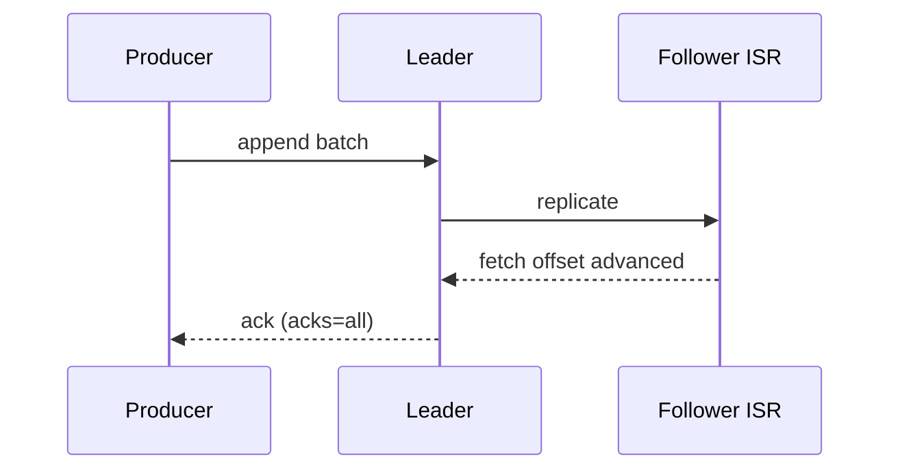

# 01. Внутренности брокера: log, segment, fetch, replication

## Введение: «диск полный, а retention ещё не вышел»

On-call: брокер `kafka-7` в **offline replicas**, диск 98%. Retention по policy — 7 дней, но **сегменты** ещё не закрыты, **compaction** отстаёт, а **replica fetch** не успевает — ISR сжимается. Без понимания **как Kafka пишет на диск** и **как реплика тянет данные** вы будете только увеличивать retention «наугад». Эта глава — фундамент для KRaft, tiered storage и troubleshooting.

## Что вы узнаете

- Структура **partition log** на диске: directory, segment files, index.
- **Append-only** запись, ротация сегментов, `log.segment.bytes` / `log.segment.ms`.
- **Zero-copy** `sendfile` при fetch (концептуально).
- **Replication protocol**: high-watermark, LEOS, follower fetch.
- Что смотреть в **JMX / metrics** (обзор).

**Предварительно:** [`kafka-basic: архитектура`](../kafka-basic/02-architecture.md), [`kafka-intermediate`](../kafka-intermediate/README.md) (RF, ISR).

**Стенд:** [`deploy/kafka`](../../deploy/kafka/README.md) — один брокер для `ls` в контейнере; cluster overlay — для describe с репликами.

---

## Partition log на диске

Каждая partition — **директория** на брокере-лидере (и копии на followers):

```text
/var/kafka/data/
  orders-0/
    00000000000000000000.log
    00000000000000000000.index
    00000000000000000000.timeindex
    00000000000000000042.log
    ...
```

| Файл | Назначение |
|------|------------|
| `*.log` | сырые записи (batch format) |
| `*.index` | offset → позиция в `.log` (sparse) |
| `*.timeindex` | timestamp → offset (для time-based retention) |

**Offset** — логический номер записи в partition; физически — смещение в цепочке сегментов.

На стенде (пути могут отличаться в образе):

```bash
docker exec mock-kafka bash -c \
  'find /var/lib/kafka/data -name "*.log" 2>/dev/null | head -5'
```

---

## Append и batch

Producer шлёт **RecordBatch** (сжатие: lz4, zstd, snappy). Broker **не обновляет** старые байты — только append в активный сегмент.

После `log.segment.bytes` или `log.segment.ms` сегмент **закрывается**, открывается новый. Закрытый сегмент безопаснее удалять по retention.

**На собеседовании:** «Kafka — commit log, не queue». Удаление = retention policy или compaction, не `ACK` от consumer.

---

## Fetch path

Consumer (или follower) делает **Fetch request** с `offset`.

1. Leader находит сегмент по index.
2. Данные отдаются из page cache (горячие topic) → меньше disk I/O.
3. **Zero-copy**: `sendfile` из kernel в socket (детали зависят от SSL — тогда копирование есть).

**Max partition fetch size**, **max poll records** на стороне consumer ограничивают размер ответа — важно при «fat messages».

---

## Replication

Для partition P на broker B1 (leader):

- Followers B2, B3 шлют **Fetch** как «special consumers» с текущим LEOS.
- **High watermark (HW)** — offset, до которого **все ISR** реплицировали (упрощённо: «безопасно отдавать consumer» при `acks=all` и `min.insync.replicas`).
- Запись считается **committed** для клиента с `acks=all` после ISR ack.



**Under-replicated partition (URP):** follower отстаёт или выпал из ISR — см. [15-troubleshooting](15-troubleshooting.md).

---

## Controller (KRaft preview)

**Controller** — брокер (или dedicated controller в KRaft quorum), назначающий **leaders**, следящий за **ISR**. События metadata — в internal topic `__cluster_metadata` (KRaft) или ZK (legacy). Подробно: [02-kraft](02-kraft.md), [04-zookeeper-legacy](04-zookeeper-legacy.md).

---

## Compaction vs delete retention

| Policy | Поведение |
|--------|-----------|
| `delete` | удалять сегменты старше `retention.ms` / `retention.bytes` |
| `compact` | оставлять последнее значение на key (changelog topic) |
| `compact,delete` | оба ограничения |

Compacted topic (`__consumer_offsets`, configs) — другой lifecycle сегментов.

---

## Метрики (что спросят)

| Метрика | Смысл |
|---------|--------|
| `BytesInPerSec` / `BytesOutPerSec` | нагрузка |
| `UnderReplicatedPartitions` | ISR < RF |
| `OfflinePartitionsCount` | нет leader — критично |
| `RequestHandlerAvgIdlePercent` | перегруз CPU / disk |
| `LogFlushRateAndTimeMs` | fsync pressure |

В Docker-стенде JMX часто не включён — в prod смотрите Prometheus JMX exporter или managed dashboards (MSK / Confluent).

---

## Типичные ошибки

| Ошибка | Последствие |
|--------|-------------|
| RF=1 в prod | потеря брокера = потеря partition |
| Гигантские сообщения | OOM consumer, reject `message.max.bytes` |
| Слишком много partition | file descriptors, metadata overhead |
| `unclean.leader.election.enable=true` | потеря данных ради availability |

---

## В проде

- **Rack awareness** (`broker.rack`) — spread RF по AZ.
- Отдельные **disk** (NVMe) под data; не делить с OS без cgroup/I/O tuning.
- **Compression** на producer (`zstd`) — меньше disk и network.
- Лимиты: `num.network.threads`, `num.io.threads`, `log.dirs` несколько mount.

---

## Резюме

Kafka хранит partition как **цепочку сегментов**, реплицирует **потоково** через fetch followers, отдаёт consumer из **leader** с учётом HW. Controller управляет **leader election**. Это объясняет lag, URP и выбор `acks` / `min.insync.replicas`.

## Чек-лист

- [ ] Назвать три файла сегмента и их роль.
- [ ] Объяснить разницу LEOS и HW одной фразой.
- [ ] Почему follower — это fetch, не push.
- [ ] Когда compaction, когда delete retention.

**Дальше:** [02-kraft](02-kraft.md).
