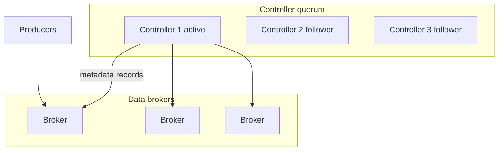

# 02. KRaft: quorum, metadata log, миграция с ZooKeeper

## Введение: «убираем ZooKeeper к релизу 4.x»

Компания на Kafka 3.5 с **ZooKeeper ensemble** из пяти узлов. Platform team планирует **KRaft** (Kafka Raft): один кластер metadata, меньше moving parts, быстрее **partition reassignment**. На интервью ждут: чем **controller quorum** отличается от ZK, какие риски **dual-write** при миграции, что меняется в **операциях**.

## Что вы узнаете

- Роли **KRaft**: broker + **controller** (combined или dedicated).
- **Metadata log** (`__cluster_metadata`) vs data topics.
- **Quorum voters**, fault tolerance (2N+1 controllers).
- Параметры `process.roles`, `node.id`, `controller.quorum.voters`.
- Путь миграции ZK → KRaft (обзор).

**Стенд:** default [`deploy/kafka/docker-compose.yml`](../../deploy/kafka/docker-compose.yml) — KRaft single node.

---

## Зачем убрали ZooKeeper

| ZK mode | KRaft |
|---------|-------|
| Отдельный ZK ensemble | Metadata в Kafka quorum |
| Два стека мониторинга | Единый кластер |
| Controller bottleneck на ZK session | Event-driven metadata |
| Операционная сложность | Меньше компонентов |

С Kafka 3.3+ KRaft **production-ready**; в 4.x ZK **удалён**.

---

## Архитектура KRaft



- **Active controller** — лидер metadata log, публикует **Record** (CreateTopic, PartitionChange, …).
- **Brokers** применяют metadata snapshot + tail log.
- **Combined mode** (учебный стенд): один процесс = `broker,controller`.

Пример фрагмента конфигурации (иллюстрация):

```properties
process.roles=broker,controller
node.id=1
controller.quorum.voters=1@kafka:9093
listeners=PLAINTEXT://:9092,CONTROLLER://:9093
advertised.listeners=PLAINTEXT://localhost:9094
controller.listener.names=CONTROLLER
```

---

## Metadata vs data plane

| Plane | Содержимое |
|-------|------------|
| Metadata | topics, partitions, ISR, configs, ACLs (в новых версиях) |
| Data | пользовательские записи в partition logs |

Раньше controller писал в **ZooKeeper znodes**; в KRaft — **append-only metadata log** с snapshot на диск (`metadata.log`).

**На собеседовании:** «ZK хранил metadata, KRaft хранит metadata в Kafka topic с Raft consensus».

---

## Quorum и отказоустойчивость

Для **K** controller nodes допускается потеря **(K-1)/2** (floor).

| Controllers | Выдерживает падение |
|-------------|---------------------|
| 1 | 0 (только dev) |
| 3 | 1 |
| 5 | 2 |

В prod — **нечётное** число; **3** controllers часто достаточно; **5** — для крупных org с жёстким SLO на metadata.

---

## Broker IDs и cluster UUID

- `node.id` уникален в кластере.
- При форматировании storage: `kafka-storage.sh format -t <cluster-uuid> -c ...`
- Смешивание директорий от другого кластера → **refuse to start**.

---

## Миграция ZK → KRaft (обзор)

Официальный путь (версии уточняйте в docs вашей ветки):

1. Rolling upgrade brokers до версии с **migration tool**.
2. Поднять **KRaft quorum** parallel.
3. **Migrate metadata** (downtime window планируется).
4. Выключить ZK.

Риски: несовместимые **ACL format**, старые **inter-broker protocol**, откат сложен. На интервью: «миграция — проект на квартал, не кнопка».

См. [04-zookeeper-legacy](04-zookeeper-legacy.md), [05-lab-zookeeper](05-lab-zookeeper.md).

---

## KRaft и Kubernetes

Strimzi / operators задают:

- **Pod names** стабильны (`kafka-0`) — аналог [`StatefulSet`](../kuber-intermediate/01-statefulset.md).
- **PersistentVolume** на `log.dirs`.
- **Rolling update** по ordinal; controller quorum **отдельный** StatefulSet в dedicated mode.

---

## Типичные ошибки

| Ошибка | Симптом |
|--------|---------|
| Чётное число controllers | split-brain risk при partition |
| Один controller в prod | metadata SPOF |
| Потеря `meta.properties` | broker не стартует |
| Неверный `advertised.listeners` | clients видят wrong broker |

---

## На собеседовании

1. **Почему KRaft?** — упростить ops, ускорить metadata, убрать ZK.
2. **Где хранится leader election для partition?** — metadata log, active controller решает.
3. **Можно ли только controllers без brokers?** — dedicated controller role в large clusters.

---

## Резюме

KRaft переносит **consensus metadata** внутрь Kafka. Quorum controllers + metadata log заменяют ZK. Учебный `deploy/kafka` уже в KRaft — используйте его как эталон конфигурации.

**Дальше:** [03-lab-kraft](03-lab-kraft.md).
