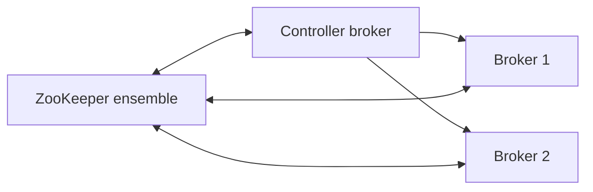

# 04. ZooKeeper mode (legacy): znodes, controller, зачем знать в 2026

## Введение: «наследие банка — Kafka 2.8 на ZK»

Новые кластеры — **KRaft**, но в enterprise ещё годы живут **ZK-backed** Kafka 2.x/3.x. Инженеру нужно читать runbook «ZK session expired», понимать **/controller** election и не путать **broker id** с **znode**. Эта глава — для интервью и миграций, не для greenfield.

## Что вы узнаете

- Роль **ZooKeeper** в classic Kafka.
- Ключевые **znodes** (концептуально).
- **Controller** broker и ZK lock.
- Отличия ops: rolling restart, session timeout.
- Связь с [`docker-compose.zk.yml`](../../deploy/kafka/docker-compose.zk.yml).

**Дальше на KRaft:** [02-kraft](02-kraft.md). **Лаба:** [05-lab-zookeeper](05-lab-zookeeper.md).

---

## Что делал ZooKeeper

| Функция | В ZK |
|---------|------|
| Broker registration | ephemeral znode `/brokers/ids/N` |
| Topic / partition state | `/brokers/topics/...` |
| Controller election | `/controller` |
| ACLs (старые версии) | `/kafka-acl/...` |
| Consumer offsets (до 0.9) | устарело |

Brokers — **ZK clients**. Потеря сессии → broker считается мёртвым → **rebalance leaders**.

---

## Controller в ZK mode

1. Brokers compete за **ephemeral znode** `/controller`.
2. Победитель становится **active controller**.
3. Controller обрабатывает: create/delete topic, partition reassignment, preferred leader election, ISR changes.

**Важно:** controller — **один из brokers**, нагрузка на CPU при тысячах partition.

---

## ZK ensemble sizing

| Nodes | Fault tolerance |
|-------|-----------------|
| 3 | 1 |
| 5 | 2 |

**Нельзя** 2 узла (нет кворума). ZK **не** Kafka — отдельные диски, JVM heap tuning, не на тех же дисках что `log.dirs` при перегрузе.

---

## Типичные инциденты

| Симптом | Причина |
|---------|---------|
| `Session expired` | GC pause, network, ZK overload |
| `Broker not registering` | ACL на ZK, wrong `zookeeper.connect` |
| Controller flapping | ZK latency, small session timeout |
| Устаревший metadata | split-brain редок при правильном ZK |

Remediation: увеличить `zookeeper.session.timeout.ms`, стабилизировать ZK, rolling restart **сначала** ZK observers, потом brokers (по runbook вендора).

---

## KRaft vs ZK (таблица для интервью)

| Вопрос | ZK | KRaft |
|--------|----|-------|
| Компоненты | Kafka + ZK | Kafka only |
| Metadata storage | znodes | `__cluster_metadata` |
| Ops skill | ZK + Kafka | Kafka |
| Kafka 4.x | нет | да |

---

## Миграция

См. [02-kraft](02-kraft.md). На интервью: «планируем окно, тестируем на staging, откат = держать ZK до cutover».

---

## В проде (legacy)

- Мониторинг **ZK latency**, **outstanding requests**.
- Отдельный **staging** ZK для тестов ACL.
- Документировать **max partitions** — controller limits.

---

## Резюме

ZK mode = metadata и coordination **вне** log. Controller broker + ephemeral locks. Знание нужно для **legacy** и **интервью**, новые системы — **KRaft**.

**Дальше:** [05-lab-zookeeper](05-lab-zookeeper.md).
