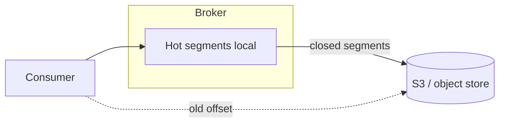

# 06. Tiered storage: remote log, cost, latency trade-offs

## Введение: «7 TB на брокере, CFO режет диски»

Retention 90 дней × высокий ingress → **дорогие NVMe** на каждом брокере. **Tiered storage** (KIP-405 и развитие в 3.6+) выносит **закрытые сегменты** в **object storage** (S3, GCS, Azure Blob), оставляя на брокере **hot tail**. На интервью: как это влияет на **fetch latency**, **SLA** и **disaster recovery**.

## Что вы узнаете

- Модель **local hot + remote cold** tier.
- Когда выгодно / когда нет.
- Влияние на **replication** и **fetch**.
- Managed offerings (Confluent, Aiven) vs self-hosted.
- Ограничения для **compact** topics.

**Лаба на Docker:** полный tiered storage в `deploy/kafka` обычно **не** включён — глава теоретическая + вопросы в [17-interview-qa](17-interview-qa.md).

---

## Проблема

| Фактор | Давление |
|--------|----------|
| Длинный retention | больше диск |
| Replay / audit | чтение старых данных |
| RF=3 | ×3 копии на брокерах |

Tiered storage ≠ «замена Kafka S3». Это **расширение log** с прозрачным fetch для consumer (с задержкой на cold).

---

## Как работает (концепция)

1. Активный сегмент — **локально** (как сегодня).
2. Закрытый сегмент **offload** в remote (async).
3. Metadata сегмента знает **remote reference**.
4. Consumer fetch старого offset → **read-through** remote (кэш опционально).



---

## Конфигурация (иллюстрация)

Имена параметров зависят от версии; типичная идея:

```properties
remote.storage.enable=true
remote.log.storage.manager.class=...
remote.log.metadata.manager.class=...
rsm.config.storage.bucket=...
```

В **Confluent Platform** / **MSK** tiered storage может быть **managed toggle** с billing за GB-month.

---

## Trade-offs

| Плюс | Минус |
|------|-------|
| Меньше локальный диск | Latency на historical fetch |
| Длинный retention дешевле | Зависимость от object store SLA |
| Меньше rebalance I/O при expand | Сложность troubleshooting |

**Compaction + tiering:** политики могут конфликтовать — уточняйте matrix версии.

---

## Replication

Followers historically копировали **байты сегментов**. С tiering репликация может **не тащить** cold bytes на каждый broker — модель **leader-only remote copy** (упрощённо). На интервью: «меньше cross-AZ traffic, но сложнее mental model».

---

## Ops checklist

- Lifecycle policy на bucket (versioning, encryption **SSE-KMS**).
- Мониторинг **remote read error rate**, **offload lag**.
- Тест **restore**: потеря bucket = потеря history.
- **RPO/RTO** для compliance retention.

---

## MSK / Confluent

| Платформа | Подход |
|-----------|--------|
| Confluent | Tiered Storage product, интеграция с S3 |
| MSK | проверяйте региональную roadmap / MSK Express |
| Self OSS | настройка Remote Log Metadata (advanced ops) |

См. [11-managed-kafka](11-managed-kafka.md).

---

## На собеседовании

1. **Зачем tiered storage?** — cost + long retention без раздувания NVMe.
2. **Consumer lag на старых offset?** — возможен higher latency.
3. **Замена backup?** — нет, нужен отдельный DR plan.

---

## Резюме

Tiered storage отделяет **hot local tail** от **cold remote segments**. Это финансовый и capacity инструмент с latency trade-off.

**Дальше:** [07-kafka-streams](07-kafka-streams.md).
