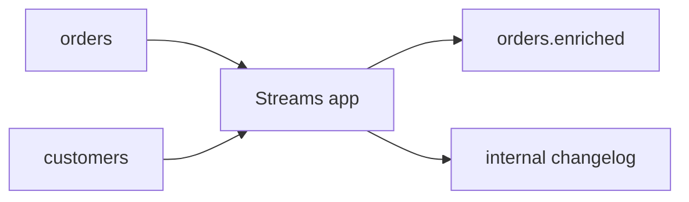

# 07. Kafka Streams: topology, state stores, exactly-once

## Введение: «считаем агрегаты в microservice — память кончилась»

Команда хранит **session windows** в памяти JVM сервиса. Рестарт — потеря state. **Kafka Streams** переносит state в **changelog topics** + **RocksDB** локально, а перераспределение — через **rebalance** stream threads. На senior interview: отличие от **consumer + DB**, что такое **KTable** vs **GlobalKTable**, **EOS**.

## Что вы узнаете

- **Stream / table duality**, KStream, KTable, GlobalKTable.
- **Topology**: source → processor → sink.
- **State store**, changelog, standby replicas.
- **Windowing**, grace period, suppression.
- **processing.guarantee=exactly_once_v2** (обзор).
- Границы: когда Streams, когда Flink.

**Лаба:** [08-lab-streams](08-lab-streams.md).

---

## Ментальная модель

| Абстракция | Аналог |
|------------|--------|
| KStream | поток событий (insert only) |
| KTable | changelog по key (last value) |
| GlobalKTable | broadcast join — полная копия на каждом instance |
| State store | локальный RocksDB + backup topic |

Kafka Streams — **библиотека** в вашем JVM процессе, не отдельный кластер (в отличие от Flink JobManager).

---

## Topology

```java
StreamsBuilder builder = new StreamsBuilder();
KStream<String, Order> orders = builder.stream("orders");
KTable<String, Customer> customers = builder.table("customers");

orders
  .join(customers, (order, cust) -> enrich(order, cust))
  .to("orders.enriched");
```

Под капотом — **sub-topology**, **internal topics** (`application-id-repartition`, changelog).



---

## Rebalance и tasks

- **StreamThread** = один или несколько **Tasks** (partition assignment).
- Scale app instances → rebalance tasks (как consumer group, но с **state migration**).
- **Standby tasks** — warm copy state (config `num.standby.replicas`).

**На собеседовании:** «почему нельзя просто scale без планирования» — restore из changelog занимает время.

---

## Windowing

| Тип | Использование |
|-----|----------------|
| Tumbling | фиксированные 5-мин окна |
| Hopping | перекрывающиеся |
| Session | gap-based для user sessions |

**Grace period** — принимать late events после закрытия окна.

---

## Exactly-once (EOS)

`processing.guarantee=exactly_once_v2`:

- транзакционный producer;
- consumer read committed;
- **transactional offsets** + idempotent produce.

Требует:

- `transaction.state.log.replication.factor` ≥ 3 в prod;
- compatible broker version;
- **не** все sinks transactional ( JDBC может быть at-least-once + idempotent write).

---

## Ограничения Streams

| Подходит | Не подходит |
|----------|-------------|
| Event enrichment, aggregations per key | Complex CEP across many rules |
| Лёгкая топология в JVM team | ML pipelines, batch ETL TB-scale |
| Co-location с Spring | Hard real-time sub-10ms |

Сравнение: [09-ksql-flink](09-ksql-flink.md).

---

## Ops

- Мониторинг **consumer lag** по internal topics.
- **application.id** — смена = новый consumer group + state.
- **RocksDB** tuning: memory, compaction.
- K8s: **one pod = one instance** или fixed partition count — осторожно с HPA.

---

## Резюме

Kafka Streams = **stateful stream processing** с changelog backup. KTable/GlobalKTable для joins. EOS возможен в рамках Kafka transaction.

**Дальше:** [08-lab-streams](08-lab-streams.md).
