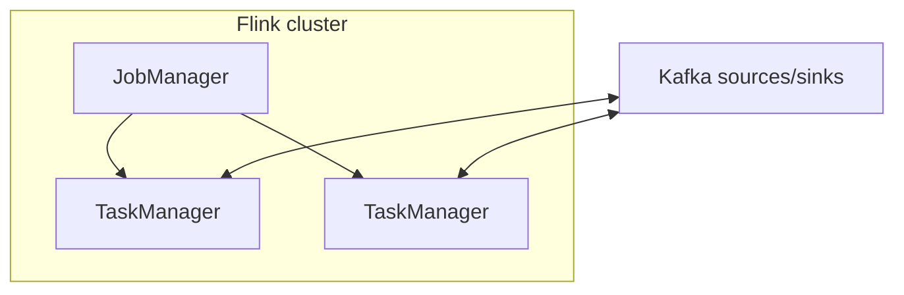

# 09. ksqlDB vs Apache Flink: когда что на собеседовании

## Введение: «нам нужен SQL поверх Kafka»

Product хочет **ad-hoc запросы** к потокам. Команда выбирает между **ksqlDB** (Confluent), **Flink SQL**, **Kafka Streams** в Java. Неправильный выбор → **operational tax** или **latency**. Глава — сравнительная теория для system design и интервью.

## Что вы узнаете

- Позиционирование **ksqlDB**, **Flink**, **Kafka Streams**.
- **Push vs pull**, **materialized views**.
- **Event time**, watermarks (Flink).
- Deployment model и state backend.
- Типовые вопросы интервью.

---

## Сравнительная таблица

| Критерий | ksqlDB | Kafka Streams | Apache Flink |
|----------|--------|---------------|--------------|
| API | SQL + streams/tables | Java/Kotlin DSL | DataStream / SQL / Table API |
| Кластер | ksqlDB server cluster | ваши JVM pods | JobManager + TaskManagers |
| State | RocksDB + Kafka changelog | то же | RocksDB / heap + checkpoint to FS/S3 |
| Масштаб | средний | средний | очень большой |
| Join window | SQL windows | API | богатый CEP |
| Ops | Confluent stack | вы сами | Flink ops (K8s operator) |
| Latency | ms–с | ms–с | ms (настройка) |

---

## ksqlDB

- **Stream** = unbounded, **Table** = changelog aggregate.
- **Persistent queries** пишут в Kafka topics.
- **Pull queries** (point lookup) на **materialized table** (interactive).
- Тесная интеграция **Schema Registry**.

**Когда:** команда знает SQL, уже Confluent Platform, dashboards, лёгкие агрегации.

**Не когда:** нужен batch over files + stream union на петабайтах без Kafka как hub.

---

## Apache Flink

- **True stream processor** с **checkpointing** (Chandy-Lamport).
- **Event time**, **watermarks**, **late data** — first-class.
- **CEP**, **iterative** batch, **Flink CDC** connectors.
- State **> память одного broker**.

**Когда:** high scale, complex windows, mixed batch/stream, ML feature pipeline.

**Не когда:** пара простых aggregations и нет ops для Flink.

---

## Kafka Streams (напоминание)

Библиотека **внутри** вашего сервиса — минимум инфраструктуры, максимум coupling release cycle app + streams version.

---

## Event time vs processing time

| Время | Определение |
|-------|-------------|
| Processing | wall-clock при обработке |
| Event | поле в payload (`eventTime`) |
| Ingestion | время записи в Kafka |

Flink: watermarks `max(eventTime) - skew`. ksqlDB: `TIMESTAMP` + `GRACE PERIOD`. На интервью: «без event time окна врут при lag».

---

## Delivery semantics

| Движок | Типично |
|--------|---------|
| Flink + Kafka sink | at-least-once или exactly-once (two-phase commit) |
| ksqlDB | зависит от query + sink |
| Streams | EOS v2 в Kafka |

Всегда: **idempotent sink** или **dedup** на стороне записи.

---

## На собеседовании — эталонные ответы

1. **«SQL over Kafka»** → ksqlDB если экосистема Confluent; иначе Flink SQL.
2. **«Сложные joins 5 потоков»** → Flink.
3. **«Логика уже в Spring»** → Kafka Streams embedded.
4. **«Один источник правды — Kafka log»** → все три; batch из data lake — Flink читает и Kafka, и S3.

---

## Связь с курсом

- Pipeline Connect: [`kafka-intermediate`](../kafka-intermediate/README.md).
- Multi-DC: [10-multi-dc](10-multi-dc.md).
- DLQ: [21-poison-dlq-replay](21-poison-dlq-replay.md).

---

## Резюме

ksqlDB — **SQL product** на Kafka. Streams — **library**. Flink — **distributed compute** для тяжёлых сценариев. Выбор = scale + ops + skill matrix.

**Дальше:** [10-multi-dc](10-multi-dc.md).
