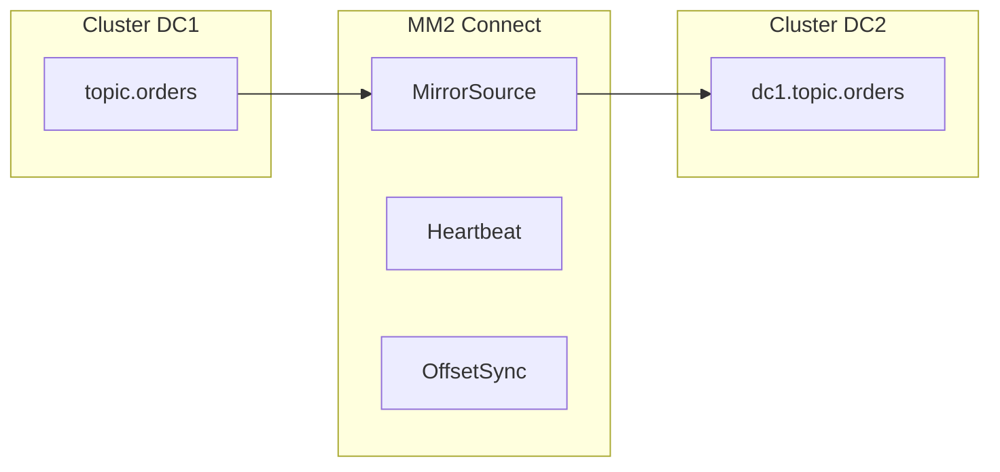

# 10. Multi-DC: MirrorMaker 2, active-active, ordering traps

## Введение: «два региона, один product catalog»

EU и US кластеры Kafka. Product team хочет **active-active**: пишут локально, читают глобально. Через неделю — **дубликаты**, **переставленный порядок** версий SKU, conflict resolution в БД. Multi-DC Kafka — не «включить репликацию», а **продуктовая модель** + **MM2**.

## Что вы узнаете

- **MirrorMaker 2** (MM2): topology, flows, offset sync.
- **Active-passive** vs **active-active**.
- Потеря **глобального порядка**, **circular replication**.
- **Heartbeats** и **offset translation** для failover consumer.
- Альтернatives: Cluster Linking (Confluent), MSK Replicator.

---

## Зачем отдельный кластер на регион

| Причина | Комментарий |
|---------|-------------|
| Latency produce | писать в локальный DC |
| Regulatory | данные не покидают регион |
| Blast radius | падение AZ не убивает всех |
| DR | второй кластер warm |

**Между кластерами нет общего partition log** — только асинхронная репликация.

---

## MirrorMaker 2 architecture

MM2 = Kafka Connect **source/sink** + internal MM2 framework.

| Поток | Назначение |
|-------|------------|
| `MirrorSourceConnector` | копирует records в `alias.topic` |
| `MirrorCheckpointConnector` | sync consumer offsets |
| `MirrorHeartbeatConnector` | lag monitoring, failover hints |

**Topic naming:** `sourceCluster.topic` — избегайте коллизий имён.

---

## Active-passive (DR)

- Primary DC принимает **write**.
- Secondary — read-only replica через MM2.
- Failover: promote secondary, переключить DNS / bootstrap, **consumer offset** через synced offsets.

**RPO** = lag репликации. **RTO** = runbook + автоматизация.

---

## Active-active

Два направления MM2:

- `DC1 → DC2` и `DC2 → DC1`.
- Риск **infinite loop** — MM2 filters `heartbeats` и `replication flows`.

**Проблема порядка:** события одного `productId` в DC1 и DC2 — **разный порядок** в целевых топиках.

**Решения на уровне приложения:**

- **version** / **vector clock** в payload;
- **last-write-wins** с осторожностью;
- **single writer per entity** (shard by region);
- **CRDT** для редких доменов.

---

## Offset translation

Consumer в DC2 читает `dc1.orders`. При failover на DC1 нужен **mapping offset** — MM2 `OffsetSync` topic хранит пары (group, partition, offset).

На интервью: «consumer failover между кластерами — нетривиально, нужен tooling».

---

## Конфликт с compaction

Compacted topic с MM2 — **tombstones** и порядок compaction могут отличаться. Тестируйте на staging.

---

## Confluent Cluster Linking / MSK

| Решение | Особенность |
|---------|-------------|
| Cluster Linking | managed, bi-directional, policy |
| MSK Replicator | managed MM2-like |
| Self MM2 | гибкость, вы ops Connect |

---

## Checklist design review

- [ ] Кто **источник правды** для entity?
- [ ] Нужен ли **глобальный порядок** (скорее нет)?
- [ ] Schema Registry **per DC** или central?
- [ ] **ACL** и TLS между DC
- [ ] Monitoring **replication latency**

---

## На собеседовании

**Вопрос:** «Сделайте Kafka stretch cluster на два региона» — **красный флаг**: latency FSYNC, не рекомендуется единый кластер на два DC. Правильно: **два кластера + MM2**.

---

## Резюме

Multi-DC = **асинхронная копия** + прикладная идемпотентность. MM2 — стандарт OSS. Active-active требует **conflict strategy**.

**Дальше:** [11-managed-kafka](11-managed-kafka.md).
