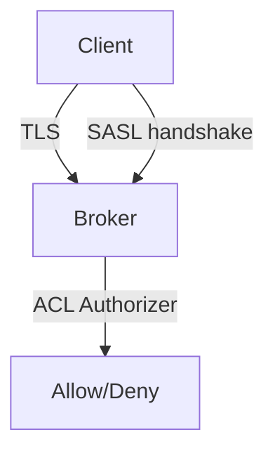

# 13. Security advanced: SASL, mTLS, ACL, audit

## Введение: «тестовый producer попал в prod topic payments»

Один **shared API key** на все сервисы, ACL не настроены, plaintext 9092 в staging «временно». Pen-test находит **produce** в `payments.settled`. Advanced security = **defense in depth**: transport, authN, authZ, audit.

## Что вы узнаете

- **Listeners** и `security.protocol.map`.
- **SASL** (SCRAM, OAUTHBEARER) и **mTLS**.
- **ACL**: principal, operation, resource, deny.
- **Super users** и least privilege.
- Audit logs (authorizer).

**Лаба:** [14-lab-acl-deny](14-lab-acl-deny.md).

---

## Слои



| Слой | Механизм |
|------|----------|
| Wire | SSL/TLS |
| Identity | SASL or mutual TLS CN |
| Authorization | Kafka ACL or RBAC (Confluent) |
| Audit | authorizer logs |

---

## Listeners (пример)

```properties
listeners=SASL_SSL://0.0.0.0:9093,INTERNAL://0.0.0.0:9092
listener.security.protocol.map=SASL_SSL:SASL_SSL,INTERNAL:PLAINTEXT
advertised.listeners=SASL_SSL://broker1.example.com:9093
sasl.enabled.mechanisms=SCRAM-SHA-512
ssl.client.auth=required
```

**INTERNAL** plaintext — только если сеть **изолирована** (mesh mTLS sidecar pattern).

---

## SASL/SCRAM

- Users в `kafka-configs.sh --alter --add-config SCRAM-SHA-512=...`.
- Пароли в **Vault**, rotation.
- MSK: **IAM** auth для Java clients без SCRAM password в app.

---

## mTLS

- Client cert CN = **Kafka principal** `User:CN=payments-producer`.
- CA rotation plan.
- Тяжелее ops, сильнее identity than SCRAM alone.

---

## ACL model

Resource: **Topic**, **Group**, **Cluster**, **TransactionalId**.

Operations: **Read**, **Write**, **Create**, **Describe**, **Delete**, **Alter**, …

```text
Principal: User:payments-svc
Operation: Write
Resource: Topic:payments.events
Host: *
```

**Deny** beats allow (explicit deny для break-glass).

**Default in KRaft:** `allow.everyone.if.no.acl.found=false` (закрытый кластер).

---

## Super users

```properties
super.users=User:admin;User:CN=admin
```

Обходят ACL — минимум людей, break-glass audit.

---

## RBAC (Confluent)

| OSS ACL | Confluent RBAC |
|---------|----------------|
| per resource Kafka ACL | Role bindings, SR, Connect |
| kafka-acls.sh | Confluent IAM |

На интервью в Confluent shop — упомяните RBAC.

---

## Audit

`authorizer.logger` → SIEM. Ищите **Denied** spikes после deploy.

---

## Client checklist

- [ ] Отдельный principal на сервис
- [ ] Только нужные topics (prefix)
- [ ] `acks=all` не заменяет ACL
- [ ] Registry ACL отдельно

---

## Резюме

Prod Kafka: **TLS + SASL/mTLS + ACL deny-by-default + audit**. Учебный `deploy/kafka` — PLAINTEXT; лаба 14 — концепт ACL на single node если authorizer включён, иначе tabletop.

**Дальше:** [14-lab-acl-deny](14-lab-acl-deny.md).
