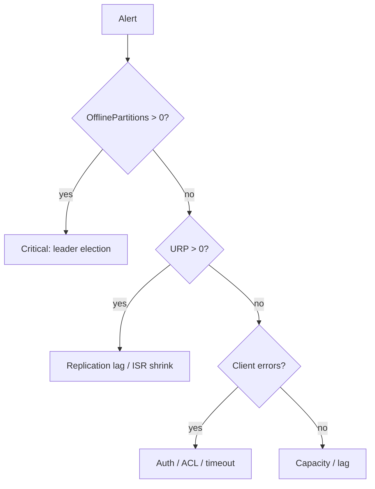

# 15. Troubleshooting: URP, offline partitions, controller, disk

## Введение: «алерт UnderReplicatedPartitions = 47»

PagerDuty в 03:00. Grafana: **URP**, **OfflinePartitionsCount** 0, но **RequestHandlerAvgIdlePercent** низкий. Без дерева решений легко **перезапустить всё** и потерять время. Эта глава — runbook mindset для senior / on-call interview.

## Что вы узнаете

- **Under-replicated partition (URP)** — причины и лечение.
- **Offline partition** — нет leader.
- **Controller** issues.
- **Disk**, **network**, **GC**.
- **Consumer** vs **broker** проблемы (разделение).

**Лаба:** [16-lab-urp-recovery](16-lab-urp-recovery.md).

---

## Дерево triage



---

## Under-replicated partitions

**Определение:** follower не в ISR или отстаёт beyond `replica.lag.time.max.ms`.

| Причина | Действие |
|---------|----------|
| Broker down | restore broker, check logs |
| Slow disk on follower | replace disk, move leader |
| Network partition | fix switch/AZ, rack awareness |
| One message huge | increase limits or fix producer |
| Reassignment in progress | wait, monitor `kafka-reassign-partitions` |

Команды:

```bash
kafka-topics.sh --describe --under-replicated-partitions
kafka-topics.sh --describe --unavailable-partitions
```

---

## Offline partitions

Нет **active leader** — producers/consumers fail.

| Причина | Действие |
|---------|----------|
| Все replicas offline | поднять брокеры с log.dirs |
| Unclean election disabled + lost ISR | **data loss risk** — executive decision |
| ZooKeeper session (legacy) | fix ZK first |

**Никогда** не включайте `unclean.leader.election.enable` без понимания потери данных.

---

## Controller problems

- Flapping controller → metadata instability.
- Симптом: constant leader movement.
- Check: controller logs, ZK latency (legacy), KRaft quorum health.

```bash
kafka-metadata.sh --snapshot ...   # KRaft advanced
kafka-cluster.sh describe
```

---

## Disk full

1. Expand volume или добавить `log.dirs`.
2. Уменьшить retention **временно** (topic config).
3. Delete topics (если policy allows).
4. **Log segment** stuck — check compaction.

---

## Broker overload

| Метрика | Интерпретация |
|---------|----------------|
| Request queue time | need more threads / brokers |
| Network processor idle low | too many connections |
| Produce latency p99 | acks=all + slow followers |

---

## Not broker: consumer lag

- Scale consumers ≤ partitions.
- Optimize processing.
- **Rebalance storm** — static membership, cooperative assignor.

См. [`kafka-basic: failures`](../kafka-basic/14-failures.md).

---

## Log analysis snippets

Искать в broker log:

- `ERROR Error while reading or writing to ...`
- `WARN [ReplicaFetcher ...]`
- `INFO [Controller ...]`

---

## Post-incident

- Timeline, blast radius.
- **min.insync.replicas** adequacy.
- Runbook update: [16-lab-urp-recovery](16-lab-urp-recovery.md).

---

## Резюме

URP — чаще **capacity/replication**, offline — **leader crisis**. Разделяйте broker vs client. Документируйте unclean election policy заранее.

**Дальше:** [16-lab-urp-recovery](16-lab-urp-recovery.md).
