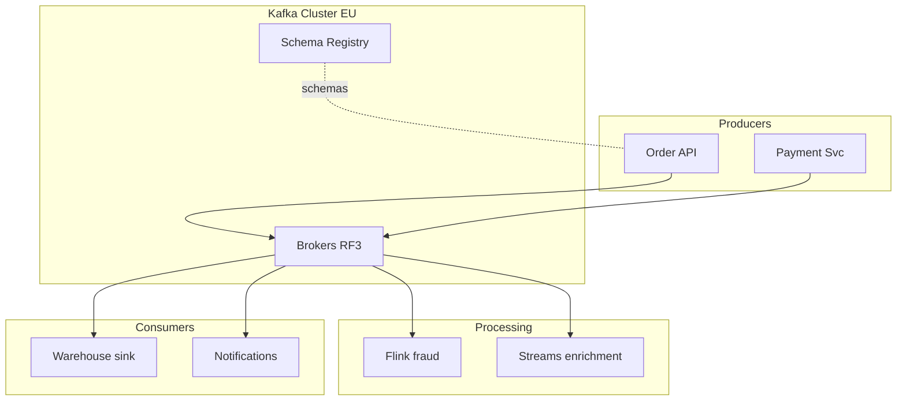

# 19. System design: event backbone на собеседовании

## Введение

Задача уровня senior: **«Спроектируйте платформу событий для e-commerce 100k orders/day, пики x10»**. Интервьюер оценивает не «установил Kafka», а **trade-offs**, **failure modes**, **evolution**.

## Framework ответа (45 мин)

1. **Requirements** (5 мин) — functional, NFR, constraints.
2. **Estimates** (5 мин) — RPS, payload, retention storage.
3. **API & data model** (5 мин) — topics, keys, schemas.
4. **High-level** (10 мин) — diagram producers, cluster, consumers.
5. **Deep dives** (15 мин) — ordering, DR, security, ops.
6. **Bottlenecks** (5 мин) — hot keys, ops burden.

---

## Clarifying questions (шаблон)

- Сколько **downstream** команд и SLAs?
- **Ordering** per order / per customer / none?
- **Retention** legal vs technical?
- **Multi-region** write или read replica?
- **Cloud** и managed vs self?
- Допустимы ли **duplicate** events?

---

## Back-of-envelope

Пример:

| Параметр | Значение |
|----------|----------|
| Orders/day | 100k |
| Events per order | 5 |
| Events/day | 500k |
| Avg RPS | ~6 |
| Peak x10 | ~60 RPS |
| Avg payload | 2 KB |
| Ingress peak | ~120 KB/s (легко для Kafka) |

Даже ×1000 для hypergrowth — Kafka часто не первый bottleneck; **consumers** и **DB** — да.

**Storage (rough):**

```text
500k events × 2 KB × 30 days × RF3 ≈ 90 GB/day raw × retention ...
```

Уточняйте compression (zstd ~3-5×).

---

## Topic design

| Topic | Key | Partitions | Retention |
|-------|-----|------------|-----------|
| `orders.events` | orderId | 24–48 | 14d |
| `payments.events` | paymentId | 24 | 90d (compliance) |
| `catalog.changes` | productId | 12 | compacted |

**Не** один гигантский topic «всё» — разные retention и ACL.

---

## Reference architecture



---

## Non-functional

| NFR | Решение |
|-----|---------|
| Durability | `acks=all`, `min.insync.replicas=2`, RF=3 |
| Availability | Multi-AZ brokers, rack awareness |
| Latency p99 produce | batch.size, linger.ms tuning |
| Security | mTLS + ACL per service |
| Observability | lag, URP, bytes in/out |

---

## Multi-region (если спросили)

Active-passive: primary EU, MM2 → EU-DR. **Не** dual-write без conflict model ([10](10-multi-dc.md)).

---

## Anti-patterns (назовите сами)

- Один consumer group на всё.
- JSON без schema в prod.
- RF=1 «пока dev» в prod.
- Giant messages с PDF внутри.
- «Мы потом сделаем idempotency».

---

## Evolution

- Phase 1: single cluster, Schema Registry.
- Phase 2: Connect to DWH.
- Phase 3: tiered storage / second region.
- Phase 4: governance (data mesh contracts).

---

## Связь с курсами

- Deploy: [`deploy/kafka`](../../deploy/kafka/README.md)
- K8s: [`kuber-intermediate: StatefulSet`](../kuber-intermediate/01-statefulset.md)
- Poison/DLQ: [21](21-poison-dlq-replay.md)

**Дальше:** [20-lab-system-design](20-lab-system-design.md).
