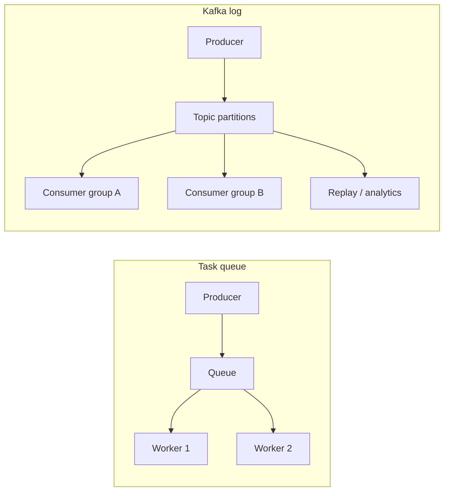

# 01. Зачем Kafka: лог, очередь и база

## Введение: «очередь переполнена», а заказы теряются

Микросервис **Checkout** кладёт заказ в RabbitMQ, **Billing** списывает деньги, **Warehouse** резервирует склад. В пике Black Friday очередь растёт, сообщения **удаляются по TTL**, а аналитика хочет пересчитать выручку за вчера — но истории уже нет. Другая команда ставит **PostgreSQL** как «шину»: таблица `outbox`, три сервиса читают одни и те же строки — блокировки, миграции, нагрузка на OLTP.

**Apache Kafka** — не «ещё одна очередь». Это **распределённый commit log**: события **дописываются** в topic и **хранятся** (по политике retention). Много consumer-ов читают **независимо**, с разной скоростью, с разных offset. Эта глава — ментальная модель до broker и partition.

## Что вы узнаете

- Чем **event log** отличается от **task queue** и от **OLTP БД**.
- Когда Kafka уместна, а когда — RabbitMQ, SQS или Postgres.
- Базовые термины: **event**, **broker**, **topic**, **consumer group**.
- Формулировки для **собеседования** (interview).

## Три модели хранения сообщений

| Модель | Метафора | Кто читает | История | Типичный кейс |
|--------|----------|------------|---------|----------------|
| **Очередь задач** | Ящик входящих: взял — исчезло для других | Один worker за сообщение | Обычно нет (ACK + delete) | Фоновая job, email |
| **Pub/Sub (fan-out)** | Газета: все подписчики видят выпуск | Много подписчиков на **одно** сообщение | Зависит от брокера | Уведомления, websockets |
| **Commit log (Kafka)** | Лента новостей с закладками | Много **независимых** читателей, каждый со своим offset | Да, по retention | Event sourcing, стриминг, интеграция |

Kafka ближе к **ленте с закладками**, чем к почтовому ящику с одним получателем.



## Очередь vs лог — на примере заказа

**Очередь (RabbitMQ, SQS):**

- Сообщение `order.created` обработал **Billing** → для очереди задача выполнена (ACK).
- **Analytics**, подключившийся позже, **не увидит** это сообщение, если не было отдельной копии.

**Kafka:**

- Событие **append** в topic `orders.events` с offset, например, `42`.
- **Billing** (consumer group `billing`) читает и коммитит offset.
- **Analytics** (group `analytics`) читает **с начала** или с нужного offset — **та же** запись в логе.
- **Warehouse** может отставать на часы — лог ждёт (пока не истечёт retention).

## Почему не «просто база данных»

PostgreSQL отлично хранит **текущее состояние** (`orders` WHERE id=…). Kafka хранит **поток изменений** (что произошло и когда). Смешивать роли опасно:

| | OLTP (Postgres) | Kafka |
|---|-----------------|-------|
| Запрос | `SELECT` по ключу | чтение **потока** по partition |
| Обновление | `UPDATE` строки | **только append** (иммутабельный лог) |
| Транзакции | ACID на строке | idempotent consumer + exactly-once — отдельная тема |
| Объём истории | дорого держать годы | сегменты на диске, retention |

На практике: **Kafka — транспорт и буфер событий**, **БД — источник правды** для чтения по id.

## Ключевые свойства Kafka (упрощённо)

- **Масштабирование записи:** topic делится на **partitions** — параллельные writers/readers.
- **Упорядочивание:** внутри **одной partition** порядок гарантирован; между partition — нет.
- **Долгое хранение:** дни/недели/годы (политика **retention**).
- **Consumer groups:** горизонтальное масштабирование чтения; одна partition — один consumer в группе.

Подробно — в [02. Архитектура](02-architecture.md).

## На стенде: первое касание

Поднимите [`deploy/kafka`](../../deploy/kafka/README.md):

```bash
cd deploy/kafka
docker compose up -d
docker compose ps
```

С хоста (если установлен **kcat**):

```bash
kcat -b localhost:9094 -L
```

Внутри контейнера:

```bash
docker exec mock-kafka /opt/kafka/bin/kafka-topics.sh \
  --bootstrap-server localhost:9092 --list
```

Пустой список на свежем стенде — норма. Topics появятся в лабах.

## Типичные ошибки

| Ошибка мышления | Почему плохо | Как правильно |
|-----------------|--------------|---------------|
| «Kafka = очередь, одно сообщение — один раз» | путают с competing consumers в queue | в группе partition назначается одному consumer; **другая группа** читает снова |
| «Положим всё в Kafka вместо БД» | нет удобных ad-hoc запросов | события в Kafka, **состояние** в БД/кэше |
| «Чем больше partition, тем лучше» | overhead, пустые consumer | столько partition, сколько нужно параллелизма |
| «Удалили consumer — сообщения пропали» | путают с очередью | данные в topic до **retention** |

## В продакшене

Kafka — **центральная шина** в event-driven архитектурах: заказы, платежи, логи приложений, CDC из Debezium. Рядом почти всегда: **Schema Registry**, **Kafka Connect**, мониторинг **lag**, алерты на **under-replicated partitions** (intermediate/advanced).

Соседние системы не исчезают: **SQS** для простых fan-out в AWS, **RabbitMQ** для routing и RPC-стиля ([rabbitmq-basic](../rabbitmq-basic/README.md)), **Redis Streams** для лёгких кейсов — подробнее в [redis-basic](../redis-basic/README.md) и сравнении [redis-basic/16](../redis-basic/16-vs-memcached-kafka.md).

## Заметки для собеседования

- **Kafka — distributed commit log**, не message queue в классическом смысле.
- **Consumer group** = масштабирование чтения + балансировка partition.
- **Offset** = позиция читателя в partition.
- **At-least-once** по умолчанию при commit после обработки; **exactly-once** — транзакции/producer id (intermediate).
- Сравнение с RabbitMQ/SQS — [18. Kafka vs очереди](18-vs-queues.md).

## Резюме

Kafka решает задачу **долгоживущего потока событий** с множеством подписчиков и replay. Очередь — **доставить задачу одному исполнителю**. БД — **хранить актуальное состояние**. Выбор инструмента начинается с вопроса: нужна ли **история** и **независимое** чтение несколькими системами?

## Чек-лист

- Чем лог отличается от очереди с ACK?
- Зачем analytics читать тот же topic, что и billing?
- Почему Kafka не заменяет PostgreSQL для `SELECT by id`?
- Что такое consumer group одной фразой?

Следующий урок: [02. Архитектура](02-architecture.md).
