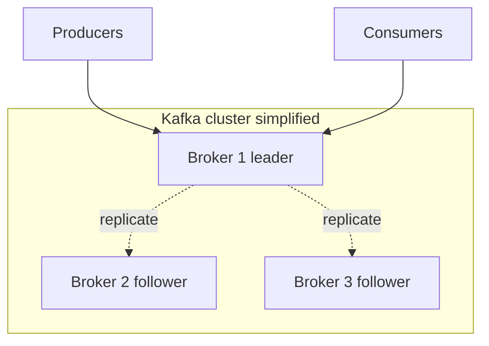

# 02. Архитектура: broker, topic, partition, offset

## Введение: «сообщения пришли не по порядку»

Два события по одному заказу: `order.created`, затем `order.paid`. **Inventory** видит оплату раньше создания — баг в коде? Не всегда. Если события попали в **разные partition**, глобального порядка нет. Если оба в **одной partition** с одним **key** (`orderId`) — порядок сохраняется. Архитектура Kafka = понимание **где** хранится запись и **кто** за неё отвечает.

## Что вы узнаете

- Роли **broker**, **controller** (KRaft), **topic**, **partition**, **replica**.
- Что такое **offset**, **leader**, **ISR** (preview).
- Как **key** влияет на partition.
- Как читать вывод `kafka-topics.sh --describe`.

## Broker и кластер

**Broker** — процесс Kafka, принимающий produce/consume и хранящий данные на диске. В учебном стенде [`deploy/kafka`](../../deploy/kafka/README.md) — **один** брокер `mock-kafka` (режим **KRaft**, без ZooKeeper).

С хоста: `localhost:9094`. Внутри Docker-сети: `kafka:9092`.

В production — **несколько** брокеров; отказ одного не должен терять данные при **replication factor** > 1 (курс intermediate).



## Topic и partition

**Topic** — именованный поток записей (как «таблица» лога).

**Partition** — упорядоченная неизменяемая последовательность записей. Topic = **набор partition**.

| Понятие | Аналогия |
|---------|----------|
| Topic | Книга |
| Partition | Глава (порядок внутри главы) |
| Offset | Номер абзаца в главе (0, 1, 2, …) |
| Key | Закладка «все абзацы про заказ X — в одной главе» |

Запись в topic всегда попадает в **одну** partition (по key или round-robin).

## Offset

**Offset** — монотонный id записи **внутри partition** (не глобальный по topic).

Consumer запоминает offset в **`__consumer_offsets`** (внутренний topic) при **commit**.

- `earliest` — читать с начала лога (пока не удалён retention).
- `latest` — только новые записи после подписки.

## Leader и реплики (preview)

У каждой partition в кластере есть **leader** — брокер, куда пишут и откуда читают по умолчанию.

**Follower**-реплики копируют данные. Множество синхронных реплик — **ISR** (in-sync replicas). Если leader падает — выбирается новый из ISR.

На **одноброкерном** стенде RF=1: leader и единственная копия на одном узле — для обучения достаточно, для prod — нет.

## Producer: куда попадёт запись

1. Если задан **key** → `hash(key) % numPartitions` (стабильно: один key → одна partition).
2. Если key нет → round-robin / sticky partition (зависит от версии клиента).

**Зачем key:** все события одного `orderId` — в одном порядке в одной partition.

## Consumer group

**Consumer group** — логическое имя (`group.id`). Kafka назначает каждую partition **не более чем одному** consumer в группе.

| Consumers в группе | Partitions | Поведение |
|--------------------|------------|-----------|
| 1 | 3 | один consumer читает все 3 |
| 3 | 3 | по одной partition на consumer |
| 5 | 3 | двое простаивают |

**Разные группы** читают **одни и те же** данные независимо (разные offset).

## На стенде: describe topic

```bash
docker exec mock-kafka /opt/kafka/bin/kafka-topics.sh \
  --bootstrap-server localhost:9092 \
  --create --topic arch-demo --partitions 3 --replication-factor 1

docker exec mock-kafka /opt/kafka/bin/kafka-topics.sh \
  --bootstrap-server localhost:9092 \
  --describe --topic arch-demo
```

Пример фрагмента вывода:

```text
Topic: arch-demo  PartitionCount: 3  ReplicationFactor: 1
  Topic: arch-demo  Partition: 0  Leader: 1  Replicas: 1  Isr: 1
  Topic: arch-demo  Partition: 1  Leader: 1  Replicas: 1  Isr: 1
  Topic: arch-demo  Partition: 2  Leader: 1  Replicas: 1  Isr: 1
```

`Leader: 1` — id брокера (на одном узле всегда 1).

Удалить после эксперимента:

```bash
docker exec mock-kafka /opt/kafka/bin/kafka-topics.sh \
  --bootstrap-server localhost:9092 --delete --topic arch-demo
```

## Типичные ошибки

| Симптом | Причина | Решение |
|---------|---------|---------|
| События одного заказа не по порядку | разные key или нет key | один key = `orderId` |
| Consumer «не видит» старые msg | `auto.offset.reset=latest` | `earliest` или сброс offset |
| 5 consumers, throughput не растёт | 3 partition | увеличить partition (с осторожностью) |
| NotLeaderForPartitionException | metadata устарела | retry; проверить describe |

## В продакшене

- Именование: `domain.entity.action` (`orders.events`, `payments.commands`).
- Partition count планируют **заранее** (увеличение возможно, уменьшение — нет).
- Мониторинг: **bytes in/out**, **request rate**, **offline partitions**, **URP**.
- Kafka UI / AKHQ / Confluent Control Center — карта topics и lag.

## Резюме

**Topic** логически объединяет поток; **partition** — единица параллелизма и порядка. **Offset** — позиция читателя. **Key** связывает связанные события с одной partition. **Consumer group** масштабирует чтение в пределах числа partition.

## Чек-лист

- Сколько partition у topic `orders` с 6 consumers в одной группе — сколько consumer активно читают?
- Гарантируется ли порядок между partition 0 и 1?
- Где хранится «закладка» consumer?
- Что показывает `Leader` в `--describe`?

Следующий урок: [03. Лаба: первый topic](03-lab-first-topic.md).
