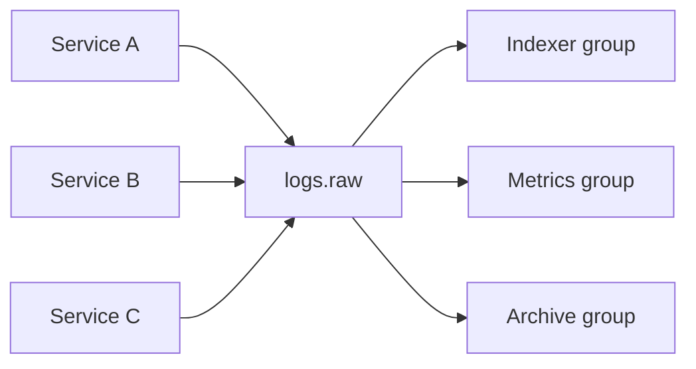

# 12. Паттерны: event notification и log aggregation

## Введение: «один сервис — десять подписчиков»

**Order** создал заказ. Нужно: списать бонус, отправить email, обновить read-model, положить строку в **data lake**. Point-to-point HTTP из Order в каждый сервис — хрупкая паутина. Kafka даёт два частых паттерна: **event notification** (слабая связь) и **log aggregation** (центральная лента логов/метрик).

## Что вы узнаете

- **Event notification** vs **event-carried state transfer**.
- **Log aggregation** и fan-out через consumer groups.
- **Pipeline** topic → обработка → другой topic (preview лабы 13).
- Антипаттерны: **большой брокер-база**, chatty topics.

## Event notification

Producer пишет **тонкое** событие:

```json
{ "eventType": "order.created", "orderId": "ord-10042" }
```

Consumer по `orderId` **сам** тянет детали из API/БД.

| Плюс | Минус |
|------|-------|
| маленькие сообщения | N+1 запросов, нагрузка на source |
| слабая связь схем | consumer зависит от доступности API |

Подходит, когда деталей много и они часто меняются.

## Event-carried state transfer

В событии — **все нужные поля** для consumer (как [`order-created.json`](examples/events/order-created.json)):

| Плюс | Минус |
|------|-------|
| автономный consumer | большие сообщения, дубли данных |
| проще replay | эволюция схемы сложнее |

Подходит для **интеграции** и **analytics** без синхронных вызовов.

## Log aggregation

Много источников → один (или иерархия) topic:

```text
app-logs-{service}  →  aggregate.raw  →  Flink/Logstash  →  OpenSearch
```

Kafka выдерживает **высокий ingress**; consumer groups масштабируют обработку.



Три группы — **три независимых** прогресса по одной ленте.

## Pipeline (stream processing lite)

```text
orders.events  →  [Enricher]  →  orders.enriched  →  [Analytics]
```

Enricher — обычный consumer + producer (или Kafka Streams / Flink в advanced).

Правила:

- **Идемпотентность** на каждом шаге.
- Отдельные topic для **сырья** и **обогащённого** потока.
- Poison message → **DLQ** `orders.events.dlq`.

## CQRS / read models (обзор)

Command side пишет в БД и **публикует** событие; query side (consumer) строит **проекцию** в OpenSearch/Redis.

Kafka — транспорт; **источник правды** часто остаётся в OLTP. Индексация логов и поиск — [opensearch-basic](../opensearch-basic/README.md) ([`deploy/opensearch`](../../deploy/opensearch/README.md)).

## На стенде: два consumer — одна лента

```bash
docker exec mock-kafka /opt/kafka/bin/kafka-topics.sh \
  --bootstrap-server localhost:9092 \
  --create --topic notifications.orders \
  --partitions 3 --replication-factor 1 --if-not-exists

echo '{"eventType":"order.created","orderId":"ord-99"}' | \
  docker exec -i mock-kafka /opt/kafka/bin/kafka-console-producer.sh \
  --bootstrap-server localhost:9092 --topic notifications.orders
```

Группы `email-sender` и `loyalty` — обе читают одно сообщение (разные `--group`).

## Типичные ошибки

| Антипаттерн | Почему плохо |
|-------------|--------------|
| Kafka как единственная БД | нет гибких запросов, сложные транзакции |
| Один topic на всё | нет изоляции retention и ACL |
| Синхронный request-reply через Kafka без correlation id | путаница с очередями |
| «Микроtopic» на каждое поле | операционный ад |
| Игнорировать порядок key | race в inventory |

## В продакшене

- **Outbox pattern**: транзакция в Postgres + запись в outbox → Connect/Debezium → Kafka.
- **Saga** / orchestration — отдельные topics для команд и ответов.
- Observability: **OpenTelemetry** → Kafka → backend.
- Границы **bounded context** = границы topics.

## Резюме

**Event notification** — сигнал; **event-carried** — данные в сообщении. **Log aggregation** — много писателей, много читателей через groups. Pipeline связывает topics; контракты и idempotency обязательны.

## Чек-лист

- Когда выбрать тонкое событие vs полный payload?
- Сколько consumer groups нужно для email + warehouse + metrics?
- Зачем отдельный topic `*.dlq`?
- Чем pipeline отличается от простого pub/sub?

Следующий урок: [13. Лаба: mini pipeline](13-lab-pipeline.md).
