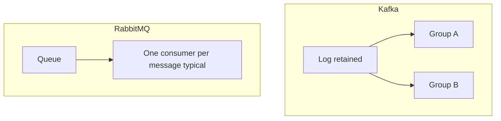

# 18. Kafka vs RabbitMQ vs SQS (собеседование)

> **Полный трек:** [messaging-deep](../messaging-deep/README.md) — Redis Streams, EventBridge, outbox, DLQ, system design.

## Введение: «почему не Rabbit, он же проще?»

На system design interview просят выбрать **брокер** для заказов, уведомлений или ETL. Ответ «везде Kafka» — провал. Ответ «Rabbit проще» без контекста — тоже. Нужна **матрица trade-offs** под сценарий: task queue, fan-out, replay, облако AWS.

## Что вы узнаете

- Сравнение **модели данных** и **гарантий доставки**.
- Когда **RabbitMQ**, когда **SQS**, когда **Kafka**.
- Типовые вопросы interview и формулировки ответов.

## Сводная таблица

| Критерий | **Apache Kafka** | **RabbitMQ** | **Amazon SQS** |
|----------|------------------|--------------|----------------|
| Модель | Commit **log** | **Queue** + exchanges | Managed **queue** |
| История / replay | да (retention) | обычно нет | нет (14 дней max в FIFO/std) |
| Много подписчиков на одно событие | да (разные groups) | fan-out через exchanges | несколько consumers **делят** очередь |
| Порядок | в partition | в одной очереди | FIFO queue — да |
| Масштаб throughput | очень высокий | средний/высокий | высокий (managed) |
| Операции | свой кластер | свой кластер | serverless AWS |
| Семантика | at-least-once (+ EOS) | ack + nack, DLX | at-least-once, visibility timeout |
| Типичный кейс | event streaming, CDC | задачи, RPC-style, routing | decouple в AWS, Lambda |

## Kafka — когда да

- Нужен **replay** и **несколько** независимых consumer (billing + analytics + search).
- Высокий **объём** событий, хранение **дней/недель**.
- **Stream processing** (Flink, Streams).
- **Log aggregation** (микросервисы → центральная лента).

## Kafka — когда нет

- Простая **очередь задач** с удалением после обработки.
- Команда **без** экспертизы ops (маленький продукт) — SQS проще.
- Жёсткий **request-reply** с таймаутом на одно сообщение — Rabbit/HTTP чаще удобнее.

## RabbitMQ — когда да

- Сложный **routing** (topic/direct headers exchanges).
- **Priority queue**, TTL per message, **dead letter exchange**.
- Средний throughput, зрелая команда AMQP.
- **RPC** pattern (reply-to queue).

## RabbitMQ — когда нет

- Требуется **долгая история** для новых consumer.
- Пиковый throughput **миллионы/сек** на один logical stream без шардинга.

## Amazon SQS — когда да

- Уже **в AWS**, нужен managed, pay-per-use.
- Lambda **триггеры**, простой worker pool.
- Не нужен replay; допустима **visibility timeout** семантика.

## Amazon SQS — ограничения

- Нет «прочитай с начала месяца» для нового сервиса.
- **Standard** — best-effort ordering; **FIFO** — ограничение 300 msg/s без batching.
- Длинная обработка — продление visibility или DLQ.

## Пары для interview

**В: Kafka — message queue?**  
О: Нет, это **distributed log**; consumer хранит **offset**, сообщения не удаляются при read.

**В: Как масштабировать consumption в Kafka?**  
О: Увеличить **partition** и consumer в **одной group** (до числа partition).

**В: Kafka vs SQS для заказов в AWS?**  
О: Если нужен replay, несколько подписчиков на полную историю, интеграция с Flink — **Kafka** (MSK). Если один worker pool и простота — **SQS**.

**В: Дубликаты?**  
О: Kafka at-least-once + идемпотентный consumer; SQS — **exactly-once** не гарантируется, visibility timeout может вернуть сообщение.

## На стенде

Kafka у вас уже поднята ([`deploy/kafka`](../../deploy/kafka/README.md)). Rabbit/SQS в basic нет — достаточно **сформулировать**, какой сервис отправил бы заказ в SQS Standard vs в topic `orders.events`.

## Типичные ошибки на собеседовании

| Плохой ответ | Лучше |
|--------------|-------|
| «Kafka всегда лучше» | критерии: replay, throughput, ops |
| «SQS не масштабируется» | масштабируется; нет log semantics |
| «Rabbit не надёжен» | зависит от cluster и ack |
| Путать **partition** и **queue** | partition = shard лога |

## Связанные курсы в репозитории

- AWS очереди и события: [aws-intermediate — SQS/DLQ](../aws-intermediate/07-sqs-dlq.md), [EventBridge](../aws-intermediate/09-eventbridge.md).
- Кэш и Redis Streams: [redis-basic](../redis-basic/README.md), сравнение [redis-basic/16](../redis-basic/16-vs-memcached-kafka.md).
- Практика RabbitMQ (routing, DLX, quorum): [rabbitmq-basic](../rabbitmq-basic/README.md) → [intermediate](../rabbitmq-intermediate/README.md) ([`deploy/rabbitmq`](../../deploy/rabbitmq/README.md)).
- Следующий уровень Kafka: [kafka-intermediate](../kafka-intermediate/README.md).

## В продакшене

- **Гибрид**: Kafka как шина, SQS как адаптер к legacy worker.
- **MSK** + **SQS** в одной компании — нормально.
- **Rabbit** внутри монолита/legacy; постепенная миграция через **outbox → Kafka**.

## Резюме

**Kafka** — лог и streaming. **Rabbit** — гибкая очередь и routing. **SQS** — managed queue в AWS без replay. Выбор по **replay**, **fan-out**, **ops** и **облаку**.

## Чек-лист

- Одно предложение: чем log отличается от queue?
- Кейс для SQS в AWS?
- Кейс для Rabbit priority + DLX?
- Почему 10 consumer SQS standard делят работу, а 10 Kafka groups — нет?

Следующий урок: [19. Финальный проект](19-final-project.md).
