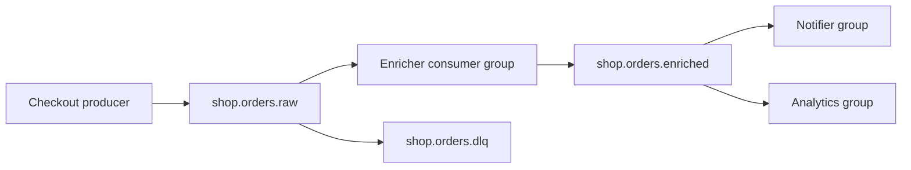

# 19. Финальный проект: мини-платформа заказов

## Введение: собрать basic в один контур

Отдельно вы умеете topic, key, group, retention, JSON и lag. **Финал** — связный сценарий «магазин»: события заказа проходят **raw → enriched → notification**, вы проверяете **partition**, **lag** и **CLI**. Без написания Java/Python — только стенд [`deploy/kafka`](../../deploy/kafka/README.md) и shell.

## Что вы узнаете (итог курса)

- Спроектировать **имена topics** и **keys**.
- Провести событие через **pipeline** из урока 13.
- Зафиксировать **операторский** чеклист и краткий отчёт.

## Архитектура



| Topic | Partition | Retention | Назначение |
|-------|-----------|-----------|------------|
| `shop.orders.raw` | 3 | 24h (`86400000` ms) | сырые события |
| `shop.orders.enriched` | 3 | 24h | обогащённые |
| `shop.orders.dlq` | 1 | 7d | битый JSON (опц.) |

## Требования

| # | Требование | Критерий |
|---|------------|----------|
| 1 | Стенд | `mock-kafka` healthy, UI :8080 |
| 2 | Topics | три topic по таблице (dlq опц.) |
| 3 | События | ≥3 заказа с разными `orderId`, key = orderId |
| 4 | Sample | минимум одно событие из [`order-created.json`](examples/events/order-created.json) |
| 5 | Enriched | поле `discountPercent` по `customerTier` (SILVER=5, GOLD=10) |
| 6 | Groups | `shop-enricher`, `shop-notifier`, `shop-analytics` — независимое чтение enriched |
| 7 | Lag | намеренно lag на `shop-analytics`, затем догнать до 0 |
| 8 | CLI | отчёт: describe topic + describe group + get-offsets |
| 9 | Retention | на raw topic задан `retention.ms=86400000` |
| 10 | Документ | `PROJECT.md` в своей копии (см. ниже) |

## Runbook — рекомендуемый порядок

### Фаза 1: инфраструктура

```bash
cd deploy/kafka
docker compose up -d
docker compose ps
bash scripts/smoke.sh
```

### Фаза 2: topics

```bash
docker exec mock-kafka /opt/kafka/bin/kafka-topics.sh \
  --bootstrap-server localhost:9092 \
  --create --topic shop.orders.raw \
  --partitions 3 --replication-factor 1 \
  --config retention.ms=86400000

docker exec mock-kafka /opt/kafka/bin/kafka-topics.sh \
  --bootstrap-server localhost:9092 \
  --create --topic shop.orders.enriched \
  --partitions 3 --replication-factor 1 \
  --config retention.ms=86400000

docker exec mock-kafka /opt/kafka/bin/kafka-topics.sh \
  --bootstrap-server localhost:9092 \
  --create --topic shop.orders.dlq \
  --partitions 1 --replication-factor 1
```

Проверка:

```bash
docker exec mock-kafka /opt/kafka/bin/kafka-topics.sh \
  --bootstrap-server localhost:9092 --describe --topic shop.orders.raw
```

### Фаза 3: produce raw

Пример (адаптируйте JSON):

```bash
printf '%s\n' 'ord-fp-1|{"eventType":"order.created","eventId":"evt-fp-1","customerTier":"SILVER","order":{"orderId":"ord-fp-1","totalCents":1000}}' | \
  docker exec -i mock-kafka /opt/kafka/bin/kafka-console-producer.sh \
  --bootstrap-server localhost:9092 --topic shop.orders.raw \
  --property parse.key=true --property key.separator='|'

printf '%s\n' 'ord-fp-2|{"eventType":"order.created","eventId":"evt-fp-2","customerTier":"GOLD","order":{"orderId":"ord-fp-2","totalCents":5000}}' | \
  docker exec -i mock-kafka /opt/kafka/bin/kafka-console-producer.sh \
  --bootstrap-server localhost:9092 --topic shop.orders.raw \
  --property parse.key=true --property key.separator='|'
```

Третье событие — из файла курса (key вручную):

```bash
printf '%s\n' "ord-10042|$(cat courses/kafka-basic/examples/events/order-created.json)" | \
  docker exec -i mock-kafka /opt/kafka/bin/kafka-console-producer.sh \
  --bootstrap-server localhost:9092 --topic shop.orders.raw \
  --property parse.key=true --property key.separator='|'
```

### Фаза 4: enricher (ручной или скрипт)

1. Consumer raw группой `shop-enricher` (`--from-beginning`, зафиксируйте partition для каждого orderId).
2. Для каждого заказа produce в `shop.orders.enriched` с тем же key и `discountPercent`.

Проверка:

```bash
docker exec mock-kafka /opt/kafka/bin/kafka-console-consumer.sh \
  --bootstrap-server localhost:9092 \
  --topic shop.orders.enriched \
  --group shop-notifier --from-beginning --timeout-ms 8000
```

### Фаза 5: lag на analytics

1. Produce ещё **20** raw-событий (цикл `seq`).
2. Прочитайте enriched группой `shop-analytics` только **5** сообщений (`--max-messages 5`).
3. `kafka-consumer-groups.sh --group shop-analytics --describe` — LAG > 0.
4. Дочитайте до LAG = 0.

### Фаза 6: DLQ (опционально)

Отправьте невалидную строку в raw, скопируйте в `shop.orders.dlq` (вручную) — имитация обработки ошибки.

### Фаза 7: отчёт PROJECT.md

Создайте у себя файл (не обязательно коммитить в repo):

```markdown
# Kafka basic — финальный проект

## Topics
- shop.orders.raw: partitions=3, retention.ms=86400000
- shop.orders.enriched: ...

## События
| orderId | tier | partition raw | discountPercent |
|---------|------|---------------|-----------------|
| ord-fp-1 | SILVER | ? | 5 |

## Lag
- shop-analytics max LAG до догона: ___
- после догона: 0

## Команды (вставьте вывод)
- kafka-topics.sh --describe
- kafka-consumer-groups.sh --describe
- kafka-get-offsets.sh
```

## Критерии сдачи (самопроверка)

- [ ] Все обязательные topics созданы и describe без ошибок
- [ ] ≥3 заказа, key = orderId, одно событие из `order-created.json`
- [ ] Enriched содержит корректный `discountPercent`
- [ ] `shop-notifier` и `shop-analytics` оба читали enriched
- [ ] Доказан lag и сброс до 0 на `shop-analytics`
- [ ] `PROJECT.md` заполнен

## Что дальше

- [`kafka-intermediate`](../kafka-intermediate/README.md) — кластер 3 брокера, RF, min ISR, Schema Registry.
- [`kafka-advanced`](../kafka-advanced/README.md) — Streams, security, tuning.

## Резюме курса

Вы прошли путь от **«зачем log»** до **операторского CLI** и мини-проекта. Держите под рукой bootstrap **9094** с хоста и **9092** в контейнере — и чеклист: **topic → produce → group → lag → retention**.
