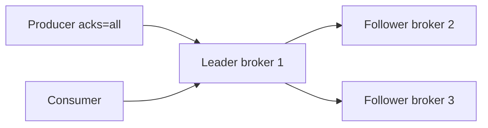

# 01. Репликация: RF, ISR, min.insync.replicas

## Введение: «leader умер — данные пропали»

Ночью упал брокер с единственной копией partition. Producer с `acks=1` успевал писать только на leader; follower не успел догнать ISR. После failover новый leader открывает **дыру** в логе — часть сообщений для consumer «исчезла». В кластере из трёх брокеров это лечится **replication factor (RF)** и политикой **in-sync replicas (ISR)** плюс **`min.insync.replicas`** на брокере.

## Что вы узнаете

- **Leader / follower**, назначение реплик.
- **ISR** — кто считается «догнавшим» leader.
- **RF**, **`min.insync.replicas`**, связь с **`acks=all`**.
- Unclean leader election (когда данные жертвуют ради доступности).
- Как читать `kafka-topics.sh --describe` на **трёхброкерном** стенде.

---

## Replication factor (RF)

**RF** — сколько брокеров хранят копию каждой partition (leader + followers).

| RF | Отказ 1 брокера без потери записей (при правильных acks) |
|----|----------------------------------------------------------|
| 1 | нет — одна копия |
| 3 | да, если ISR ≥ 2 и producer ждёт `acks=all` |

На стенде [`deploy/kafka/docker-compose.cluster.yml`](../../deploy/kafka/docker-compose.cluster.yml):

- `KAFKA_DEFAULT_REPLICATION_FACTOR: 3`
- `KAFKA_MIN_INSYNC_REPLICAS: 2`

Topic создаёте с `--replication-factor 3` (auto-create отключён).

## Leader и follower

Для каждой partition:

- **Leader** — принимает produce и отдаёт fetch consumer'ам (по умолчанию).
- **Follower** — тянет данные с leader (replication), не обслуживает клиентов, пока не станет leader.



## ISR (in-sync replicas)

**ISR** — реплики, которые не отстают от leader больше порога (`replica.lag.time.max.ms` / байты). Только реплики из ISR могут стать **новым leader** при «чистном» выборе.

Если follower выпал из ISR и снова догнал — вернётся в ISR.

**Операторский сигнал:** в `describe` видите `Isr: 1,2,3` — все три в синхроне.

## min.insync.replicas

Broker-level (и можно на topic): **минимум** реплик в ISR, при которых partition считается доступной для записи с `acks=all`.

Пример стенда: **RF=3**, **min.insync.replicas=2**.

| ISR size | acks=all produce |
|--------|------------------|
| 3 | OK |
| 2 | OK |
| 1 | **NotEnoughReplicasException** (защита от записи «в одну копию») |

Смысл: при двух живых репликах вы не согласитесь на commit, пока **хотя бы две** (leader + один follower) не подтвердят.

## acks и durability (связка)

| Producer `acks` | Поведение с RF=3, min ISR=2 |
|-----------------|-----------------------------|
| `0` | не ждёт брокер — риск потери |
| `1` | leader записал — follower может отстать |
| `all` | ждёт подтверждения от всех ISR; при min ISR=2 — минимум 2 реплики |

Для **критичных** событий (платежи, заказы): **RF=3**, **min.insync.replicas=2**, **acks=all**.

## Unclean leader election

Если **все** реплики в ISR потеряны, а «отставшие» follower ещё живы — **unclean** election может выбрать leader вне ISR → **потеря** последних записей, но кластер снова принимает write.

В production часто **`unclean.leader.election.enable=false`** — предпочитают недоступность partition потере данных.

## Внутренние topics

На cluster compose уже **RF=3** для:

- `__consumer_offsets`
- transaction log

Иначе consumer groups и транзакции не переживут отказ брокера.

## На стенде: describe

```bash
docker exec mock-kafka-1 /opt/kafka/bin/kafka-topics.sh \
  --bootstrap-server kafka-1:9092 \
  --create --topic lab.repl.demo --partitions 3 --replication-factor 3

docker exec mock-kafka-1 /opt/kafka/bin/kafka-topics.sh \
  --bootstrap-server kafka-1:9092 \
  --describe --topic lab.repl.demo
```

Ищите строки вида:

```text
Topic: lab.repl.demo  Partition: 0  Leader: 2  Replicas: 2,3,1  Isr: 2,3,1
```

Leader может быть на любом из трёх node id — это нормально.

## Типичные ошибки

| Ошибка | Причина |
|--------|---------|
| `NotEnoughReplicasException` | RF=3, но ISR=1 (упали 2 брокера) или min ISR не выполнен |
| Topic с RF=1 на cluster | создали вручную с RF=1 — нет отказоустойчивости |
| `acks=1` и «мы думали, что RF=3 защищает» | без `all` follower мог не получить запись |
| Один bootstrap | клиент должен знать **все** брокеры или достаточный список для metadata |

## В продакшене

- RF=3 для бизнес-topics; RF=1 только для явно ephemeral/dev.
- **min.insync.replicas** согласовать с **acks=all** и SLO по доступности.
- Мониторить **UnderReplicatedPartitions**, **OfflineReplicas**, размер ISR.
- Планировать rack awareness (`broker.rack`) — реплики на разные AZ.

## Резюме

Репликация — не «три копии на диске ради красоты», а контракт: **сколько копий обязаны подтвердить запись** до ответа producer. ISR и min ISR — предохранитель от записи в единственную живую копию.

## Чек-лист

- [ ] Объясняете разницу leader и follower.
- [ ] Знаете, что такое ISR и зачем `min.insync.replicas`.
- [ ] Связываете `acks=all` с RF и min ISR.
- [ ] Умеете прочитать `Replicas` и `Isr` в describe.

**Дальше:** [02. Лаба: RF=3 и отказ брокера](02-lab-replication.md).
