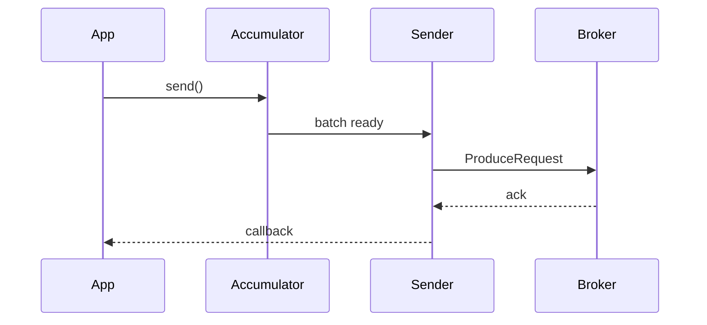

# 03. Producer tuning: batch, linger, compression, buffer

## Введение: «latency выросла вдвое после релиза»

Команда включила `compression.type=zstd` и увеличила `batch.size` — throughput вырос, но p99 latency для API «создать заказ» пополз вверх. Producer Kafka — **асинхронный конвейер**: записи буферизуются, сжимаются, отправляются пачками. Tuning — баланс **latency**, **throughput** и **durability** (см. [01-replication](01-replication.md)).

## Что вы узнаете

- **`linger.ms`**, **`batch.size`**, **`buffer.memory`**.
- **Compression** и влияние на CPU/сеть.
- **`max.in.flight.requests.per.connection`** и порядок.
- **`delivery.timeout.ms`**, **`request.timeout.ms`**.
- Напоминание: **`enable.idempotence`** (лаба 10).

---

## Путь записи

1. `KafkaProducer.send()` кладёт record в **accumulator** (per partition).
2. Sender thread формирует **batch** при достижении `batch.size` или по таймеру `linger.ms`.
3. Batch уходит на broker; ответ по `acks`.



## linger.ms и batch.size

| Параметр | Эффект |
|----------|--------|
| `linger.ms` | Подождать до N мс, чтобы наполнить batch (выше throughput, выше latency) |
| `batch.size` | Верхний размер batch в байтах на partition |

**Правило:** для интерактивных API — малый `linger.ms` (0–5 ms); для bulk/логов — 10–50 ms и крупный batch.

## buffer.memory

Общий лимит буфера producer (`32` MB по умолчанию). При переполнении `send()` блокируется или падает по `max.block.ms`.

Симптом в prod: **`RecordAccumulator is full`** — consumer не успевает, или слишком много partition в полёте.

## Compression

| Тип | CPU | Сжатие |
|-----|-----|--------|
| `lz4` | низкий | хорошее |
| `zstd` | выше | лучше |
| `gzip` | высокий | хорошее, реже для hot path |
| `snappy` | низкий | среднее |

`compression.type` на producer; broker может пересжать, если на topic задано иное — смотрите `compression.type` на topic.

## max.in.flight.requests.per.connection

Сколько неподтверждённых produce-запросов на connection **без** idempotence:

- `>1` + retry → риск **перестановки** порядка в partition при ошибках.
- С **`enable.idempotence=true`** Kafka выставляет безопасное значение (обычно ≤5 с sequence numbers).

Для **строгого порядка** в одной partition: idempotence + осторожность с retries.

## Таймауты

| Параметр | Назначение |
|----------|------------|
| `request.timeout.ms` | Ожидание ответа брокера на один запрос |
| `delivery.timeout.ms` | Верхняя граница доставки record (включая retries) |

Если `delivery.timeout.ms` слишком мал при `acks=all` и медленных follower — ложные сбои и retry.

## Durability-набор (напоминание)

```properties
acks=all
enable.idempotence=true
retries=2147483647   # по сути «до delivery.timeout»
```

На cluster с **min.insync.replicas=2** это согласованный «надёжный» профиль.

## На стенде

С хоста (kcat), если установлен:

```bash
kcat -b localhost:9091,localhost:9092,localhost:9093 -t lab.prod.tune -P \
  -X compression.codec=lz4 -X linger.ms=20
```

В Java — те же ключи в `Properties` для `KafkaProducer`.

## Типичные ошибки

| Ошибка | Причина |
|--------|---------|
| Огромный `linger.ms` на API path | искусственная задержка каждого batch |
| `acks=1` + «у нас RF=3» | ложное чувство безопасности |
| Игнор `buffer.memory` при всплеске partition | блокировки producer |
| `max.in.flight=5` без idempotence | дубли и reorder при сбоях |

## В продакшене

- Отдельные **producer profiles** для real-time и для bulk.
- Метрики: `record-send-rate`, `request-latency-avg`, `batch-size-avg`, ошибки `NOT_ENOUGH_REPLICAS`.
- Нагрузочное тестирование после смены compression.

## Резюме

Tuning producer — не «включить всё на максимум», а подобрать **batch/linger/compression** под SLO и не сломать **durability** и **порядок**.

## Чек-лист

- [ ] Объясняете роль accumulator и batch.
- [ ] Выбираете compression под нагрузку.
- [ ] Знаете риск `max.in.flight` без idempotence.

**Дальше:** [04. Лаба: producer tuning](04-lab-producer-tuning.md).
