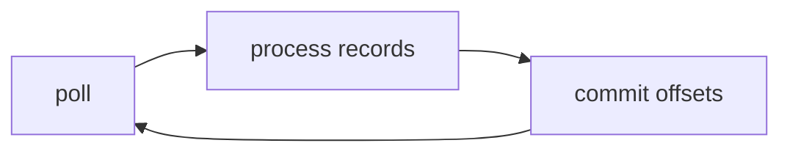

# 05. Consumer tuning: fetch, poll, session

## Введение: «consumer выкинули из группы»

Сервис обрабатывает сообщение 6 минут в одном потоке `poll()`. Брокер не получает heartbeat — **rebalance**, partition ушли соседу, тот же offset обработали **дважды**. Consumer tuning — про **сколько данных тянуть**, **как часто poll** и **когда считается, что consumer жив**.

## Что вы узнаете

- **`fetch.min.bytes`**, **`fetch.max.wait.ms`**, **`max.partition.fetch.bytes`**.
- **`max.poll.interval.ms`** vs **`session.timeout.ms`** / **`heartbeat.interval.ms`**.
- **`max.poll.records`** — размер порции на обработку.
- **Static membership** (`group.instance.id`) — обзор.
- Связь с **lag** (глава 17).

---

## Цикл consumer

1. `poll(Duration)` — batch записей + heartbeat.
2. Обработка бизнес-логики (должна укладываться в **`max.poll.interval.ms`**).
3. `commitSync` / `commitAsync` (если не auto-commit).



## Fetch-параметры

| Параметр | Смысл |
|----------|--------|
| `fetch.min.bytes` | Ждать минимум N байт (экономия round-trip) |
| `fetch.max.wait.ms` | Сколько ждать, если min bytes не набрали |
| `max.partition.fetch.bytes` | Потолок байт **на partition** за один fetch |

Большие fetch → выше throughput, больше память в consumer, дольше обработка одного poll.

## max.poll.records

Сколько записей максимум вернуть за один `poll`. Уменьшайте, если обработка одной порции не укладывается в **`max.poll.interval.ms`**.

## Таймауты группы

| Параметр | Назначение |
|----------|------------|
| `session.timeout.ms` | Нет heartbeat → consumer **мертв** |
| `heartbeat.interval.ms` | Как часто шлёт heartbeat (обычно ≤ session/3) |
| `max.poll.interval.ms` | Максимум между двумя `poll()` при обработке |

**Классика инцидента:** `max.poll.interval.ms` слишком мал для тяжёлой обработки → **rebalance loop**.

## Cooperative vs eager rebalance

- **Eager (range, round-robin старый):** отбирают **все** partition, потом раздают заново — stop-the-world.
- **Cooperative (sticky):** поэтапно отдают только нужные partition — меньше «двойной» обработки при миграции.

`partition.assignment.strategy`: `CooperativeStickyAssignor` (Kafka 2.4+).

## Auto-commit

`enable.auto.commit=true` — commit после poll, **до** успешной обработки → at-least-once с риском **потери** при crash после commit.

Production: **manual commit** после успешной обработки.

## Static membership

`group.instance.id` — при рестарте consumer «тот же» участник, меньше rebalance при деплое (если session позволяет).

## На стенде

```bash
docker exec mock-kafka-1 /opt/kafka/bin/kafka-console-consumer.sh \
  --bootstrap-server kafka-1:9092 \
  --topic lab.consumer.tune \
  --group lab-tune-g1 \
  --consumer-property fetch.min.bytes=1 \
  --consumer-property max.poll.records=100
```

## Типичные ошибки

| Ошибка | Причина |
|--------|---------|
| Долгий HTTP внутри poll loop | превышен `max.poll.interval.ms` |
| Слишком большой `max.poll.records` | OOM или timeout |
| Auto-commit + «обработали после commit» | потеря сообщений |
| Один consumer на 100 partition | не успевает poll/обработку |

## В продакшене

- Выносите тяжёлую работу в **worker pool** с pause/resume partition (advanced) или уменьшайте batch.
- Алерт на **time between polls**, **rebalance rate**.
- Отдельные consumer groups для fast/slow path.

## Резюме

Consumer tuning — уложить **обработку одной порции** между `poll()` и не задушить сеть ни слишком мелкими, ни слишком жирными fetch.

## Чек-лист

- [ ] Различаете `session.timeout.ms` и `max.poll.interval.ms`.
- [ ] Знаете роль `max.poll.records`.
- [ ] Понимаете риск auto-commit.

**Дальше:** [06. Лаба: медленный consumer](06-lab-slow-consumer.md).
