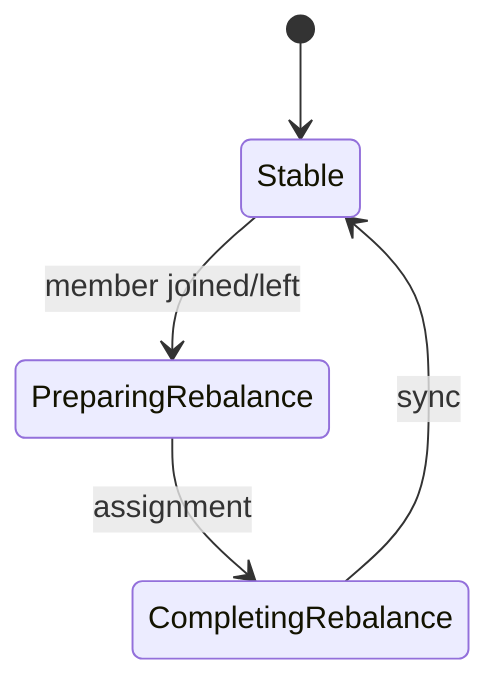

# 07. Rebalance: когда и зачем перераспределяют partition

## Введение: «деплой — и заказы обработали дважды»

Rolling deploy consumer: старый pod ещё commit'ит offset, новый уже читает ту же partition — дубли в БД. **Rebalance** — пересмотр «кто какую partition читает» в **consumer group**. Понимание триггеров и стратегий — must-have для intermediate.

## Что вы узнаете

- Триггеры rebalance.
- **Group coordinator** и `__consumer_offsets`.
- Стратегии: **range**, **round-robin**, **sticky**, **cooperative sticky**.
- **Rebalance listener** (обзор).
- Как снизить «шторм» rebalance при деплое.

---

## Когда происходит rebalance

- Новый consumer **присоединился** к группе.
- Consumer **вышел** (shutdown, crash, session timeout).
- Изменилось число **partition** topic (admin).
- Subscription изменился (другой набор topics).
- `max.poll.interval.ms` превышен.



## Фазы (упрощённо)

1. Consumer шлёт **JoinGroup**.
2. Coordinator выбирает **leader** consumer группы (не путать с partition leader).
3. Leader применяет **assignor** → partition → member.
4. Все получают **SyncGroup** с назначением.
5. Consumer **resume** fetch с committed offset.

Во время rebalance **stop the world** (eager) — fetch приостановлен.

## Стратегии назначения

| Стратегия | Поведение |
|-----------|-----------|
| Range | По topic диапазоны partition — возможен дисбаланс |
| RoundRobin | По кругу — ровнее при однородных topics |
| Sticky | Минимизирует **перемещение** partition при изменении членов |
| Cooperative Sticky | Sticky + **поэтапный** отзыв partition |

Рекомендация для новых сервисов: **`CooperativeStickyAssignor`**.

## Дубли и потери при rebalance

- **Eager:** consumer A отозван, B читает с **committed** offset — если A обработал, но не commit → **дубль**; если commit до обработки → **потеря**.
- **Cooperative:** меньше partition «в воздухе» одновременно.

**Идемпотентность** downstream обязательна при at-least-once.

## group.instance.id (static)

При рестарте с тем же `group.instance.id` coordinator может **не** считать участника новым сразу — меньше лишних rebalance (см. документацию по `group.initial.rebalance.delay.ms`).

## Rebalance listener

`ConsumerRebalanceListener`:

- `onPartitionsRevoked` — flush state, commit sync.
- `onPartitionsAssigned` — восстановить кэш, seek.

Критично для **stateful** stream processing.

## На стенде

Наблюдайте в логах приложения или Kafka UI → Consumer Groups при:

```bash
docker stop mock-kafka-2   # косвенно — network blip у consumer
# лучше: запустить/остановить второй console-consumer в одной группе
```

## Типичные ошибки

| Ошибка | Причина |
|--------|---------|
| Частый scale up/down | rebalance storm |
| Долгая обработка без pause | max.poll exceeded |
| Нет idempotency | дубли после каждого deploy |
| Разный `group.id` на «один сервис» | двойная нагрузка на topic |

## В продакшене

- **Cooperative** assignor + протестированный deploy playbook.
- Limit на partition per consumer instance.
- Метрики: `rebalance-latency-avg`, failed rebalance.

## Резюме

Rebalance — не баг, а механизм масштабирования группы; боль — **дубли** и **стоп** при плохих настройках и отсутствии идемпотентности.

## Чек-лист

- [ ] Назвали ≥3 триггера rebalance.
- [ ] Различаете eager и cooperative.
- [ ] Знаете, зачем `onPartitionsRevoked`.

**Дальше:** [08. Лаба: rebalance](08-lab-rebalance.md).
