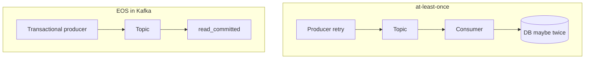

# 09. Семантики доставки: at-most-once, at-least-once, exactly-once

## Введение: «мы включили exactly-once, но деньги списали дважды»

Маркетинг любит фразу **exactly-once**, в Kafka она означает **контракт в границах Kafka** (producer → topic → consumer с EOS), а не магическое «БД + email + Kafka без дублей». Intermediate — разложить три семантики и что реально настраивается.

## Что вы узнаете

- **At-most-once**, **at-least-once**, **exactly-once** (в Kafka).
- Роль **commit offset** и **retry**.
- **Idempotent producer** (PID + sequence).
- **Transactional producer** (preview → глава 11).
- Почему consumer всё равно должен быть **идемпотентным**.

---

## At-most-once

Сообщение может **потеряться**, дублей нет.

Типично: `acks=0` или commit offset **до** обработки + auto-commit.

| Плюс | Минус |
|------|-------|
| Простота | Потеря событий недопустима для заказов |

## At-least-once

Сообщение **не теряется** при правильных acks, но возможны **дубли** (retry producer, rebalance, повторный consume).

Типично: `acks=all`, manual commit **после** обработки, идемпотентный handler (`UPSERT` по `eventId`).

## Exactly-once в Kafka (EOS)

Сочетание:

1. **Idempotent producer** — без дублей в partition при retry.
2. **Transactions** — atomic write в несколько partition/topics.
3. Consumer **`isolation.level=read_committed`** — не видит abort-транзакций.

EOS **не** отменяет дубли на стороне **внешней** БД без идемпотентности.

## Idempotent producer

`enable.idempotence=true` включает:

- **Producer ID (PID)**
- **Sequence number** per partition

Broker отбрасывает дубликаты в рамках сессии producer.

Ограничения:

- В рамках **одного** producer instance / эпохи.
- Не заменяет идемпотентность **consumer → DB**.
- Требует `acks=all`, безопасный `max.in.flight`.

## Commit и обработка

| Порядок | Семантика при сбое |
|---------|-------------------|
| commit → process | at-most-once риск потери |
| process → commit | at-least-once, дубли при crash до commit |
| process + transactional consume (Kafka Streams) | EOS в рамках приложения |

## Дедупликация в приложении

Паттерны:

- **Natural key** в БД (`orderId`, `eventId`) UNIQUE.
- Таблица **processed_events**.
- **Outbox** + один writer.

## На стенде

Idempotence в console-producer **не** включается — лаба 10 на **kafka-producer-perf-test** или описание через Java properties; в лабе — качественная демонстрация retry-дублей **без** idempotence.

## Типичные ошибки

| Ошибка | Причина |
|--------|---------|
| «EOS включили» только на producer | consumer читает uncommitted/aborted |
| Нет idempotency в API | дубли в БД при at-least-once |
| Считать dedup broker'а вечным | новый producer epoch — новая сессия |

## В продакшене

- Явный выбор семантики в **ADR** сервиса.
- Метрики дублей на стороне consumer (business KPI).
- EOS только где оправдана сложность (Streams, connect exactly-once sink).

## Резюме

**At-least-once + идемпотентный consumer** — самый частый практичный выбор; **EOS** — для строгих pipeline внутри Kafka-экосистемы.

## Чек-лист

- [ ] Объясняете три семантики без путаницы с «EOS везде».
- [ ] Знаете, что даёт idempotent producer.
- [ ] Понимаете место manual commit.

**Дальше:** [10. Лаба: idempotency](10-lab-idempotency.md).
