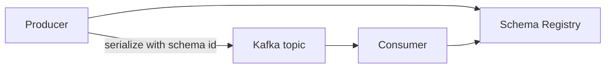

# 13. Schema Registry: контракты и эволюция

## Введение: «consumer упал на новом поле»

Команда добавила `discountCode` в JSON без согласования — старый consumer с жёсткой десериализацией падает. **Schema Registry** хранит **версии схем** (Avro/JSON Schema/Protobuf), проверяет **совместимость** при регистрации и отдаёт **schema id** в wire format.

## Что вы узнаете

- Зачем Registry поверх «просто JSON в topic».
- **Subject naming** (`topic-value`, `topic-key`).
- **Compatibility**: BACKWARD, FORWARD, FULL.
- **Schema ID** в сообщении (Confluent wire format).
- Связь с **Kafka Connect** converters.

---

## Архитектура



Registry хранит метаданные в compacted topic `_schemas` на Kafka.

## Форматы

| Формат | Типичное использование |
|--------|------------------------|
| **Avro** | Kafka + Connect, строгие контракты |
| **JSON Schema** | HTTP/API мир, валидация JSON |
| **Protobuf** | gRPC-экосистема |

На стенде Confluent Registry: [http://localhost:8081](http://localhost:8081) при [`docker-compose.extras.yml`](../../deploy/kafka/docker-compose.extras.yml).

## Subject и версии

- Subject `orders-value` — схема **value** для topic `orders`.
- Версии монотонны: v1, v2, …
- **Latest** с compatibility check при `POST /subjects/.../versions`.

## Совместимость

| Режим | Правило (упрощённо) |
|-------|---------------------|
| **BACKWARD** | новые consumer читают старые данные (добавление optional полей с default) |
| **FORWARD** | старые consumer читают новые данные |
| **FULL** | и то, и другое |
| **NONE** | только dev |

По умолчанию часто **BACKWARD** — безопасные эволюции для rolling deploy consumer.

## Wire format (Confluent)

Префикс сообщения: magic byte + **4-byte schema id** + payload.

Consumer по id запрашивает схему у Registry — не нужно вшивать JSON Schema в каждое сообщение.

## Операции REST (обзор)

```bash
curl -s http://localhost:8081/subjects
curl -s http://localhost:8081/subjects/orders-value/versions/latest
```

## Типичные ошибки

| Ошибка | Причина |
|--------|---------|
| Ломающее изменение (удалили поле) | нарушена compatibility |
| Разные subject на prod/dev | хаос версий |
| Registry недоступен | producer/consumer не стартуют (fail closed) |
| «Схема в Git достаточно» | runtime не валидирует payload |

## В продакшене

- CI: регистрация схемы + **compatibility check** (`mvn schema-registry:validate` / `curl --dry`).
- Отдельный Registry cluster / HA (не один контейнер).
- ACL на Registry (kafka-advanced).

## Резюме

Registry — **источник правды** для структуры данных в потоке; эволюция — осознанная, не «сломали прод случайно».

## Чек-лист

- [ ] Объясняете subject и версию.
- [ ] Назвали BACKWARD и зачем default у новых полей.
- [ ] Знаете роль schema id в payload.

**Дальше:** [14. Лаба: Schema Registry](14-lab-schema-registry.md).
