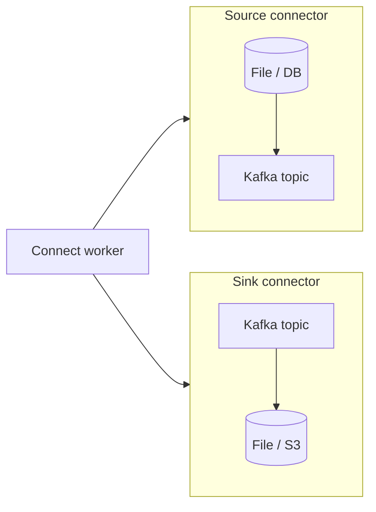

# 15. Kafka Connect: интеграция без своего consumer

## Введение: «напишем ещё один consumer на S3»

Каждая интеграция «Kafka ↔ система X» своим кодом — дублирование offset management, retry, масштабирования. **Kafka Connect** — фреймворк **connector** + **tasks**, distributed mode, REST API для конфигурации.

## Что вы узнаете

- **Source** vs **Sink** connector.
- **Worker**, **connector**, **task**.
- Внутренние topics: `_connect-configs`, `_connect-offsets`, `_connect-status`.
- **Converters** (JSON, Avro + Schema Registry).
- **SMT** (Single Message Transforms) — обзор.
- **Dead Letter Queue** — обзор.

---

## Модель



- **Source:** внешняя система → Kafka.
- **Sink:** Kafka → внешняя система.

## Worker

На стенде один worker в [`docker-compose.extras.yml`](../../deploy/kafka/docker-compose.extras.yml):

- REST: [http://localhost:8083](http://localhost:8083)
- `CONNECT_GROUP_ID=mock-connect`
- Internal topics с RF=1 (достаточно для lab).

## Конфигурация connector

POST `/connectors` с JSON:

```json
{
  "name": "file-source-orders",
  "config": {
    "connector.class": "...FileStreamSourceConnector",
    "tasks.max": "1",
    "topic": "connect.orders.raw",
    "file": "/tmp/source.txt"
  }
}
```

Примеры: [`examples/connect/file-source.json`](examples/connect/file-source.json), [`file-sink.json`](examples/connect/file-sink.json).

## Converters

| Converter | Когда |
|-----------|--------|
| `StringConverter` | текст, учебные лабы |
| `JsonConverter` | JSON без Registry |
| `AvroConverter` + `schema.registry.url` | production контракты |

## Масштабирование

`tasks.max` ≤ число partition (для sink) или логика source (file — обычно 1 task).

Несколько worker — **distributed mode** (не на учебном compose).

## SMT (кратко)

`InsertField`, `ExtractField`, `Filter` — преобразование **до** записи, без отдельного microservice.

## Ошибки и DLQ

`serrors.tolerance=all` + `errors.deadletterqueue.topic.name` — битые сообщения в DLQ topic (production).

## Типичные ошибки

| Ошибка | Причина |
|--------|---------|
| Sink tasks > partitions | лишние idle tasks |
| Нет converter для Registry | бинарный мусор в topic |
| RF=1 internal topics в prod | потеря offsets при сбое |
| Путь file внутри контейнера | file not found |

## В продакшене

- Connect **кластер** отдельно от brokers.
- Secrets через **config providers**.
- Мониторинг connector **FAILED** state в `_connect-status`.

## Резюме

Connect — стандарт для **мостов** Kafka ↔ внешний мир; ваш код — только кастомные connector при необходимости.

## Чек-лист

- [ ] Различаете source и sink.
- [ ] Знаете REST :8083 и internal topics.
- [ ] Открыли примеры JSON конфигов в `examples/connect/`.

**Дальше:** [16. Лаба: Connect](16-lab-connect.md).
