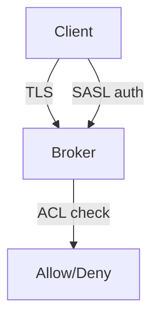

# 19. Безопасность Kafka: TLS, SASL, ACL (обзор)

## Введение: «любой в VPN пишет в production topic»

Учебный cluster — **PLAINTEXT**, без аутентификации. В production открытый broker = чтение PII и запись мусора в `payments`. Intermediate — карта механизмов и **ограничения PLAINTEXT** для лаб ACL.

## Что вы узнаете

- **Encryption in transit** (TLS).
- **Authentication**: SASL/SCRAM, mTLS, OAuth (обзор).
- **Authorization**: **ACL** (Kafka native).
- **Ограничения PLAINTEXT** на стенде.
- Связь с **Schema Registry** и **Connect** security.

---

## Слои защиты



1. **Wire encryption** — TLS между client ↔ broker ↔ broker.
2. **Authentication** — кто подключается.
3. **Authorization** — что разрешено (ACL или RBAC в Confluent).

## TLS

- Brokers: `listeners=SSL://...`, keystore/truststore.
- Clients: `security.protocol=SSL`, truststore CA.
- **Inter-broker** encryption отдельно настраивается.

На PLAINTEXT стенде TLS **не** включён — в лабе 20 только **концепт** ACL.

## SASL (кратко)

| Механизм | Сценарий |
|----------|----------|
| **SCRAM-SHA-512** | логин/пароль, K8s secrets |
| **GSSAPI (Kerberos)** | enterprise AD |
| **OAuthBearer** | SSO, cloud IAM |

`super.users` — админы, обходящие обычные ACL (осторожно).

## ACL

Ресурсы:

- **Topic**, **Group**, **Cluster**, **TransactionalId**

Операции: `Read`, `Write`, `Create`, `Describe`, `Delete`, …

Принцип: **deny by default**, минимальные права на сервисный аккаунт.

Пример (концепт):

```text
User:app-orders ALLOW Write DESCRIBE on TOPIC orders
User:app-orders ALLOW Read on GROUP app-orders-
```

## PLAINTEXT: ограничения лабы

На [`docker-compose.cluster.yml`](../../deploy/kafka/docker-compose.cluster.yml):

- Нет TLS/SASL — **ACL не enforced** так же, как в secured cluster, или команды ACL работают в «заготовке» без реального deny для анонимных клиентов в зависимости от `authorizer.class.name`.

**Лаба 20:** изучаете **синтаксис** `kafka-acls.sh` и модель прав; для реального deny нужен кластер с `StandardAuthorizer` + SASL (kafka-advanced).

## Schema Registry / Connect

- Registry: `basic.auth`, RBAC, HTTPS.
- Connect: principals для connector, ACL на topics + internal topics.

## Типичные ошибки

| Ошибка | Причина |
|--------|---------|
| ACL только на topic, не на group | consumer не стартует |
| `*` Write для приложения | lateral movement при взломе |
| PLAINTEXT в prod «внутри VPC» | insider threat, sniffing |
| Забыли ACL на `__consumer_offsets` | describe group падает |

## В продакшене

- mTLS или SASL везде; PLAINTEXT только dev.
- GitOps для ACL (Terraform `kafka_acl`).
- Ротация SCRAM, audit log.

## Резюме

Безопасность Kafka — **три слоя**; на учебном стенде вы учите **модель ACL**, в prod включаете authorizer + auth.

## Чек-лист

- [ ] Назвали TLS, SASL, ACL.
- [ ] Понимаете, почему PLAINTEXT lab ≠ prod.
- [ ] Знаете ресурсы Topic и Group для ACL.

**Дальше:** [20. Лаба: ACL](20-lab-acl.md).
