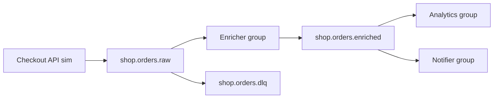

# 27. Финальный проект: платформа событий заказов (кластер)

## Введение: intermediate в одном контуре

Вы прошли репликацию, tuning, rebalance, семантики, мониторинг, операции. **Финал** — событийная платформа **заказов** на **трёхброкерном** кластере: RF=3, надёжный produce, consumer groups, lag drill, alter topic, отчёт оператора. Без обязательного Java — CLI, UI, curl (Registry/Connect — опциональный бонус).

## Что вы сдаёте

Репозиторий или папка `kafka-intermediate-project/` с **`PROJECT.md`**: архитектура, таблица topics, скриншоты/вывод CLI, runbook инцидента lag.

## Архитектура



| Topic | Partitions | RF | retention.ms | Назначение |
|-------|------------|-----|--------------|------------|
| `shop.orders.raw` | 6 | 3 | 86400000 (24h) | сырые события |
| `shop.orders.enriched` | 6 | 3 | 86400000 | обогащённые |
| `shop.orders.dlq` | 1 | 3 | 604800000 (7d) | битый JSON (опц.) |

**Keys:** `orderId` на всех записях.

## Требования

| # | Требование | Критерий |
|---|------------|----------|
| 1 | Стенд | `docker-compose.cluster.yml` up, UI :8080 |
| 2 | Topics | три topic по таблице, RF=3, созданы явно |
| 3 | Config | на `shop.orders.raw`: `min.insync.replicas=2` (topic config) |
| 4 | Produce | ≥5 заказов, `acks=all`, разные `orderId` |
| 5 | Enricher | group `shop-enricher`: tier → `discountPercent` (SILVER=5, GOLD=10) |
| 6 | Downstream | `shop-notifier` и `shop-analytics` читают enriched независимо |
| 7 | Lag drill | остановить analytics, нагрузить raw, LAG>0, затем догнать до 0 |
| 8 | Replication | describe показывает ISR=3 на здоровом кластере |
| 9 | Alter | увеличить partition `shop.orders.enriched` 6→9, задокументировать эффект |
| 10 | Hot key | один заказ с key `VIP-1` × 100 событий — skew в отчёте |
| 11 | CLI отчёт | describe topics + consumer groups + get-offsets |
| 12 | Инцидент | таблица runbook из [18-lab-lag-drill](18-lab-lag-drill.md) |
| 13 | PROJECT.md | ≤5 страниц, диаграмма, выводы |

## Runbook — рекомендуемый порядок

### Фаза 1: кластер

```bash
cd deploy/kafka
docker compose -f docker-compose.cluster.yml up -d
docker exec mock-kafka-1 /opt/kafka/bin/kafka-broker-api-versions.sh \
  --bootstrap-server kafka-1:9092
```

Bootstrap с хоста: `localhost:9091,localhost:9092,localhost:9093`.

### Фаза 2: topics

```bash
for t in shop.orders.raw shop.orders.enriched shop.orders.dlq; do
  docker exec mock-kafka-1 /opt/kafka/bin/kafka-topics.sh \
    --bootstrap-server kafka-1:9092 \
    --create --topic "$t" \
    --partitions 6 --replication-factor 3
done

docker exec mock-kafka-1 /opt/kafka/bin/kafka-topics.sh \
  --bootstrap-server kafka-1:9092 \
  --alter --topic shop.orders.dlq --partitions 1

docker exec mock-kafka-1 /opt/kafka/bin/kafka-configs.sh \
  --bootstrap-server kafka-1:9092 \
  --entity-type topics --entity-name shop.orders.raw \
  --alter --add-config retention.ms=86400000,min.insync.replicas=2
```

### Фаза 3: события raw

Пример строки (key|json):

```text
ord-1001|{"eventId":"evt-1001","eventType":"order.created","orderId":"ord-1001","customerTier":"GOLD","amount":120}
```

Отправка:

```bash
# ваш файл events.txt
docker exec -i mock-kafka-1 /opt/kafka/bin/kafka-console-producer.sh \
  --bootstrap-server kafka-1:9092 \
  --topic shop.orders.raw \
  --producer-property acks=all \
  --property parse.key=true --property key.separator='|'
```

### Фаза 4: enricher pipeline

Consumer `shop-enricher` из raw → produce enriched (как в [kafka-basic/13-lab-pipeline](../kafka-basic/13-lab-pipeline.md), с RF=3).

### Фаза 5: lag drill

1. Остановить consumer `shop-analytics`.
2. Залить burst ≥2000 сообщений в raw.
3. `kafka-consumer-groups --describe --group shop-analytics` — LAG.
4. Запустить 2–3 consumer в группе — LAG→0.

### Фаза 6: alter + hot key

- `shop.orders.enriched` partitions 6→9 ([24-lab-alter-topic](24-lab-alter-topic.md)).
- 100× produce key `VIP-1` в raw — skew ([22-lab-hot-partition](22-lab-hot-partition.md)).

### Фаза 7 (бонус): Registry + Connect

Поднять [`docker-compose.extras.yml`](../../deploy/kafka/docker-compose.extras.yml), зарегистрировать JSON Schema для `shop.orders.enriched`, FileStream source в staging topic — не обязательно для зачёта.

## Шаблон PROJECT.md

```markdown
# Kafka Intermediate — финальный проект

## Архитектура
(диаграмма mermaid или ссылка)

## Стенд
- compose: cluster
- bootstrap: localhost:9091-9093

## Topics
| topic | partitions | RF | configs |

## Группы consumer
| group | topics | lag max |

## Инцидент lag (дата учебная)
| T0 lag | действие | T1 lag |

## Hot partition
какой partition, предложения по fix

## Выводы
3–5 предложений: RF+minISR, idempotency, rebalance
```

## Критерии зачёта

- [ ] Все обязательные пункты таблицы **Требования** выполнены.
- [ ] **PROJECT.md** читается как операторский отчёт, не копипаст лаб.
- [ ] Команды воспроизводимы на `deploy/kafka` cluster.

## После курса

- [kafka-advanced](../kafka-advanced/README.md) — tiered storage, MirrorMaker, secured cluster.
- [kuber-intermediate](../kuber-intermediate/README.md) — Strimzi в практике.

Поздравляем с завершением **Kafka Intermediate**.
