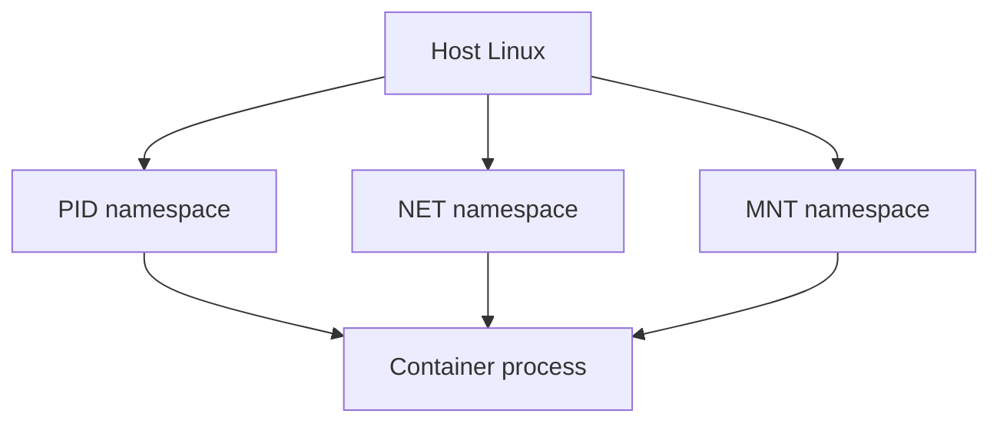

# 01. Linux namespaces

## Введение: «в контейнере свой PID 1, с хоста — другой номер»

Вы делаете `docker exec` в pod и видите `ps`: процесс nginx — **PID 1**. На ноде `ps aux | grep nginx` — тот же процесс, но **PID 18432**. Это не баг и не «два nginx» — это **PID namespace**: внутри контейнера дерево процессов начинается заново.

Kubernetes не запускает «магические» контейнеры. **kubelet** просит **container runtime** (containerd) создать процесс через **runc**, который настраивает **namespaces** и **cgroups**. Понимание namespaces — мост между «Linux admin» и «почему kubectl/debug ведёт себя так».

## Что вы узнаете

- Какие бывают **namespaces** (UTS, IPC, PID, NET, MOUNT, USER, cgroup).
- Как смотреть namespaces в **`/proc/$pid/ns/`**.
- Зачем в контейнере свой **PID 1** и init.
- Связь с Docker/Kubernetes и лабой **unshare**.

---

## Типы namespaces

| Namespace | Изоляция | Пример в контейнере |
|-----------|----------|---------------------|
| **pid** | дерево процессов | PID 1 = ваш entrypoint |
| **net** | интерфейсы, routing, порты | свой `eth0`, свой `127.0.0.1` |
| **mnt** | mount points | `/` контейнера ≠ `/` хоста |
| **uts** | hostname, domainname | `hostname` в pod |
| **ipc** | SysV IPC, POSIX mq | изоляция очередей |
| **user** | UID/GID mapping | root в контейнере ≠ root на хосте (user ns) |
| **cgroup** | вид на cgroup hierarchy | cgroup v2 namespace |



---

## Просмотр namespaces

Каждый процесс — набор inode в `/proc`:

```bash
ls -la /proc/self/ns/
readlink /proc/self/ns/pid
readlink /proc/self/ns/net
readlink /proc/self/ns/mnt
```

Одинаковый inode у двух PID → они в **одном** namespace. Разные inode → изоляция.

В Docker:

```bash
# на хосте
docker inspect --format '{{.State.Pid}}' CONTAINER_ID
ls -la /proc/THAT_PID/ns/
```

---

## PID namespace — почему важен PID 1

В новом PID ns первый процесс получает **PID 1**. Он должен:

- **reap** зомби-дочерние процессы (`wait`);
- корректно обрабатывать сигналы (часто нужен минимальный init: `tini`, `dumb-init`).

Если entrypoint — shell script без init, зомби могут копиться.

**С хоста** тот же процесс имеет обычный PID — вы видите «настоящую» картину на ноде.

---

## NET namespace — порты и loopback

В своём NET ns:

- `127.0.0.1:8080` в контейнере A **не** конфликтует с `127.0.0.1:8080` в контейнере B;
- `ss -tlnp` внутри показывает только **свои** сокеты;
- для доступа снаружи нужен **publish** / **Service** / CNI.

Симптом «порт занят» внутри контейнера — другой процесс **в том же** net ns.

---

## MNT и UTS

**mnt** — корень ФС контейнера (overlayfs layers). `chroot` — упрощённая модель; контейнер = mnt ns + остальное.

**uts** — `hostname` в `kubectl exec` ≠ hostname ноды.

```bash
hostname
cat /proc/sys/kernel/hostname
```

---

## USER namespace (обзор)

UID 0 внутри контейнера может мапиться на UID 100000 на хосте — **rootless** контейнеры безопаснее. Не все runtime включают user ns по умолчанию.

---

## unshare — создать namespace вручную

Превью (лаба 02):

```bash
sudo unshare --fork --pid --mount --uts /bin/bash
hostname isolated-box
ps aux | head
```

`unshare` — то, что делает runc перед `exec` вашего образа.

---

## Связь с Kubernetes

| Компонент | Роль |
|-----------|------|
| kubelet | CRI CreateContainer |
| containerd | образы, snapshot |
| runc | namespaces + cgroups + exec |
| pause pod | держит net ns для pod (общая сеть контейнеров) |

См. [kuber-basic: Docker vs containerd](../kuber-basic/02-docker-vs-containerd.md).

---

## Типичные ошибки

| Ошибка | Правда |
|--------|--------|
| «PID 1 в контейнере = главный на сервере» | только в своём pid ns |
| debug на ноде и в pod — одна картина | разные net/pid ns |
| нет init в образе | зомби, игнор SIGTERM |

---

## В продакшене

Sidecar, service mesh, `hostNetwork: true` — **ломают** изоляцию net ns намеренно. `hostPID: true` — видите процессы хоста (debug only). Понимайте, когда pod «вышел» из изоляции.

---

## Резюме

**Namespaces** — отдельные «взгляды» на PID, сеть, mount, hostname. Контейнер = процесс(ы) в наборе namespaces + cgroups. Смотрите `/proc/$pid/ns/` и сравнивайте inode.

## Чек-лист

- [ ] Какой namespace изолирует порты?
- [ ] Почему в контейнере свой PID 1?
- [ ] Где в `/proc` видны namespaces?
- [ ] Чем pause container связан с net ns pod?

Следующий урок: [02. Лаба: unshare](02-lab-unshare.md).
