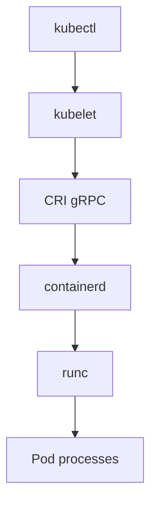

# 05. containerd и CRI

## Введение: «на ноде нет docker, но поды бегут»

Современный Kubernetes на worker-ноде часто **без dockerd**. `kubectl get nodes -o wide` показывает `containerd://1.7.x`. Образы тянет **kubelet** через **CRI** (Container Runtime Interface) → **containerd** → **runc** → namespaces + cgroups.

Путаница «я привык к docker ps» ломает отладку: на ноде смотрят **`crictl`**, не `docker`.

## Что вы узнаете

- Роли **containerd**, **runc**, **CRI**.
- Цепочка Docker CLI vs Kubernetes.
- Команды **ctr**, **crictl** (обзор).
- Где лежат образы и snapshot.
- Связь с **mockctl** / minikube.

---

## Роли компонентов



| Компонент | Роль |
|-----------|------|
| **containerd** | daemon: pull образов, snapshot, запуск контейнеров |
| **runc** | OCI runtime: `run` процесса в namespaces/cgroups |
| **CRI** | API kubelet ↔ runtime (containerd или CRI-O) |
| **dockerd** | опционально: CLI + build (не обязателен на K8s node) |

**Docker CLI** → dockerd → containerd → runc (если Docker Desktop / legacy).  
**kubelet** → CRI → containerd → runc (типичный K8s).

---

## CLI: ctr vs crictl vs docker

| Команда | Где | Назначение |
|---------|-----|------------|
| `docker` | dev machine | удобство разработчика |
| `ctr` | нода, debug | низкоуровневый containerd |
| `crictl` | **K8s worker** | обёртка над CRI, «как kubectl для runtime» |

```bash
ctr version 2>/dev/null
crictl version 2>/dev/null
crictl images
crictl ps
crictl pods
```

Конфиг crictl: `/etc/crictl.yaml` → `runtime-endpoint: unix:///run/containerd/containerd.sock`.

---

## Образы и snapshot

containerd хранит слои в **`/var/lib/containerd`** (не `/var/lib/docker`).

```bash
sudo ctr images pull docker.io/library/nginx:alpine 2>/dev/null
sudo ctr images ls | head
```

**Snapshotter** (overlayfs) — корневая ФС контейнера.

---

## OCI и runc

**OCI** (Open Container Initiative) — спецификация образа (`config.json` + layers). **runc** читает bundle и вызывает `unshare` + cgroups.

Просмотр (если установлен runc):

```bash
runc list 2>/dev/null
```

---

## Связь с mockctl

```bash
kubectl get nodes -o jsonpath='{.items[0].status.nodeInfo.containerRuntimeVersion}{"\n"}'
```

[`INSTALL.md`](../../INSTALL.md), [`mockctl`](../../mockctl/README.md) — локальный кластер использует containerd (или docker) под капотом.

---

## Типичные ошибки

| Ошибка | Правда |
|--------|--------|
| `docker ps` на worker пустой | runtime — containerd |
| образ есть в docker, pod ImagePullBackOff | другой runtime/socket |
| чистить диск через `docker system prune` на K8s node | `crictl rmi`, kubelet garbage collection |
| монтировать docker.sock в pod | root на хосте |

---

## В продакшене

- Версионируйте containerd с совместимостью kubelet.
- Мониторинг: disk `/var/lib/containerd`, image pull errors.
- **Sandbox image** (pause) — отдельный образ, не путать с app.

---

## Резюме

Kubernetes на ноде говорит с **containerd** через **CRI**. **runc** создаёт контейнер. Для отладки ноды — **crictl**, не docker. Образы — `/var/lib/containerd`.

## Чек-лист

- [ ] Чем containerd отличается от dockerd?
- [ ] Что такое CRI?
- [ ] Зачем crictl на worker node?
- [ ] Где на диске слои containerd?

Следующий урок: [06. Лаба: ctr](06-lab-ctr.md).
