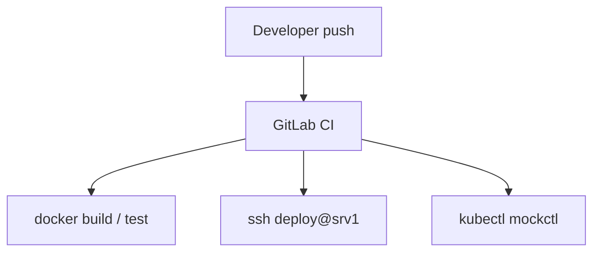

# 27. Интеграция: Linux + GitLab + mockctl

## Введение: навык «только Linux» не живёт в вакууме

Production path: **GitLab CI** собирает образ → **deploy** по SSH на VM (Linux hardening, nginx, systemd) → **kubectl/Helm** на **mockctl** кластер. Эта глава связывает **linux-advanced** с соседними курсами в один сценарий.

## Сквозной сценарий



```text
GitLab CI  --build-->  container image
       |
       +--ssh deploy-->  srv1 (systemctl reload nginx)
       |
       +--kubectl-->  mockctl cluster (Helm / manifests)
```

---

## Роли Linux по слоям

| Слой | Навык из курса |
|------|----------------|
| CI runner host | user, **docker socket** риски, limits |
| App server srv1 | nginx, systemd, **ufw**, audit, fail2ban |
| K8s worker | swap off, sysctl, **containerd**, verify-node |
| Ops | **runbook**, capacity, HANDOFF |

---

## Порядок курсов (рекомендуемый)

1. **linux-basic** → **linux-intermediate** → **linux-advanced**
2. **gitlab-basic** → **gitlab-intermediate** (CI deploy)
3. **kuber-basic** → mockctl / **kuber-intermediate**

Параллельно: **linux-security** после advanced baseline.

---

## Что уже сделано на srv1 (capstone preview)

| Компонент | Урок |
|-----------|------|
| ufw + SSH hardening | 11–12 |
| auditd sudoers | 09–10 |
| fail2ban | 13–14 |
| deploy + sudo | 26, capstone |
| runbook disk-full | 24 |
| verify-node | 07–08 |

---

## Проверка интеграции (чеклист)

- [ ] `mockctl up` / кластер Ready
- [ ] `ansible` или `ssh deploy` на srv1
- [ ] curl http://172.28.0.11/ OK
- [ ] GitLab pipeline (если настроен) — green deploy stage

---

## Типичные разрывы

| Разрыв | Симптом |
|--------|---------|
| Linux без K8s prep | NotReady nodes |
| CI root на VM | audit nightmare |
| K8s без host fw | странные timeouts |
| нет HANDOFF | bus factor |

---

## Резюме

Advanced Linux — фундамент для **VM** и **node**. CI/CD и K8s — следующие слои того же pipeline.

## Чек-лист

- [ ] Нарисуйте свой pipeline от git push до prod.
- [ ] Где в нём srv1, где mockctl?

Следующий урок: [28. Capstone](28-final-project.md).
