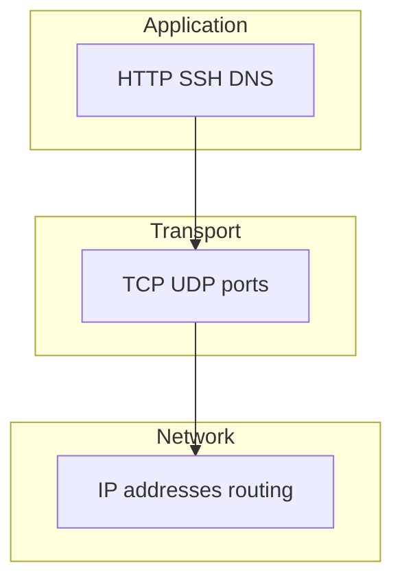

# 01. TCP/IP: модель, адреса, маршруты

## Введение: «curl висит» — это ещё не «сервер упал»

Вы открываете терминал, запускаете `curl https://api.internal.company` — и минута тишины. Паника: «прод лёг»? Не обязательно. Запрос мог застрять на **DNS**, упереться в **маршрут**, упереться в **firewall**, или дойти до хоста, где **никто не слушает порт** — и каждый случай выглядит по-разному, если знать, на каком уровне смотреть.

Kubernetes, load balancer и Security Group — это всё надстройки над тем же **TCP/IP**, что вы настраиваете на VM. Эта глава — фундамент для всего блока «Сеть» в intermediate: без неё DNS и firewall будут набором команд без смысла.

## Что вы узнаете

- Как устроены уровни **L2–L7** и какой инструмент к какому уровню относится.
- Как читать адрес **172.28.0.10/24** и таблицу маршрутов.
- Чем **TCP** отличается от **UDP** и когда это важно для диагностики.
- Как по сообщению ошибки отличить **timeout** от **connection refused**.
- Какие IP у хостов учебного стенда `deploy/linux`.

## Модель уровней — «на пальцах»

Представьте письмо: конверт с адресом (куда везти), внутри — надёжная доставка с подтверждением или «просто бросили в ящик», внутри письма — смысл (HTTP, SSH).

| Уровень | Имя | Примеры | Ваши инструменты |
|---------|-----|---------|------------------|
| L2 | Канал | Ethernet, MAC, ARP | `ip neigh`, bridge Docker |
| L3 | Сеть | IP, ICMP | `ip addr`, `ping`, маршруты |
| L4 | Транспорт | TCP, UDP, порты | `ss`, `nc` |
| L7 | Приложение | HTTP, SSH, DNS | `curl`, `dig`, `ssh` |

DevOps чаще всего живёт в **L3–L7**. L2 всплывает, когда «два контейнера в одной docker-сети, но странности с ARP» — реже, но полезно знать, что существует.



## IPv4: адрес, маска, подсеть

Запись **172.28.0.10/24** читается так:

- **172.28.0.10** — адрес **этого** интерфейса (хоста).
- **/24** — маска 255.255.255.0: первые 24 бита — номер сети, последние 8 — хосты (256 адресов в подсети).
- Хосты с тем же префиксом (172.28.0.1–172.28.0.254) для Linux — **локальная подсеть**: пакет уходит напрямую, без маршрутизатора.

В стенде [`deploy/linux`](../../deploy/linux/README.md):

| Имя | IP | Роль |
|-----|-----|------|
| lab | 172.28.0.10 | ваша «рабочая станция» |
| srv1 | 172.28.0.11 | сервер для лаб |
| srv2 | 172.28.0.12 | второй сервер |
| web | 172.28.0.20 | nginx / TLS |
| dns | 172.28.0.53 | BIND, зона lab.local |

Посмотреть на **lab**:

```bash
ip -4 -br addr
ip route show
```

`-br` — краткий вывод: интерфейс, IP, up/down. `ip route` — куда ядро отправит пакет для каждого назначения.

## Маршрутизация: куда уходит пакет

```bash
ip route get 172.28.0.11
ip route get 8.8.8.8
```

Первая команда покажет: до соседа в той же /24 — `dev eth0` (или аналог), **без** `via` (шлюза). Вторая — до «интернета» — через **default gateway** (`via 172.28.0.1` или как настроил Docker).

Если `ip route` пустой или нет default — внешние адреса недоступны; локальная сеть 172.28.0.0/24 может работать.

## TCP и UDP

| | TCP | UDP |
|---|-----|-----|
| Соединение | есть (handshake) | нет |
| Надёжность | повторы, порядок | нет гарантий |
| Типичные сервисы | HTTP, SSH, Postgres | DNS, DHCP, VoIP |
| Диагностика | `ss -tlnp` | `ss -ulnp` |

### TCP handshake — три шага (почему это «соединение»)

Когда вы `curl http://172.28.0.11/`, происходит упрощённо:

1. **SYN** — клиент: «хочу соединение на порт 80».
2. **SYN-ACK** — сервер: «согласен».
3. **ACK** — клиент: «ок, начинаем».

Только после этого уходит HTTP `GET /`. Если на порту 80 **никто не слушает**, сервер отвечает **RST** — в curl это **Connection refused**.

### Connection refused vs timed out — разбираем по-человечески

Это **две разные истории**. Запомните таблицу — она сэкономит часы on-call.

| Сообщение | Пакет дошёл до хоста? | Порт 80 слушается? | Типичные причины |
|-----------|------------------------|---------------------|------------------|
| **Connection refused** | да | **нет** (или REJECT) | nginx не запущен, слушает другой порт, только 127.0.0.1 |
| **Connection timed out** | часто **нет** или DROP | неизвестно | firewall DROP, неверный IP, хост down, маршрут |
| **No route to host** | нет маршрута | — | `ip route`, опечатка в IP |
| **Could not resolve host** | — (ещё не сеть) | — | DNS, см. урок 03 |

**Практический пример на стенде:**

```bash
# 1. Слушает ли кто-то 80 на srv1?
ssh course@172.28.0.11 'ss -tlnp | grep :80'
# пусто → curl даст refused, когда nginx нет

# 2. Установите nginx
ssh course@172.28.0.11 'sudo apt install -y nginx && sudo systemctl start nginx'

# 3. Снова
curl -v http://172.28.0.11/ 2>&1 | head -20
# Connected to ... → HTTP/1.1 200
```

**Refused** — чините **сервис** (`systemctl`, `ss`). **Timeout** — чините **путь** (ping, route, ufw, SG).

### UDP — «отправил и забыл»

DNS-запрос: один UDP-пакет на порт 53, ответ может прийти или нет. Нет «соединения» — поэтому `nc -u` сложнее отлаживать. Для DNS используйте **dig** с таймаутом.

```bash
dig @172.28.0.53 srv1.lab.local +time=2 +tries=1
```

## ICMP и ping

```bash
ping -c3 172.28.0.11
```

Ping проверяет **доступность на L3** (ICMP Echo). Это **не** проверка порта 443. Firewall может блокировать ICMP, а SSH на 22 работать — и наоборот.

## Порты и сокеты

Сервис «слушает» **IP:port** — например `0.0.0.0:80` (все интерфейсы) или `127.0.0.1:8080` (только localhost).

```bash
ss -tlnp
ss -tlnp | grep ':22'
```

Перед «сеть сломана» всегда спросите: **процесс слушает нужный порт?**

## MTU (кратко)

Ethernet MTU обычно **1500** байт. На VPN/tunnel если MTU не согласован — большие пакеты «пропадают», мелкие работают. Симптом: SSH открывается, scp больших файлов висит. Лечение — MSS clamping, уменьшение MTU на туннеле (advanced).

## На стенде: быстрая проверка

С **lab** после `docker compose up -d`:

```bash
ping -c2 172.28.0.11
ip route get 172.28.0.11
ssh course@172.28.0.11 'ss -tlnp | grep -E ":22|:80"'
```

## Типичные ошибки

| Симптом | Уровень | Что проверить |
|---------|---------|---------------|
| ping нет, SSH нет | L3 / fw | IP, `ip route`, firewall |
| ping есть, curl timeout на 80 | L4 / app | `ss -tlnp`, nginx |
| curl refused | L4 | сервис не запущен |
| только FQDN не работает | L7 DNS | `dig`, `/etc/resolv.conf` |
| работает с localhost, не с IP | bind | слушает 127.0.0.1, не 0.0.0.0 |

## В продакшене

В облаке у instance есть **private IP** в VPC и иногда **public IP** / Elastic IP. Security Group фильтрует до гостевой ОС. В Kubernetes **ClusterIP** — ещё один уровень виртуальной сети. Мысленная схема «клиент → SG → VM → ufw → pod» та же, что lab → srv1.

## Резюме

Сеть в диагностике идёт **снизу вверх**: маршрут и ping (L3), порт и TCP (L4), HTTP/DNS (L7). Адрес с `/24` задаёт подсеть соседей. **Refused** и **timeout** — разные истории. Команды `ip`, `ss`, `ping` — базовый набор до tcpdump и firewall.

## Чек-лист

- Что означает /24 для 172.28.0.10?
- Когда пакет идёт через gateway?
- Чем TCP отличается от UDP для DNS?
- Что покажет `ss -tlnp` для «nginx не принимает соединения»?

Следующий урок: [02. Лаба: ip и соседи стенда](02-lab-ip.md).
