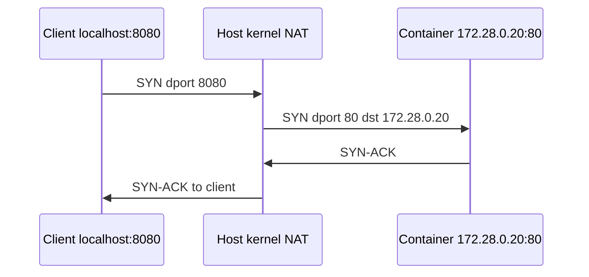

# 05. NAT и IP forwarding

## Введение: почему «снаружи 8080», а внутри контейнера — 80

Вы на ноутбуке открываете `http://localhost:8080` и видите страницу nginx, который внутри Docker слушает **порт 80**. Пакет пришёл на **8080** хоста, а оказался на **80** контейнера с другим IP. Ядро **подменило адрес назначения** — это **DNAT** (Destination NAT).

Обратный путь: контейнер отвечает с IP `172.28.0.20`, клиент ждёт ответ с `127.0.0.1`. Хост **подменяет источник** ответа — **SNAT** / **MASQUERADE**.

Без NAT и forwarding частные сети (Docker, VPC, домашний Wi‑Fi) не могли бы «выходить в интернет» с одного публичного IP. Это ломается, когда «порт проброшен, но с другой машины не заходит» или «из контейнера нет интернета».

## Что вы узнаете

- Что такое **частные IP** (RFC1918) и зачем **SNAT**.
- Когда нужен **ip_forward=1**.
- Разницу **DNAT** и **SNAT** на примере Docker.
- Где смотреть правила: **iptables-nft**, **nft**.
- Роль **conntrack** и почему firewall смотрит **FORWARD**.

---

## Частные адреса — почему «172.28.0.10» не в интернете

| Диапазон | Пример |
|----------|--------|
| 10.0.0.0/8 | 10.0.5.12 в VPC |
| 172.16.0.0/12 | **172.28.0.0/24** в нашем стенде |
| 192.168.0.0/16 | home router |

Роутеры в интернете **не маршрутизируют** 172.28.0.10 как глобальный адрес. Выход в интернет: хост с **публичным IP** подменяет **исходный** адрес пакета на свой (**SNAT**). Ответ приходит на публичный IP; ядро по **conntrack** отдаёт пакет обратно в 172.28.0.10.

**Аналогия:** офис с одним почтовым ящиком на улице — все письма наружу идут с адресом офиса, внутри офис знает, кому вернуть ответ.

---

## IP forwarding — разрешить ядру быть маршрутизатором

По умолчанию Linux часто **не пересылает** пакеты между интерфейсами, если они не для локального процесса.

```bash
cat /proc/sys/net/ipv4/ip_forward
# 0 = не маршрутизатор между интерфейсами
# 1 = можно пересылать

sudo sysctl -w net.ipv4.ip_forward=1
echo 'net.ipv4.ip_forward=1' | sudo tee /etc/sysctl.d/99-forward.conf
sudo sysctl -p /etc/sysctl.d/99-forward.conf
```

Без `ip_forward=1` два интерфейса и правильные `ip route` **недостаточны** — пакеты между docker0 и eth0 дропаются.

---

## DNAT — проброс порта (Docker publish)



| До DNAT | После DNAT |
|--------|------------|
| dst: 127.0.0.1:8080 | dst: 172.28.0.20:80 |

`docker compose` с `ports: "8080:80"` создаёт правила в таблице **nat**. Проверка с хоста:

```bash
docker compose port web 80
curl -s -o /dev/null -w "%{http_code}\n" http://127.0.0.1:ПОРТ/
```

Внутри сети compose **без** DNAT:

```bash
curl -s -o /dev/null -w "%{http_code}\n" http://172.28.0.20/
```

---

## SNAT / MASQUERADE — выход «наружу»

Пакет из 172.28.0.10 → интернет: источник подменяется на IP хоста с маршрутом наружу.

```bash
# Учебный пример — интерфейс наружу подставьте свой (eth0, ens5)
sudo iptables -t nat -A POSTROUTING -o eth0 -j MASQUERADE
```

**MASQUERADE** — SNAT с автоматическим IP интерфейса (удобно при DHCP на WAN).

Симптом в lab: `curl https://example.com` из контейнера **timeout**, ping внутри 172.28.0.0/24 **OK** — часто нет SNAT/маршрута на хосте, не «сломан DNS в контейнере» (хотя DNS тоже проверяют).

---

## Таблицы iptables/nft и цепочка FORWARD

| Таблица | Роль |
|---------|------|
| **nat** | DNAT, SNAT |
| **filter** | INPUT, FORWARD, OUTPUT — разрешить/запретить |

Трафик **в контейнер** на published port часто идёт через **FORWARD** (хост → bridge), не через INPUT. Поэтому `ufw allow 80` на INPUT **не помогает** — см. [07-firewall](07-firewall.md).

```bash
sudo iptables-nft -t nat -L -n -v 2>/dev/null | head -40
sudo iptables-nft -L FORWARD -n -v 2>/dev/null | head -15
```

Ищите **DOCKER**, **DNAT** на IP контейнера.

---

## conntrack — почему ответ «находит» клиента

Ядро запоминает соответствие:

`клиент 127.0.0.1:54321 ↔ 172.28.0.20:80`

Ответный пакет от контейнера **обратно переводится** в 127.0.0.1:8080 без ручных правил на каждый пакет.

```bash
sudo conntrack -L 2>/dev/null | head -5
```

Если conntrack переполнен (очень высокая нагрузка) — странные обрывы NAT; на учебном стенде редко.

---

## Сценарии DevOps

| Сценарий | Механизм |
|----------|----------|
| `docker -p 8080:80` | DNAT на docker bridge |
| Kubernetes NodePort | kube-proxy + iptables/IPVS |
| AWS private subnet → internet | NAT Gateway (managed SNAT) |
| Site-to-site VPN | forward + MASQUERADE на hub |

В [`deploy/linux`](../../deploy/linux/README.md) lab **не** настраивают как шлюз в интернет — смотрите правила в [лабе 06](06-lab-nat.md).

---

## Типичные ошибки

| Симптом | Причина | Действие |
|---------|---------|----------|
| localhost:8080 OK, с соседа нет | bind 127.0.0.1 | `0.0.0.0:8080` |
| Контейнер без интернета | нет MASQUERADE | POSTROUTING, маршрут |
| forward=1, не работает | нет route | `ip route get 8.8.8.8` |
| Порт проброшен, blackhole | FORWARD DROP | ufw/nft forward |
| Путают DNAT и SNAT | — | dst vs src подмена |

---

## В продакшене

В облаке SNAT на **managed NAT Gateway**. В K8s — CNI, kube-proxy, security groups. При отладке спрашивайте: пакет **на хост** (INPUT) или **через хост в pod** (FORWARD)?

---

## Резюме

**ip_forward** — пересылка между интерфейсами. **DNAT** — publish порта. **SNAT/MASQUERADE** — выход в интернет. **conntrack** связывает обратный путь. Docker правит iptables сам — отсюда конфликт с ufw.

## Чек-лист

- [ ] Зачем 172.28.0.x не в интернете напрямую?
- [ ] Что меняет DNAT в `8080:80`?
- [ ] Зачем conntrack?
- [ ] Почему FORWARD для Docker?

Следующий урок: [06. Лаба: NAT](06-lab-nat.md).
