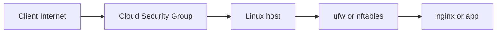

# 07. Firewall: ufw и nftables

## Введение: «включили firewall — пропал SSH»

Типичный инцидент в пятницу вечером: коллега «укрепил» сервер, выполнил `ufw enable`, и jump-хост больше не может зайти по SSH. Снаружи — **timeout** или **connection refused**, в панели облака VM «зелёная», а вы не можете ни перезапустить сервис, ни откатить конфиг. Причина почти всегда одна: **входящий TCP 22 не разрешён** в правилах host firewall, либо трафик уходит не в ту цепочку (INPUT vs FORWARD в Docker).

Firewall на Linux — это не «галочка в антивирусе». Это **фильтр пакетов** в ядре: для каждого входящего кадра решается — **принять**, **отбросить** или **отклонить с ответом**. В DevOps вы настраиваете его на каждой VM, на bastion, иногда на нодах Kubernetes — **в дополнение** к Security Group в AWS/Azure/GCP. Один слой без другого — дыра; оба слоя без понимания — самострел.

В этом уроке — как мыслить **default deny**, как безопасно включить **ufw** на Ubuntu, что лежит под капотом (**nftables**), и почему Docker ломает интуицию «я открыл порт в ufw, значит всё работает».

## Что вы узнаете

- Чем **host firewall** отличается от **Security Group** в облаке.
- Как включить **ufw** так, чтобы не потерять SSH.
- Что такое **INPUT**, **FORWARD**, **established/related** в nftables.
- Почему published port Docker может обходить ваши ожидания про ufw.
- Как по симптомам отличить «порт закрыт firewall» от «сервис не слушает».

## Два слоя защиты

Представьте запрос пользователя к API на VM в private subnet:



| Слой | Где живёт | Кто правит |
|------|-----------|------------|
| Security Group / NSG | гипервизор / SDN облака | Terraform, консоль |
| ufw / nftables | внутри гостевой ОС | админ, Ansible |

**Оба** должны разрешать нужный порт. SG открыт, ufw закрыт — снаружи облака может быть тихо, с другой VM в той же VPC — тоже. SG закрыт, ufw открыт — с интернета всё равно не зайти.

Политика, которую ожидают аудиторы и здравый смысл: **default deny incoming** — явно разрешаем только то, что нужно (22, 80, 443, иногда 53 только внутри сети).

## Default deny — что это значит на практике

До включения firewall многие сервисы слушают `0.0.0.0` — все интерфейсы. Сканер в интернете за сутки находит открытый Redis, Elasticsearch, Docker API. **Default deny** говорит ядру: «всё неразрешённое — DROP». Закрытый порт 6379 и `bind`/`protected-mode` для Redis — [redis-advanced/07-security](../redis-advanced/07-security.md).

Исходящий трафик (обновления apt, curl, ответы на установленные соединения) обычно оставляют **allow outgoing** — иначе сломаете apt и DNS, пока не пропишете десятки исключений.

**Золотое правило перед `ufw enable`:** откройте **вторую SSH-сессию** к тому же хосту. Первую не закрывайте, пока не убедитесь, что вторая переподключается после enable.

## ufw — интерфейс для админа на Ubuntu

**Uncomplicated Firewall** — обёртка, которая генерирует правила nftables/iptables. Вы не обязаны писать низкоуровневые цепочки для рутины.

### Проверить текущее состояние

```bash
sudo ufw status verbose
```

`Status: inactive` — фильтр ещё не применяется к входящим (но правила могут уже лежать в конфиге).

### Безопасная последовательность на srv1

На учебном **srv1** (172.28.0.11) с [`deploy/linux`](../../deploy/linux/README.md):

```bash
# 1. Политики по умолчанию
sudo ufw default deny incoming
sudo ufw default allow outgoing

# 2. SSH — ОБЯЗАТЕЛЬНО до enable
sudo ufw allow OpenSSH
# или явно: sudo ufw allow 22/tcp

# 3. HTTP для лаб (nginx)
sudo ufw allow 80/tcp

# 4. Ограничить SSH только lab-сетью (учебно, хорошая практика)
sudo ufw allow from 172.28.0.0/24 to any port 22 proto tcp

# 5. Просмотр правил с номерами — перед включением
sudo ufw status numbered

# 6. Включить — в ответ на вопрос y
sudo ufw enable
```

| Команда | Зачем |
|---------|--------|
| `allow OpenSSH` | профиль из `/etc/ufw/applications.d/`, порт 22 |
| `allow from 172.28.0.0/24` | SSH только с Docker-сети стенда |
| `status numbered` | удаление: `sudo ufw delete 3` |
| `reload` | после правки `/etc/ufw/*.rules` |

Конфиги лежат в `/etc/ufw/`. После ручной правки файлов — `sudo ufw reload`, не забывайте про синтаксис.

### Что ufw делает под капотом

```bash
sudo ufw status verbose
sudo nft list ruleset | less
# или на старых системах:
sudo iptables-nft -L -n -v | head -40
```

Вы увидите цепочки вроде `ufw-user-input` — это уже не «магия ufw», а обычный netfilter.

## nftables — как это выглядит без обёртки

На современных Debian/Ubuntu **nftables** — backend. Минимальный учебный пример **не копируйте слепую на prod** без бэкапа доступа:

```nft
table inet filter {
  chain input {
    type filter hook input priority 0; policy drop;
    ct state established,related accept
    iif "lo" accept
    tcp dport 22 accept
    tcp dport { 80, 443 } accept
  }
}
```

Разбор по строкам:

| Элемент | Смысл |
|---------|--------|
| `policy drop` | всё неразрешённое — отбросить |
| `established,related accept` | ответы на уже открытые соединения (SSH-сессия, HTTP keep-alive) |
| `iif "lo" accept` | localhost к localhost |
| `tcp dport 22 accept` | входящий SSH |

Сохранение: `/etc/nftables.conf`, затем `sudo systemctl enable --now nftables`.

ufw и «голый» nft на одном хосте **могут конфликтовать** — на учебном srv1 достаточно ufw; nft смотрите для понимания.

## Docker ломает интуицию: INPUT vs FORWARD

Трафик **в контейнер** с published port (`-p 8080:80`) часто проходит цепочку **FORWARD**, а не INPUT. Правило `ufw allow 8080` на хосте может не совпасть с тем, как Docker вставил DNAT.

Если «с хоста curl localhost:8080 работает, с соседней VM — нет»:

```bash
sudo nft list ruleset | less
sudo iptables-nft -L DOCKER -n -v 2>/dev/null
ip route get 172.28.0.10 from 172.28.0.11
```

Проверьте и **SG облака** (если VM в облаке), и ufw, и Docker.

## На стенде deploy/linux

| Хост | IP | Роль в лабе firewall |
|------|-----|----------------------|
| lab | 172.28.0.10 | клиент: curl, ssh |
| srv1 | 172.28.0.11 | включаем ufw |
| web | 172.28.0.20 | опционально TLS позже |

С lab проверка после настройки srv1:

```bash
ssh course@172.28.0.11 'sudo ufw status'
curl -s -o /dev/null -w "%{http_code}\n" http://172.28.0.11/
```

## Типичные ошибки

| Симптом | Вероятная причина | Что сделать |
|---------|-------------------|-------------|
| SSH timeout после enable | нет правила 22, или SSH только с «чужой» сети | консоль провайдера / `compose restart srv1`, добавить `allow OpenSSH` |
| Connection refused на 80 | nginx не слушает, не firewall | `ss -tlnp \| grep :80`, `systemctl status nginx` |
| HTTP работал, после ufw — нет | забыли `allow 80/tcp` | `sudo ufw allow 80/tcp` |
| С lab SSH OK, с ноутбука нет | `allow from 172.28.0.0/24` — задумано | для прода — свой CIDR office/VPN |
| Порт Docker не снаружи | FORWARD/DNAT | см. раздел Docker выше |

## В продакшене

- Правила firewall — в **IaC** (Ansible `ufw`, Terraform security groups), не ручками «на один раз».
- **22/tcp** часто закрывают с интернета полностью — доступ только через VPN или SSM Session Manager.
- Изменения — в change window, с rollback-планом и второй сессией.
- Логи отброшенных пакетов (rate-limited) иногда включают для расследования сканов — на учебном стенде не обязательно.

## Резюме

Host firewall — обязательный слой вместе с облачным SG. **ufw** на Ubuntu — удобный способ включить **default deny** и явно открыть SSH и сервисы. Перед `enable` всегда разрешайте **OpenSSH** и держите запасную сессию. Под капотом — **nftables** и состояния `established,related`. В Docker-средах смотрите ещё **FORWARD** и правила DOCKER. Симптом **timeout** чаще firewall или маршрут; **refused** — порт закрыт или никто не слушает.

## Чек-лист

- Зачем два слоя: SG и ufw?
- В каком порядке добавлять правила перед `ufw enable`?
- Что принимает цепочка `established,related`?
- Чем отличается INPUT от FORWARD для контейнера?
- Как разрешить HTTP только с подсети 172.28.0.0/24?

Следующий урок: [08. Лаба: ufw на srv1](08-lab-firewall.md).
