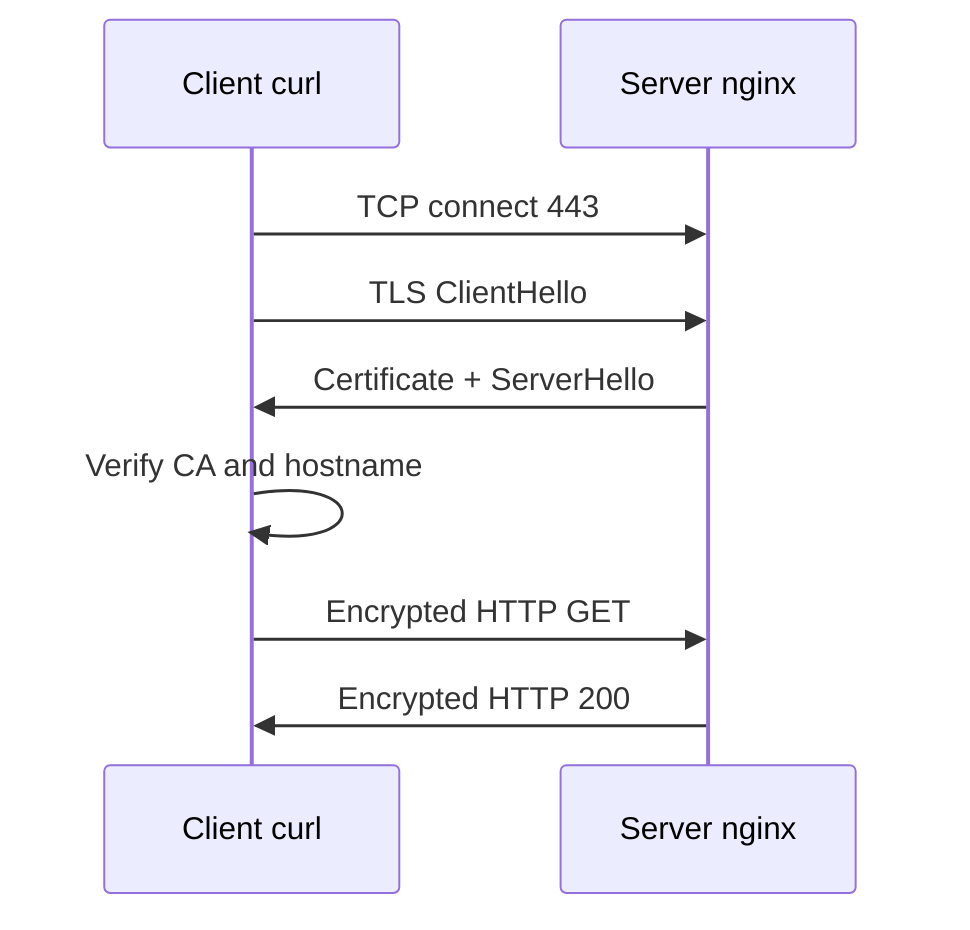

# 09. TLS и OpenSSL

> TLS termination на nginx (практика): [nginx-intermediate/01-tls-termination](../nginx-intermediate/01-tls-termination.md), стенд [`deploy/nginx`](../../deploy/nginx/README.md) + `scripts/gen-certs.sh`.

## Введение: «сертификат истёк» и «самоподписанный»

Браузер блокирует сайт с красным замком. CI падает на `curl https://internal.service`. Клиент Java ругается на **hostname mismatch**. Всё это — не «магия HTTPS», а проверяемая цепочка: **приватный ключ**, **сертификат**, **доверенный CA**, совпадение **имени в URL** с **SAN** в сертификате.

TLS (Transport Layer Security) шифрует трафик поверх TCP и подтверждает, что вы говорите с тем сервером, чей сертификат прошёл проверку. В DevOps вы выпускаете cert (Let's Encrypt, корпоративный CA) или временно ставите **self-signed** в лабе.

## Что вы узнаете

- Из чего состоит HTTPS: TCP → TLS handshake → HTTP.
- Разница **приватный ключ** / **сертификат** / **цепочка CA**.
- Как смотреть сертификат через **openssl** и **curl -v**.
- Как подключить TLS к **nginx** на стенде.
- Почему `-k` в curl только для лабы.

---

## Как устроен HTTPS



1. TCP на порт **443**.
2. **ClientHello** — версии cipher, SNI (имя хоста).
3. Сервер отдаёт **цепочку сертификатов**.
4. Клиент проверяет подпись CA и **hostname** (SAN).
5. Дальше HTTP внутри шифрованного канала.

Клиент доверяет сертификату, если он подписан **CA из trust store** ОС/браузера (или вы явно отключили проверку `-k`).

---

## Сертификат и ключ

| Артефакт | Секрет? | Где лежит |
|----------|---------|-----------|
| **Private key** (.key) | **да**, никогда в git | chmod 600, owner root/nginx |
| **Certificate** (.crt/.pem) | публичный | nginx, LB |
| **Chain / fullchain** | публичный | cert + intermediate CA |

Ключ и сертификат — **пара**: nginx не запустит TLS, если они не матчатся (`SSL_CTX_use_PrivateKey_file` failed).

### Self-signed для lab

```bash
sudo mkdir -p /etc/ssl/lab
sudo openssl req -x509 -nodes -days 365 -newkey rsa:2048 \
  -keyout /etc/ssl/lab/key.pem \
  -out /etc/ssl/lab/cert.pem \
  -subj "/CN=web.lab.local"
sudo chmod 600 /etc/ssl/lab/key.pem
```

| Ключ openssl | Смысл |
|--------------|--------|
| `-x509` | самоподписанный cert, не CSR |
| `-nodes` | ключ без passphrase (lab; в prod часто HSM/KMS) |
| `-days 365` | срок действия |
| `-subj "/CN=..."` | Common Name (legacy); в браузерах важен **SAN** |

Проверка:

```bash
openssl x509 -in /etc/ssl/lab/cert.pem -noout -subject -issuer -dates -ext subjectAltName 2>/dev/null
openssl rsa -in /etc/ssl/lab/key.pem -check -noout
```

**issuer** у self-signed = **subject** (сам себе CA).

---

## Посмотреть чужой сертификат

```bash
openssl s_client -connect example.com:443 -servername example.com </dev/null 2>/dev/null \
  | openssl x509 -noout -subject -issuer -dates
curl -vI https://example.com 2>&1 | head -30
```

**SNI** (`-servername`) обязателен, если на одном IP много TLS-сайтов — без SNI сервер отдаст «чужой» cert.

Проверка срока (мониторинг):

```bash
echo | openssl s_client -connect example.com:443 -servername example.com 2>/dev/null \
  | openssl x509 -noout -enddate
```

---

## nginx: блок server для 443

```nginx
server {
    listen 443 ssl;
    server_name web.lab.local;

    ssl_certificate     /etc/ssl/lab/cert.pem;
    ssl_certificate_key /etc/ssl/lab/key.pem;

    location / {
        return 200 "tls ok\n";
        add_header Content-Type text/plain;
    }
}
```

```bash
sudo nginx -t
sudo systemctl reload nginx
ss -tlnp | grep 443
curl -k https://172.28.0.20/
curl -v https://172.28.0.20/ 2>&1 | grep -E "subject:|issuer:|SSL certificate"
```

`-k` / `--insecure` — **не проверять** CA (только учебная среда).

---

## Let's Encrypt (концепт)

**Certbot** + HTTP-01 (файл на :80) или DNS-01 (TXT в DNS). Нужно **публичное DNS-имя** и доступ с интернета (или API DNS-провайдера). Для `*.lab.local` в Docker — self-signed или внутренний CA (mkcert, step-ca).

Автообновление: systemd timer certbot, cert-manager в Kubernetes.

---

## Типичные ошибки

| Ошибка / сообщение | Причина |
|--------------------|---------|
| certificate has expired | не продлили cert |
| hostname mismatch | URL ≠ CN/SAN |
| unable to get local issuer certificate | нет intermediate в chain |
| SSL_CTX_use_PrivateKey_file failed | key ≠ cert |
| permission denied на key | права не 600, nginx не читает |
| curl без -k на self-signed | ожидаемо fail verify |

---

## В продакшене

TLS 1.2+ (лучше 1.3), сильные cipher из шаблона ingress/mozilla ssl-config-generator. Мониторинг **expiry** за 30 дней. Секреты в Vault/K8s Secret, не в репозитории. HSTS, OCSP stapling — на периметре.

---

## Резюме

TLS = шифрование + идентичность через PKI. Ключ — секрет; сертификат — публичный. Проверяйте `openssl x509` и `curl -v`. Self-signed — стенд; прод — CA + мониторинг срока.

## Чек-лист

- [ ] Чем ключ отличается от сертификата?
- [ ] Зачем SNI в s_client?
- [ ] Почему нельзя привыкать к `curl -k`?
- [ ] Что проверить, если nginx -t OK, а браузер ругается?

Следующий урок: [10. Лаба: HTTPS](10-lab-tls.md).
