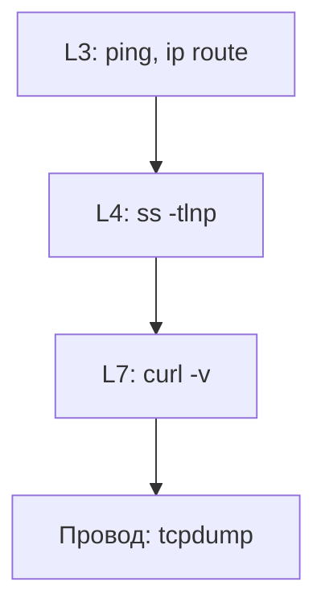

# 11. ss, curl, traceroute, tcpdump

## Введение: метод «снизу вверх»

On-call: «API не отвечает». Нельзя сразу рестартить всё подряд — вы потеряете доказательства и можете усугубить (рестарт БД при сетевой проблеме). Рабочая привычка — **диагностика по слоям OSI**, снизу вверх:



1. **L3** — до хоста доходим? (`ping`, `ip route get`)
2. **L4** — порт слушается? процесс жив? (`ss`)
3. **L7** — HTTP/TLS отвечает? (`curl -v`)
4. **Провод** — пакеты реально ушли и пришли ответ? (`tcpdump`)

Эта глава сводит инструменты в **один сценарий**; отработаете его в [лабе 12](12-lab-tcpdump.md) на стенде `172.28.0.11` (srv1).

## Что вы узнаете

- Когда `ss` вместо устаревшего `netstat`.
- Как читать вывод `curl -v` построчно.
- Зачем `traceroute` в Docker-сети и в WAN.
- Как безопасно запускать **tcpdump** с фильтрами.
- Таблица «refused vs timeout» — ключ к firewall и bind.

---

## ss — кто слушает и кто к кому подключён

`ss` читает данные из `/proc/net/tcp` — быстрее и информативнее, чем `netstat`.

```bash
ss -tlnp
ss -tlnp | grep ':80'
ss -tan state established | head
ss -ulnp
```

| Ключ | Смысл |
|------|--------|
| `-t` | TCP |
| `-u` | UDP |
| `-l` | только listening |
| `-n` | порты числами, без DNS |
| `-p` | процесс (нужен root для всех PID) |
| `-a` | все сокеты |

**Как читать строку LISTEN:**

```text
LISTEN 0 511 0.0.0.0:80 0.0.0.0:* users:(("nginx",pid=123,fd=6))
```

| Адрес bind | Кто может подключиться |
|------------|-------------------------|
| `0.0.0.0:80` | с любого интерфейса |
| `127.0.0.1:8080` | только с localhost |
| `172.28.0.11:22` | только на этот IP |

**Типичная ловушка:** nginx слушает `127.0.0.1:80` — с srv2 `curl http://172.28.0.11/` даст **connection refused**, хотя `systemctl status nginx` — active.

```bash
# на srv1
ss -tlnp | grep nginx
```

---

## curl — вся цепочка L7

`curl -v` печатает этапы: resolve → connect → TLS (если https) → HTTP.

```bash
curl -v http://172.28.0.11/ 2>&1 | head -45
curl -vk https://172.28.0.20/
curl -o /dev/null -s -w 'code=%{http_code} connect=%{time_connect}s total=%{time_total}s\n' http://172.28.0.11/
```

**Разбор фрагмента успешного HTTP:**

```text
*   Trying 172.28.0.11:80...
* Connected to 172.28.0.11 (172.28.0.11) port 80
> GET / HTTP/1.1
< HTTP/1.1 200 OK
```

| Сообщение curl | Слой | Что проверить |
|----------------|------|----------------|
| `Could not resolve host` | DNS | `/etc/resolv.conf`, dig |
| `Connection timed out` | L3/L4 fw | ufw, route, security group, host down |
| `Connection refused` | L4 app | `ss -tlnp`, сервис stopped |
| `HTTP/1.1 502 Bad Gateway` | L7 proxy | backend, error.log nginx |
| `SSL certificate problem` | TLS | SAN, срок, `-k` только в lab |

**Refused vs timed out** — не взаимозаменяемы:

- **Refused** — SYN дошёл, хост ответил RST (порт закрыт / нет listen).
- **Timeout** — ответа нет (DROP в firewall, неверный маршрут, хост не в сети).

На стенде:

```bash
# srv1, nginx остановлен
sudo systemctl stop nginx
curl -m3 http://172.28.0.11/   # с lab: refused

# ufw DROP 80 (после урока firewall)
# curl: timeout
```

---

## traceroute / tracepath

Показывает **хопы** до цели (TTL expire → ICMP от роутера).

```bash
traceroute -n 172.28.0.20
tracepath -n 172.28.0.11
```

В сети `deploy/linux` часто **один hop** — нормально: lab и srv1 на одном bridge.

В WAN ищете, где **latency скачет** или появляются `* * *` (фильтрация ICMP — не всегда «обрыв»).

```bash
traceroute -n -T -p 443 example.com   # TCP traceroute к 443
```

---

## tcpdump — с фильтрами

Без фильтра на busy-хосте — гигабайты и утечка секретов.

```bash
sudo tcpdump -i any port 80 -nn -c 20
sudo tcpdump -i any host 172.28.0.11 and port 22 -nn -c 15
sudo tcpdump -i eth0 'tcp[tcpflags] & tcp-syn != 0' -nn -c 10
```

| Ключ | Зачем |
|------|--------|
| `-i any` | все интерфейсы (осторожно на шумных нодах) |
| `-nn` | не резолвить имена — быстрее и чище |
| `-c N` | остановиться после N пакетов |
| `-w file.pcap` | сохранить для Wireshark |

**Мини-разбор SYN/ACK:**

```text
IP 172.28.0.10.xxxxx > 172.28.0.11.80: Flags [S]     # SYN
IP 172.28.0.11.80 > 172.28.0.10.xxxxx: Flags [S.]    # SYN-ACK
```

Нет SYN-ACK после SYN — firewall DROP или хост недоступен.

В проде: согласование, PII в payload, ограничение `-c` и времени.

---

## Сценарий «как я бы чинил» (runbook)

Проблема: **с lab не открывается http://172.28.0.11/**

| Шаг | Команда | Хороший результат | Если плохо |
|-----|---------|-------------------|------------|
| 1 | `ping -c2 172.28.0.11` | 0% loss | route, host down, icmp blocked |
| 2 | `ip route get 172.28.0.11` | via dev br0 | нет маршрута |
| 3 | `nc -zv 172.28.0.11 80` или `ss` на srv1 | open / LISTEN | refused → nginx; timeout → fw |
| 4 | `curl -v http://172.28.0.11/` | HTTP 200 | 502 → proxy; 403 → app |
| 5 | `sudo tcpdump -i any host 172.28.0.11 and port 80 -nn -c 10` | виден обмен | пусто → wrong iface/filter |

Записывайте **первую** команду, где поведение «ломается» — это граница слоя.

---

## Типичные ошибки

| Ошибка | Не путать с | Правильный шаг |
|--------|-------------|----------------|
| ping OK, curl fail | «сеть мертва» | порт, bind, ufw |
| curl refused | timeout | ss на целевом хосте |
| tcpdump пусто | «пакетов нет» | интерфейс, filter, VLAN |
| тест только с localhost | «снаружи работает» | curl с **другой** VM |
| смотрят логи app до curl | — | сначала L3–L4 |

---

## В продакшене

Service mesh, sidecar, eBPF — картина сложнее, но **ss** и **curl** на pod/node остаются первым шагом. `kubectl exec` + `curl` к Service ClusterIP повторяет ту же логику. Centralized logging не заменяет пятиминутный curl с клиента, похожего на реального пользователя.

---

## Резюме

Диагностика сети — **послойно**, не угадыванием. **ss** — порты и bind. **curl -v** — HTTP/TLS и текст ошибки. **tcpdump** — факты, когда логи врут. Refused и timeout ведут в разные runbook'и.

## Чек-лист

- [ ] Как увидеть PID процесса на порту 443?
- [ ] Что значит refused vs timed out на примере ufw?
- [ ] Зачем `-nn` и `-c` в tcpdump?
- [ ] Почему curl с lab важнее curl с localhost на srv1?

Следующий урок: [12. Лаба: tcpdump](12-lab-tcpdump.md).
