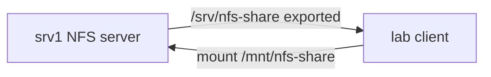

# 17. NFS: сервер и клиент

## Введение: общая папка для нескольких серверов

Три app-сервера должны читать одни и те же загруженные файлы (медиа, артефакты сборки). Object storage (S3, MinIO) — современный ответ для новых систем; **NFS** (Network File System) всё ещё встречается в legacy, виртуализации и некоторых on-prem кластерах.

Один сервер **экспортирует** каталог по сети, клиенты **монтируют** его как обычную файловую систему — приложение не знает, что файлы «далеко». В Kubernetes для **ReadWriteMany** томов иногда используют NFS CSI — принцип export/mount тот же.

## Что вы узнаете

- Схема **server export** / **client mount**.
- Файл `/etc/exports` и опции `rw`, `sync`, `root_squash`.
- **NFSv4** vs v3 (порты, firewall).
- Строка **fstab** с `_netdev`.
- Типичные ошибки mount и «stale file handle».

---

## Архитектура



| Роль | Хост в стенде | Действие |
|------|---------------|----------|
| Server | srv1 172.28.0.11 | `nfs-kernel-server`, `/etc/exports` |
| Client | lab 172.28.0.10 | `mount -t nfs ...` |

Порт **2049/tcp** (и udp) — NFS. **NFSv3** дополнительно тянет **rpcbind** (111) — в firewall сложнее. В лабе предпочтительнее **NFSv4** (один порт 2049).

---

## Сервер: установка и экспорт

```bash
sudo apt install -y nfs-kernel-server
sudo mkdir -p /srv/nfs-share
echo "shared $(date -Is)" | sudo tee /srv/nfs-share/readme.txt

echo '/srv/nfs-share 172.28.0.0/24(rw,sync,no_subtree_check,no_root_squash)' | sudo tee /etc/exports
sudo exportfs -ra
sudo exportfs -v
```

| Опция | Смысл |
|-------|--------|
| `172.28.0.0/24` | только эта подсеть может монтировать |
| `rw` | чтение и запись |
| `sync` | данные на диск до ответа клиенту (медленнее, надёжнее) |
| `no_subtree_check` | меньше проблем с inode при rename (часто в lab) |
| `no_root_squash` | root на клиенте = root на export — **опасно в проде** |
| `root_squash` | root на клиенте → nobody на сервере — **норма в проде** |

После правки exports всегда:

```bash
sudo exportfs -ra
```

---

## Клиент: mount

```bash
sudo apt install -y nfs-common
showmount -e 172.28.0.11
sudo mkdir -p /mnt/nfs-share
sudo mount -t nfs 172.28.0.11:/srv/nfs-share /mnt/nfs-share
df -h /mnt/nfs-share
echo "from client" | sudo tee /mnt/nfs-share/client.txt
```

**fstab** (осторожно — ошибка может задержать boot):

```text
172.28.0.11:/srv/nfs-share  /mnt/nfs-share  nfs  defaults,_netdev  0  0
```

| Поле | Зачем |
|------|--------|
| `_netdev` | монтировать после поднятия сети |
| `0 0` | не dump/fsck по умолчанию |

Проверка fstab без reboot: `sudo mount -a`.

---

## Как NFS выглядит для приложения

Приложение делает обычные `open/read/write` — ядро клиента переводит в NFS RPC. Задержки выше, чем на локальном диске; **блокировки файлов** и **кэш** ведут себя иначе, чем на ext4 — при нескольких писателях возможны гонки (нужен app-level locking или object storage).

---

## Типичные ошибки

| Симптом | Причина | Действие |
|---------|---------|----------|
| access denied by server | IP не в exports, ro | `exportfs -v`, CIDR |
| mount.nfs: Connection timed out | fw, нет маршрута | ping, открыть 2049 |
| stale file handle | server reboot, inode сменился | remount |
| Permission denied на запись | root_squash, uid map | `ls -ln`, id, squash |
| target is busy при umount | процесс в каталоге | `lsof +D` |

---

## NFS vs альтернативы

| Решение | Когда |
|---------|--------|
| NFS | legacy RW-many, простой shared dir |
| S3/MinIO | новые app, большие объёмы |
| iSCSI block | БД, один писатель |
| Ceph/Gluster | свой кластер storage |

---

## В продакшене

NFS через **VPN** или **выделенную storage VLAN**. **Kerberos** (`sec=krb5`) для аутентификации. Snapshot на storage/SAN, не только `tar` с клиента. Мониторинг: latency, RPC errors, место на export.

---

## Резюме

NFS = сетевая ФС: **exports** на сервере, **mount** на клиенте. **no_root_squash** — только lab. Проверяйте **showmount**, **2049**, **exports** перед «переустановкой NFS».

## Чек-лист

- [ ] Что пишется в `/etc/exports`?
- [ ] Зачем `_netdev` в fstab?
- [ ] Чем NFSv4 проще для firewall?
- [ ] Почему root_squash важен в prod?

Следующий урок: [18. Лаба: NFS](18-lab-nfs.md).
