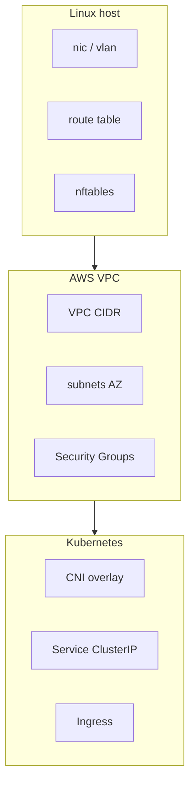

# 01. Зачем networking-deep: карта L2–L7 и типичные сбои

## Введение: «сеть сломана» — это не диагноз

Инцидент: «между сервисами не ходит трафик». Через час выясняется: security group не открыт порт, а не «сеть AWS упала». Другой случай: `curl` висит минуту — MTU blackhole на VPN, а не «приложение тормозит». Без **общей карты уровней** каждый инженер чинит свой любимый слой (только firewall или только DNS).

Этот курс **не заменяет** [`linux-intermediate`](../linux-intermediate/README.md) и [`aws-intermediate`](../aws-intermediate/README.md) — он **сшивает** их: от ARP на хосте до Transit Gateway в облаке.

---

## Что уже есть в mock-exams

| Тема | Где пройдено | Что добавляем здесь |
|------|--------------|---------------------|
| TCP/IP, ping, маршруты | [linux-intermediate/01](../linux-intermediate/01-tcp-ip.md) | CIDR-дизайн, policy routing |
| NAT, iptables | [05–06](../linux-intermediate/05-nat-forwarding.md) | hairpin, облачное соответствие |
| Firewall | [07–08](../linux-intermediate/07-firewall.md) | зоны, SG vs host firewall |
| ss, curl, tcpdump | [11–12](../linux-intermediate/11-network-debug.md) | runbook, сценарии P1 |
| Custom VPC | [aws-intermediate/01](../aws-intermediate/01-vpc-custom.md) | peering, TGW, endpoints |
| ALB + SG | [03](../aws-intermediate/03-alb-security-groups.md) | L7 path, health checks |
| K8s Service | [kuber-advanced/08](../kuber-advanced/08-network-internals.md) | полная карта CNI/overlay |

---

## Модель уровней (повторение с углублением)

```text
L7  HTTP, gRPC, DNS-запрос как приложение
L4  TCP/UDP, порты, установление сессии
L3  IP, маршрутизация, ICMP
L2  Ethernet, MAC, VLAN, ARP
L1  Физика (в bare-metal — отдельно)
```

**Правило диагностики:** не поднимайтесь на L7, пока не исключили L3–L4 на **том же пути**, что и пользователь (не с bastion «с другой стороны»).

| Симптом | Частый слой | Первый инструмент |
|---------|-------------|-------------------|
| `No route to host` | L3 | `ip route get <dst>` |
| `Connection refused` | L4 (порт) | `ss -tlnp` на цели |
| `Connection timed out` | L3–L4 (filter/NAT) | `tcpdump`, SG/NACL |
| `Could not resolve host` | L7 (DNS) | `dig +trace` |
| TLS handshake fail | L7 | `openssl s_client` |
| Работает с хоста, не из Pod | overlay/NAT | `ip route`, CNI, NetworkPolicy |

---

## Три «мира» одного инженера



1. **Хост** — интерфейсы, таблицы маршрутов, conntrack, локальный firewall.
2. **VPC** — логическая L3-сеть, IGW/NAT, SG как stateful firewall на ENI.
3. **Кластер** — поверх VPC ещё один overlay (часто VXLAN), Service IP, kube-proxy.

Ошибка мышления: «у Pod свой IP в VPC» — **часто нет**; в VPC виден IP **ноды** или secondary ENI CNI, а Pod — в overlay.

---

## Типичные архитектуры

### Трёхзонная VPC (учебный шаблон aws-intermediate)

```text
10.0.0.0/16 VPC
├── public-a   10.0.1.0/24   → IGW
├── private-a  10.0.10.0/24  → NAT (исходящий интернет)
└── private-b  10.0.20.0/24  → RDS, internal ALB
```

### On-prem + cloud (глава 09)

BGP между **customer gateway / Direct Connect** и **cloud router** — маршруты «кто знает про 10.0.0.0/16».

### K8s на AWS (глава 12)

Worker в **private subnet** → NAT для образов → ALB в **public** → Pod overlay внутри ноды.

---

## В mock-exams

| Практика | Ресурс |
|----------|--------|
| Хост, маршруты, tcpdump | [`deploy/linux`](../../deploy/linux/README.md) |
| VPC Terraform | [aws-intermediate/02-lab](../aws-intermediate/02-lab-vpc-custom.md) |
| Calico / NetworkPolicy | [kuber-advanced/09](../kuber-advanced/09-lab-cni-calico.md) |

---

## Заметки для собеседования

- **Timeout vs refused** — ключ к firewall vs «ничего не слушает».
- **Stateful** (SG, conntrack) vs **stateless** (NACL, raw ACL) — разный порядок правил.
- **Overlay** не отменяет L3 — добавляет инкапсуляцию поверх underlay.
- **BGP** — протокол **маршрутизации между автономными системами**, не «настройка nginx».

---

## Резюме

Networking-deep учит **переключать уровень абстракции**: один и тот же инцидент читается по-разному на srv1, в VPC и в Pod. Дальше — детали L2–L3.

---

## Чек-лист самопроверки

- [ ] Назовите три слоя, где чаще всего застревает «не работает API».
- [ ] Объясните, почему bastion с открытым SSH не доказывает доступность сервиса для клиента.
- [ ] Где в вашей инфраструктуре заканчивается «сеть Linux» и начинается «сеть AWS»?

**Дальше:** [02. L2–L3: ARP, VLAN, CIDR](02-l2-l3.md).
