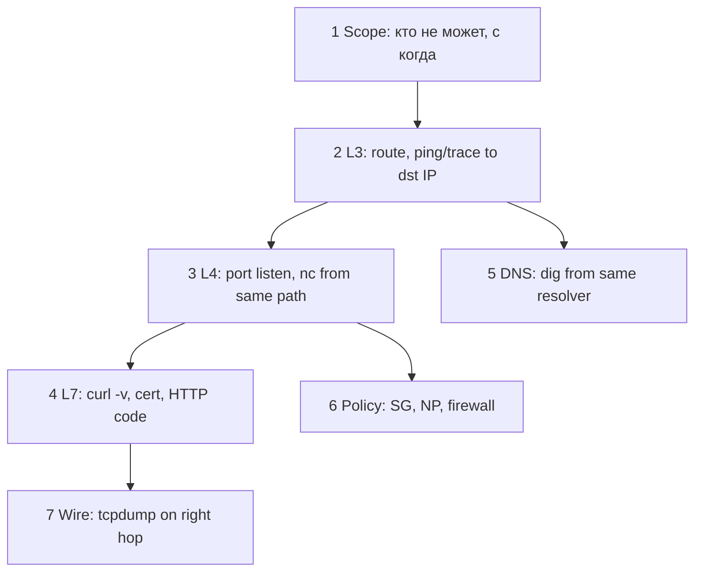

# 13. Методология troubleshooting и runbook

## Введение

Без метода on-call **рестартит** и **теряет время**. Эта глава формализует [linux-intermediate/11](../linux-intermediate/11-network-debug.md) для **любой** среды: VM, VPC, K8s.

---

## Алгоритм (снизу вверх)



### 1. Scope

- **Кто** затронут: все пользователи / один регион / один Pod?
- **С какого** source IP идёт проверка (тот же path)?
- **Что изменилось**: deploy, SG, route, cert expiry?

### 2. L3

```bash
ip route get <dst>
ping -c3 <dst>          # если ICMP разрешён
traceroute -n <dst>     # где обрыв
```

### 3. L4

```bash
ss -tlnp | grep <port>     # на сервере
nc -zv <dst> <port>        # с клиента того же path
```

### 4. L7

```bash
curl -v --connect-timeout 5 https://host/path
openssl s_client -connect host:443 -servername host
```

### 5. DNS

```bash
dig +short host
dig +trace host
```

### 6. Policy

- AWS: SG, NACL, route table
- Linux: `nft list ruleset`
- K8s: `kubectl get networkpolicy`

### 7. Wire

```bash
tcpdump -i any -nn host <dst> and port 443 -c 20
```

| Видите на wire | Вывод |
|----------------|-------|
| SYN, нет SYN-ACK | filter или host down |
| SYN-ACK, RST | port closed |
| TLS ClientHello, нет ServerHello | middlebox / wrong backend |
| Пакеты только в одну сторону | asymmetric routing |

---

## Таблица симптомов

| Симптом | Вероятные слои | Первые шаги |
|---------|----------------|-------------|
| timeout | SG, NACL, route, NP | tcpdump, `ip route get` |
| connection refused | app not listening, wrong IP bind | `ss -tlnp` |
| 502/503 from LB | no healthy targets, app crash | target health, app logs |
| SSL certificate problem | wrong cert, expired, SNI | `openssl s_client` |
| works in browser, not in Pod | DNS, NP, different resolver | `dig` from Pod |
| intermittent | MTU, conntrack full, flaky backend | MTU probe, metrics |

---

## Runbook шаблон (одна страница)

```markdown
# Service: checkout-api

## Symptom
Users cannot complete payment (HTTP 5xx / timeout).

## Blast radius
Region eu-central-1, all AZ.

## Dashboards
- Grafana: checkout RED
- AWS: ALB 5xx, target health

## Quick checks (5 min)
1. ALB target health
2. curl -v https://checkout.internal/health from bastion AND from test Pod
3. dig checkout.internal
4. Recent deploy / SG change

## Escalation
#platform-network if SG/VPC; #app if 500 from app

## Safe mitigations
- rollback deployment
- scale replicas (if capacity)
```

---

## Антипаттерны

- Проверка **только** с ноутбука инженера (другой VPN path).
- `telnet` вместо понимания refused vs timeout.
- Открыть `0.0.0.0/0` «временно» без ticket и rollback.
- Рестарт без сохранения `ss` / `tcpdump` snapshot.

---

## В mock-exams

- Отработка: [15-lab-troubleshooting](15-lab-troubleshooting.md)
- Runbooks: [observability-advanced](../observability-advanced/README.md)

---

## Резюме

Troubleshooting — **гипотезы по слоям**, доказательства с **того же path**, что пользователь. Runbook экономит cognitive load в 3:00.

---

## Чек-лист

- [ ] Опишите порядок L3→L4→L7 для «API timeout».
- [ ] Когда tcpdump обязателен?
- [ ] Что записать в incident timeline в первые 10 минут?

**Дальше:** [14. Зоны безопасности](14-security-zones.md).
