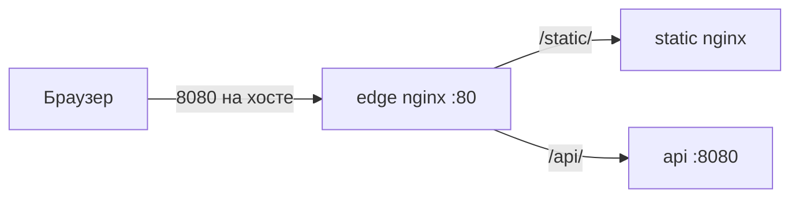

# 01. Зачем nginx: edge vs app server

## Введение: один вход вместо десяти портов

В проде у команды часто три слоя: **браузер** → **edge** (nginx, Ingress, ALB) → **приложение** (Flask, Node, Java). Пользователь видит `https://shop.example.com/api/orders`, а внутри сети запрос попадает на `http://api:8080/orders` — без публикации каждого микросервиса на отдельный внешний порт.

Если вы прошли [containers-basic: multi-service Compose](../containers-basic/10-compose-multi-service.md), вы уже видели этот паттерн: контейнер **web** с nginx слушает **8088** на хосте и проксирует `/api/*` на **api**. Курс **nginx-basic** углубляет именно **роль edge**: маршрутизация, заголовки, логи, upstream — на стенде [`deploy/nginx`](../../deploy/nginx/README.md) с портами **8080** (HTTP) и **8443** (HTTPS).

Обзор nginx на «голой» Linux — в [linux-intermediate/13-nginx](../linux-intermediate/13-nginx.md); здесь та же логика, но в Docker и с явными именами контейнеров.

## Что вы узнаете

- Чем **reverse proxy / edge** отличается от **app server**.
- Когда nginx отдаёт **файлы**, а когда **проксирует**.
- Зачем DevOps держит nginx в Compose и в Kubernetes.
- Как этот курс стыкуется с контейнерами и Ingress.

## Edge vs app server

| Роль | Типичные задачи | Примеры на стенде |
|------|-----------------|-------------------|
| **Edge** | TLS termination, маршрутизация по path/Host, rate limit, сжатие, единые логи | `mock-nginx-edge` :8080 |
| **App server** | Бизнес-логика, JSON, сессии, БД | `mock-nginx-api` (Python :8080) |
| **Static backend** | HTML/CSS без логики | `mock-nginx-static` |

**Edge** не заменяет приложение: он **терминирует HTTP(S)** снаружи и **переписывает** запрос к внутреннему сервису. App server **не должен** быть доступен с интернета напрямую — только из сети `internal` compose.



Сравните с [`deploy/containers/stack/web/nginx.conf`](../../deploy/containers/stack/web/nginx.conf): там nginx **и** edge, **и** раздаёт `index.html` — для учебного стека это нормально. В `deploy/nginx` роли **разделены**: edge только маршрутизирует, static — только файлы.

## Почему nginx, а не «ещё один контейнер с Flask»

- **Стабильность под нагрузкой** — event-driven модель, мало памяти на соединение.
- **Один конфиг** для десятков `location` и vhost.
- **Graceful reload** — `nginx -t` и `reload` без обрыва всех клиентов (в отличие от полного restart приложения).
- **Экосистема** — Ingress Controller (ingress-nginx), API gateway, CDN origin.

Альнативы edge: Traefik, Envoy, HAProxy, облачный ALB. Концепции **proxy_pass**, **upstream**, **X-Forwarded-*** переносятся между ними.

## Типичный сценарий DevOps

1. Разработчик поднимает api на `:8080` внутри кластера/compose.
2. Вы добавляете в edge `location /api/` → `proxy_pass` + заголовки.
3. TLS сертификат вешаете на edge (лабы intermediate / [linux-intermediate/09-tls](../linux-intermediate/09-tls-openssl.md)).
4. Мониторинг смотрит **5xx на edge** и **latency upstream** в access.log.

Команда проверки перед reload — всегда одна:

```bash
cd deploy/nginx
docker compose exec mock-nginx-edge nginx -t
docker compose exec mock-nginx-edge nginx -s reload
```

## Связь с containers-basic

В [лабе 11 compose](../containers-basic/11-lab-compose-stack.md) вы поднимали **web + api + redis**. Nginx в образе web — **упрощённый edge** в одном контейнере. Курс nginx-basic учит **выделять edge** в отдельный сервис — как в проде и как в Kubernetes (Ingress → Service → Pod).

| Стенд | Порт на хосте | Edge |
|-------|---------------|------|
| deploy/containers | 8088 | web (nginx + static) |
| deploy/nginx | 8080 / 8443 | edge (только proxy) |

### Что смотреть в образе web

Файл [`deploy/containers/stack/web/nginx.conf`](../../deploy/containers/stack/web/nginx.conf) — два `location`: `/` отдаёт `index.html` с диска, `/api/` проксирует на `http://api:8080/`. Dockerfile копирует конфиг в `/etc/nginx/conf.d/default.conf` — тот же механизм `include`, что и `conf.d` на стенде nginx-basic.

Полезное упражнение до лаб 03: поднять `deploy/containers`, открыть web-конфиг и устно назвать, какой запрос пойдёт в Flask, а какой останется в nginx.

```bash
cd deploy/containers
docker compose up -d --build
curl -s http://localhost:8088/ | head -3
curl -s http://localhost:8088/api/health
```

Вы уже делали это в [главе 10 containers-basic](../containers-basic/10-compose-multi-service.md); здесь повторяем фокус на **роли nginx**, а не на compose.

## Когда nginx не нужен как отдельный edge

- **Serverless** (Lambda + API Gateway) — маршрутизацию делает облако.
- **Service mesh** с ingress gateway (Envoy) — nginx может отсутствовать.
- **Один сервис в dev** — иногда достаточно `ports` на app (не для prod).

Даже тогда понимание **proxy_pass** и **X-Forwarded-*** нужно при отладке и при чтении Ingress-аннотаций.

## Типичные ошибки

| Ошибка | Последствие |
|--------|-------------|
| Публиковать api на хост `ports: 8080:8080` | обход edge, лишняя поверхность |
| Путать «nginx в образе app» и «отдельный edge» | сложно менять TLS и маршруты |
| Reload без `nginx -t` | edge не стартует, 502 на всё |
| Ждать от nginx бизнес-логику | нужен app server |

## В продакшене

- Edge — **stateless**, конфиг из Git, деплой через CI/Ansible.
- App — горизонтальное масштабирование за **upstream** или K8s Service.
- WAF / DDoS — перед или на edge.
- Логи edge — источник правды о **внешнем** трафике.

## Резюме

**nginx на edge** — единая дверь HTTP(S): статика, API, TLS, лимиты. **App server** обрабатывает запрос после прокси. Стенд курса разделяет **edge / static / api**; проверка конфига — `docker compose exec mock-nginx-edge nginx -t`. Дальше — архитектура файлов и процессов.

## Чек-лист

- Чем edge отличается от app server?
- Где nginx в стеке deploy/containers?
- Зачем не выставлять api на хост?
- Какая команда проверяет синтаксис на стенде?

Следующий урок: [02. Архитектура стенда](02-architecture.md).
