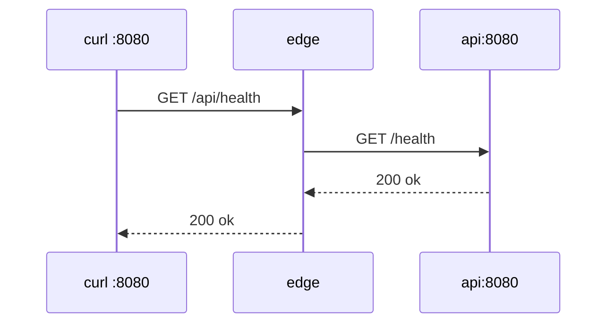

# 04. Reverse proxy: proxy_pass, слэш, X-Forwarded-*

## Введение: клиент видит /api/health, backend — /health

Edge принимает `GET http://localhost:8080/api/health`. Контейнер **api** слушает `GET /health` на :8080. Между ними — директива **`proxy_pass`** и правило переписывания URI при **слэше** в конце URL upstream.

Эта глава — теория, которую вы уже видели в сжатом виде в [linux-intermediate/13-nginx](../linux-intermediate/13-nginx.md) и в [containers-basic web nginx](../../deploy/containers/stack/web/nginx.conf). На стенде эталон — [`00-default.conf`](../../deploy/nginx/config/conf.d/00-default.conf). Практика — [лаба 05](05-lab-proxy-pass.md).

## Что вы узнаете

- Настройку `location` + `proxy_pass`.
- Таблицу **URI клиента → URI backend**.
- Набор заголовков **X-Forwarded-\***.
- Таймауты `proxy_connect_timeout` / `proxy_read_timeout`.

## Схема запроса



Конфиг на стенде:

```nginx
location /api/ {
    proxy_pass http://api:8080/;
    proxy_http_version 1.1;
    proxy_set_header Host $host;
    proxy_set_header X-Real-IP $remote_addr;
    proxy_set_header X-Forwarded-For $proxy_add_x_forwarded_for;
    proxy_set_header X-Forwarded-Proto $scheme;
}
```

Сниппет для копирования: [`examples/proxy-pass-snippet.conf`](examples/proxy-pass-snippet.conf).

## Ловушка trailing slash

nginx сопоставляет **префикс** `location /api/` с URI. Если в `proxy_pass` указан URI со **слэшем** (`http://api:8080/`), префикс location **отрезается** и подставляется хвост.

| Запрос клиента | proxy_pass | Запрос на backend |
|----------------|------------|-------------------|
| `/api/health` | `http://api:8080/` | `/health` |
| `/api/health` | `http://api:8080` | `/api/health` |
| `/api/v1/x` | `http://api:8080/v1/` | `/v1/x` |

**Правило:** слэш **после** host:port в `proxy_pass` включает переписывание (при prefix location с завершающим слэшем).

Перед деплоем спросите: «какой path увидит мой Flask/Go handler?» Ошибка «404 на API при живом backend» в 80% случаев — эта таблица.

## Заголовки X-Forwarded-*

| Заголовок | Переменная | Зачем backend |
|-----------|------------|---------------|
| `Host` | `$host` | виртуальный хост, cookies domain |
| `X-Real-IP` | `$remote_addr` | IP клиента в логах app |
| `X-Forwarded-For` | `$proxy_add_x_forwarded_for` | цепочка прокси |
| `X-Forwarded-Proto` | `$scheme` | http vs https за TLS на edge |

Без **`X-Forwarded-Proto`** приложение за HTTPS на :8443 может генерировать ссылки `http://`. На стенде после `gen-certs.sh` в `10-tls.conf` для HTTPS location выставляют `https`.

Backend должен **доверять** этим заголовкам только от известного edge (в проде — firewall, не публиковать app напрямую).

## proxy_http_version 1.1

HTTP/1.0 по умолчанию в старых конфигах не держит keepalive к upstream. **`proxy_http_version 1.1;`** — базовая практика для API. В лабе upstream с keepalive — [глава 08](08-upstream.md).

## Таймауты

```nginx
proxy_connect_timeout 5s;
proxy_read_timeout    30s;
```

| Симптом в error.log | Директива |
|---------------------|-----------|
| `upstream timed out` | `proxy_read_timeout` |
| `connect() failed` | backend down или неверный host |

## Отличие root и proxy_pass

| Задача | Директива | Пример |
|--------|-----------|--------|
| Файлы с диска **этого** nginx | `root` + `try_files` | static-контейнер |
| Запрос на **другой** сервис | `proxy_pass` | `/api/` → api |

На edge для `/static/` используется **proxy_pass** на отдельный static — единообразие с API (в проде static может быть S3 или CDN).

## TLS на edge

HTTP — :8080. HTTPS — :8443 после:

```bash
bash scripts/gen-certs.sh
docker compose exec mock-nginx-edge nginx -t
docker compose exec mock-nginx-edge nginx -s reload
curl -sk https://localhost:8443/api/health
```

Теория сертификатов: [linux-intermediate/09-tls](../linux-intermediate/09-tls-openssl.md).

## Типичные ошибки

| Симптом | Причина |
|---------|---------|
| 404 на API | неверный слэш в proxy_pass |
| 502 | api не слушает / не в сети |
| Редиректы на http | нет X-Forwarded-Proto |
| Двойной префикс /api/api | лишний path в proxy_pass |

## В продакшене

- Один edge на ingress class / ALB.
- `proxy_set_header` вынесен в **snippet** Ansible/Helm.
- Для WebSocket — отдельные директивы `Upgrade`, `Connection` (вне scope basic).

## Резюме

**proxy_pass** с **`http://api:8080/`** отрезает `/api/` и отдаёт backend чистый path. **X-Forwarded-\*** сообщают приложению реальный клиент и схему. Всегда **`nginx -t`** перед reload.

## Чек-лист

- Куда попадёт `/api/hits` при конфиге стенда?
- Чем отличается `proxy_pass` с слэшем и без?
- Зачем `X-Forwarded-Proto` при TLS на 8443?

Следующий урок: [05. Лаба: proxy_pass](05-lab-proxy-pass.md).
