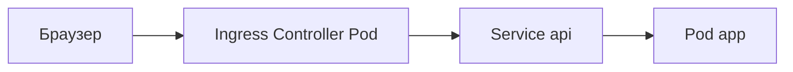

# 10. Ingress: теория и связь с nginx edge

## Введение: тот же reverse proxy, другой способ конфигурации

Всё, что вы настроили в `deploy/nginx` — **listen 80**, `server_name`, `location /api/`, `proxy_pass`, TLS на :443 — в Kubernetes делает **Ingress Controller**. Чаще всего это **ingress-nginx**: внутри Pod'а тот же nginx, конфиг генерируется из ресурсов **Ingress**, а не из файлов в `conf.d/`.

Эта глава — **теория-мост** без обязательного кластера. Практика Ingress — [kuber-basic/20-ingress](../kuber-basic/20-ingress.md) и [лаба 21](../kuber-basic/21-lab-ingress.md).

## Что вы узнаете

- Разницу **Ingress** (объект) и **Ingress Controller** (процесс).
- Соответствие nginx-директив и полей Ingress.
- Зачем **ingressClassName** и аннотации rewrite.
- Как стенд `deploy/nginx` готовит к курсу Kubernetes.

## Проблема без Ingress

Каждый **Service** типа **LoadBalancer** или **NodePort** — отдельный внешний порт или LB. Десять микросервисов — десять балансировщиков, дорого и неудобно для TLS по hostname.

**Ingress** — декларация правил: «хост `app.local`, путь `/api` → Service `api:8080`». **Controller** читает все Ingress в кластере и пишет `nginx.conf` (или эквивалент).



## Таблица соответствий

| deploy/nginx (edge) | Kubernetes |
|---------------------|------------|
| `server_name localhost` | `rules[].host` |
| `location /api/` | `paths[].path` + `pathType: Prefix` |
| `proxy_pass http://api:8080/` | `backend.service.name` + `port` |
| `upstream api_backends` | Service с несколькими Endpoints |
| `ssl_certificate` в server :443 | `spec.tls` + Secret |
| `X-Forwarded-*` | выставляет controller автоматически |

Пример Ingress из kuber-basic:

```yaml
spec:
  ingressClassName: nginx
  rules:
    - host: app.local
      http:
        paths:
          - path: /
            pathType: Prefix
            backend:
              service:
                name: web
                port:
                  number: 80
```

**ingressClassName: nginx** — «обрабатывай только контроллером класса nginx» (как выбрать правильный edge).

## Rewrite и слэш — снова

Аннотация (ingress-nginx):

```yaml
nginx.ingress.kubernetes.io/rewrite-target: /$2
```

Это тот же смысл, что **`proxy_pass` со слэшем**: внешний `/api/v1/users` → внутренний `/users`. Ошибки **404** в кластере часто из-за неверного rewrite — как в [лабе 05](05-lab-proxy-pass.md).

## TLS

На стенде: `gen-certs.sh` → `10-tls.conf` → :8443.

В кластере: **cert-manager** + `tls.secretName` в Ingress, или облачный managed certificate. Браузер доверяет CA, не self-signed.

Теория TLS: [linux-intermediate/09](../linux-intermediate/09-tls-openssl.md).

## Controller vs CNI vs Service

| Компонент | Уровень |
|-----------|---------|
| **CNI** (Calico, Flannel) | сеть Pod↔Pod |
| **Service** (ClusterIP) | стабильный VIP на набор Pod |
| **Ingress** | HTTP-маршрутизация по host/path |
| **Ingress Controller** | реализация (nginx, Traefik) |

Ваш **mock-nginx-edge** ≈ один Pod Ingress Controller. **mock-nginx-api** ≈ Pod'ы за Service `api`.

## Несколько Ingress и один Controller

Как `include conf.d/*.conf` на edge, controller **мержит** правила из всех Ingress-объектов. Конфликт host/path — ошибка или непредсказуемый приоритет; в Git review важны host и path.

## Отличие от Service Mesh

**Ingress** — вход **в кластер** (north-south). **Mesh** (Istio, Linkerd) — ещё и east-west между сервисами. nginx-basic покрывает north-south; mesh — отдельные курсы.

## Что уже умеете после nginx-basic

- Читать **location / path** и понимать backend path.
- Диагностировать **502** по error.log upstream.
- Настраивать **X-Forwarded-Proto** за TLS.
- Использовать **upstream** как аналог Service с несколькими Pod.

## Типичные ошибки в Ingress

| Симптом | Причина |
|---------|---------|
| Ingress есть, трафика нет | не установлен / не running Controller |
| 404 | rewrite-target, pathType |
| 502 | Pod not Ready, неверный port в Service |
| TLS не работает | Secret не в namespace Ingress |

## В продакшене

- Один **ingress class** на окружение.
- GitOps: Ingress в репозитории приложения.
- WAF перед controller (Cloudflare, AWS WAF).
- Лимиты body и timeout — аннотации или ConfigMap controller.

## Резюме

**Ingress** — декларативный «nginx.conf» для кластера; **ingress-nginx** — тот же reverse proxy, что edge на :8080. Освоение `proxy_pass`, логов и upstream на Docker напрямую ускоряет [kuber-basic](../kuber-basic/README.md).

## Чек-лист

- Чем Ingress отличается от Service?
- Какой объект без Controller бесполезен?
- Что в nginx соответствует `rules[].host`?
- Где практика Ingress в репозитории?

Следующий урок: [11. Финальный проект](11-final-project.md).
