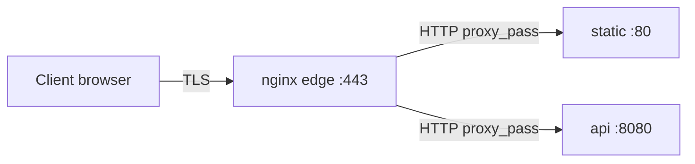

# 01. TLS termination на edge

## Введение: где заканчивается HTTPS

В продакшене редко шифруют трафик **от edge до каждого Pod**. Чаще схема такая:

```text
[клиент] --TLS--> [nginx / ALB / Ingress] --HTTP или TLS--> [backend]
```

**TLS termination** — nginx (или Ingress Controller) принимает HTTPS на :443, расшифровывает запрос и дальше может:

- проксировать на backend по **обычному HTTP** во внутренней сети (Docker network, VPC);
- или снова включить TLS до backend (**re-encrypt**) — отдельная тема для zero-trust.

На стенде [`deploy/nginx`](../../deploy/nginx/README.md) контейнер **edge** играет роль периметра; сертификаты лежат в `certs/`, конфиг — `config/conf.d/10-tls.conf`.

Теория PKI, ключ vs сертификат, SAN — в [`linux-intermediate/09-tls-openssl`](../linux-intermediate/09-tls-openssl.md). Здесь — **как это подключается к nginx**.

## Что вы узнаете

- Зачем edge терминирует TLS, а не каждый backend.
- Директивы `ssl_certificate`, `ssl_certificate_key`, `ssl_protocols`.
- Как `gen-certs.sh` готовит self-signed для `localhost` и `lab.local`.
- Заголовок `X-Forwarded-Proto` для backend, который строит redirect на `https://`.
- Связь с [Ingress](../kuber-basic/20-ingress.md): тот же паттерн на уровне кластера.

---

## Роли в архитектуре



| Узел | Порт снаружи | TLS |
|------|----------------|-----|
| edge | 8080 HTTP, 8443 HTTPS (маппинг хоста) | да, на 443 внутри контейнера |
| static, api | только internal network | нет |

Преимущества termination на edge:

- Один cert на имя сайта, а не N сертификатов на N сервисов.
- Централизованные cipher suites, HSTS, WAF (в облаке — на LB).
- Backend остаётся простым (Python API без OpenSSL).

Риск: трафик **между** edge и backend в открытой сети должен быть изолирован (VPC, NetworkPolicy). В Docker Compose сеть `internal` — учебная изоляция.

---

## Сертификаты на стенде

Скрипт [`deploy/nginx/scripts/gen-certs.sh`](../../deploy/nginx/scripts/gen-certs.sh):

```bash
cd deploy/nginx
bash scripts/gen-certs.sh
```

Создаёт `certs/server.crt` и `certs/server.key` с **SAN**: `DNS:localhost`, `DNS:lab.local`, `IP:127.0.0.1`. Без SAN современные клиенты ругаются на hostname mismatch даже при `-k` в некоторых сценариях.

Проверка пары key/cert:

```bash
openssl x509 -in deploy/nginx/certs/server.crt -noout -subject -dates
openssl rsa -in deploy/nginx/certs/server.key -check -noout
```

В контейнере edge том монтируется как `/etc/nginx/certs/`.

---

## Блок server для HTTPS

Эталон — [examples/ssl-server-block.conf](examples/ssl-server-block.conf) и `deploy/nginx/config/conf.d/10-tls.conf`:

```nginx
server {
    listen 443 ssl;
    server_name localhost lab.local;

    ssl_certificate     /etc/nginx/certs/server.crt;
    ssl_certificate_key /etc/nginx/certs/server.key;
    ssl_protocols       TLSv1.2 TLSv1.3;

    location /api/ {
        proxy_pass http://api:8080/;
        proxy_set_header Host $host;
        proxy_set_header X-Forwarded-Proto https;
    }
}
```

| Директива | Назначение |
|-----------|------------|
| `listen 443 ssl` | включить TLS на порту 443 |
| `ssl_certificate` | публичный cert (PEM) |
| `ssl_certificate_key` | приватный ключ (секрет) |
| `ssl_protocols` | разрешённые версии TLS |

После правки **всегда**:

```bash
docker compose exec edge nginx -t
docker compose exec edge nginx -s reload
```

`reload` — graceful: master перечитывает конфиг, workers дорабатывают старые соединения.

---

## HTTP → HTTPS (концепт)

На проде часто делают редирект с :80:

```nginx
server {
    listen 80;
    server_name app.example.com;
    return 301 https://$host$request_uri;
}
```

На стенде HTTP :8080 оставлен для лаб без TLS. В финальном проекте можно добавить редирект в отдельный `server`.

---

## X-Forwarded-Proto

Backend не видит, что клиент пришёл по HTTPS, если не передать контекст:

```nginx
proxy_set_header X-Forwarded-Proto $scheme;   # http на :80
proxy_set_header X-Forwarded-Proto https;     # явно на TLS server
```

Приложения используют это для построения абсолютных URL в JSON, cookies `Secure`, redirect. В Kubernetes Ingress Controller выставляет те же заголовки автоматически.

---

## Проверка с клиента

```bash
curl -sk https://localhost:8443/
curl -vk https://localhost:8443/api/health 2>&1 | grep -E "SSL|subject:|issuer:"
echo | openssl s_client -connect localhost:8443 -servername localhost 2>/dev/null \
  | openssl x509 -noout -subject -dates
```

| Флаг | Когда |
|------|--------|
| `-k` / `--insecure` | self-signed в лабе |
| `-v` | отладка handshake и cert |
| SNI `-servername` | обязателен при нескольких cert на одном IP |

---

## Let's Encrypt vs lab

В проде: **cert-manager** + Ingress, или **certbot** на VM. Нужны публичный DNS и доступ с интернета (HTTP-01) или API DNS (DNS-01).

На `localhost` LE не выдаст cert — используйте `gen-certs.sh`, **mkcert** или корпоративный CA.

---

## Связь с Kubernetes Ingress

[Ingress](../kuber-basic/20-ingress.md) описывает правила; **ingress-nginx** — тот же nginx с:

- TLS в `spec.tls` (Secret с cert/key);
- аннотациями для rewrite, rate limit, cors.

Навык «прочитать `server {}` на edge» переносится на чтение **ConfigMap** контроллера и аннотаций Ingress.

---

## Типичные ошибки

| Симптом | Причина |
|---------|---------|
| `nginx: [emerg] cannot load certificate` | нет файлов в `certs/` — запустите `gen-certs.sh` |
| `SSL_CTX_use_PrivateKey_file() failed` | key не соответствует cert |
| Браузер: NET::ERR_CERT_AUTHORITY_INVALID | self-signed — ожидаемо |
| hostname mismatch | URL не в SAN cert |
| 502 только на HTTPS | опечатка в `proxy_pass`, backend недоступен |
| Backend редиректит на `http://` | не передан `X-Forwarded-Proto` |

---

## Резюме

TLS termination на nginx — стандартный паттерн периметра: один cert, расшифровка на edge, HTTP (или re-encrypt) к сервисам. На стенде cert генерирует `gen-certs.sh`, конфиг — `10-tls.conf`, проверка — `curl -vk` и `openssl s_client`.

## Чек-лист

- [ ] Где в вашей схеме заканчивается TLS?
- [ ] Зачем SAN в self-signed для localhost?
- [ ] Чем `reload` отличается от `restart`?
- [ ] Как Ingress повторяет роль edge nginx?

Следующий урок: [02. Лаба: HTTPS](02-lab-https.md).
