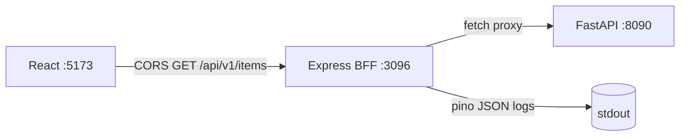

# 39. Capstone: Shop BFF (6–8 часов)

## Введение: зачем capstone

Уроки 00–38 дали **фрагменты**: event loop, streams, Express middleware, pino, прокси к FastAPI. Capstone собирает их в **один deployable сервис** — BFF «Shop Proxy», через который React (`:5173`) ходит в shop API на [`deploy/fastapi`](../../deploy/fastapi/README.md) `:8090`.

Аналог в backend-треке — [fastapi/42-capstone](../fastapi/42-capstone.md); в JS-ветке — [javascript-basic/39-capstone](../javascript-basic/39-capstone.md) (CLI tasks). Здесь — **HTTP BFF**, как в prod mock-exams stack.

**Оценка времени:** 6–8 часов чистой работы (3–4 сессии по 2 часа).

---

## Задача

Реализовать **Express BFF** на порту **3096**, который:

1. Проксирует shop endpoints на FastAPI **8090**.
2. Отдаёт **health** / **readiness** для оркестратора.
3. Логирует запросы через **pino** (JSON, request id).
4. Читает конфиг из **env** (dotenv локально).
5. Разрешает **CORS** для Vite React dev server **5173**.

Стартовый скелет: [`examples/`](examples/package.json). FastAPI: `cd deploy/fastapi && docker compose up -d --build`.

---

## Функциональные требования

### Прокси API

| BFF endpoint | Upstream | Метод |
|--------------|----------|-------|
| `/api/v1/items` | `{FASTAPI_URL}/api/v1/items` | GET |
| `/api/v1/items/{id}` | `{FASTAPI_URL}/api/v1/items/{id}` | GET |

- Проброс **HTTP status** upstream (200, 404, 5xx).
- Проброс **Content-Type** JSON.
- При upstream недоступен — **503** с `{ "error": "upstream_unavailable" }`.
- Таймаут upstream: **10 s** (`AbortSignal.timeout`).

**Расширение B (опционально):** `POST /api/v1/items` с телом JSON — если добавите route в FastAPI стенд.

### Health

| Endpoint | Поведение |
|----------|-----------|
| `GET /health` | 200 `{ "status": "ok", "service": "shop-bff" }` — всегда, если процесс жив |
| `GET /health/ready` | 200 если `GET {FASTAPI_URL}/health` OK за 3 s; иначе 503 |

### CORS

- `origin`: `http://localhost:5173`, `http://127.0.0.1:5173`
- `credentials: true` (на будущее cookie auth в react-intermediate)
- Не использовать `origin: *` с credentials

### Логирование

- **pino-http** на все запросы: method, url, status, duration, `req.id`
- Принимать входящий **`X-Request-Id`** или генерировать UUID
- Ошибки 5xx — `level: error` с полем `err` (stack в log, не в response)

### Конфигурация

| Переменная | Default | Описание |
|------------|---------|----------|
| `PORT` | 3096 | порт BFF |
| `FASTAPI_URL` | — | **обязательна**, без trailing slash |
| `LOG_LEVEL` | info | pino level |
| `NODE_ENV` | development | в production — без stack в JSON |

Шаблон: [`.env.example`](examples/.env.example).

---

## Нефункциональные требования

| Требование | Зачем |
|------------|-------|
| ES modules, `"type": "module"` | урок 09 |
| Разбиение: `index`, `app`, `config`, `routes`, `services` | урок 35 |
| Централизованный error handler | уроки 24, 36 |
| `helmet()` | урок 36 |
| Базовый rate limit на `/api/` (100 req/min per IP) | урок 36, `express-rate-limit` |
| README в `examples/` с curl-примерами | для проверяющего |
| Не коммитить `.env` | урок 28 |

---

## Целевая структура

```text
examples/
├── .env.example
├── package.json
├── README.md
├── lab/                          # уже есть стартовые файлы
└── src/
    ├── index.js                  # listen
    ├── app.js                    # createApp(), middleware chain
    ├── config.js                 # env validation
    ├── routes/
    │   ├── health.js
    │   └── proxy.js              # /api/v1/*
    ├── services/
    │   └── fastapiClient.js      # fetch wrapper, timeout, headers
    └── middleware/
        └── errorHandler.js
```



---

## Пошаговый план

### Фаза 1 — Скелет и health (~1.5 ч)

1. `npm install` в `examples/`; скопируйте `.env.example` → `.env`.
2. Поднимите FastAPI `:8090`; проверьте `curl http://localhost:8090/health`.
3. Доработайте [`src/app.js`](examples/src/app.js): вынесите health в `routes/health.js`.
4. Реализуйте `/health/ready` с ping upstream.
5. **Критерий:** `curl http://localhost:3096/health/ready` → 200 при живом FastAPI.

**Уроки:** [28-env-config.md](28-env-config.md), [21-express-routing.md](21-express-routing.md).

### Фаза 2 — FastAPI client и прокси (~2 ч)

1. `services/fastapiClient.js`: `get(path, { requestId })`, base URL из config, timeout 10 s.
2. `routes/proxy.js`: mount `GET /api/v1/items`, `GET /api/v1/items/:id`.
3. Проброс status/body; при `fetch` failure — 503.
4. **Критерий:**

```bash
curl -s http://localhost:3096/api/v1/items | jq .
# тот же items[], что curl :8090
```

**Уроки:** [20-fastapi-client.md](20-fastapi-client.md), [33-proxy-aggregation.md](33-proxy-aggregation.md), [34-lab-bff.md](34-lab-bff.md).

### Фаза 3 — Логи, CORS, ошибки (~1.5 ч)

1. Убедитесь, что pino-http первый middleware после helmet.
2. Проброс `X-Request-Id` в upstream fetch.
3. Error handler: prod без stack; dev optional detail.
4. Проверка CORS из browser или:

```bash
curl -H "Origin: http://localhost:5173" -I http://localhost:3096/api/v1/items
```

5. **Критерий:** в логах одна JSON-строка на запрос с `req.id`.

**Уроки:** [30-logging-pino.md](30-logging-pino.md), [25-express-body-cors.md](25-express-body-cors.md), [24-express-errors.md](24-express-errors.md).

### Фаза 4 — Security hardening (~1 ч)

1. `npm install helmet express-rate-limit`.
2. `app.use(helmet())` — проверка `curl -I`.
3. Rate limit 100/min на `/api/`.
4. `express.json({ limit: "100kb" })` для будущих POST.
5. **Критерий:** 101-й быстрый запрос → 429.

**Уроки:** [36-security-basics.md](36-security-basics.md).

### Фаза 5 — Документация и smoke (~1 ч)

1. `examples/README.md`: установка, env, curl, таблица endpoints.
2. Smoke script (bash или PowerShell):

```bash
curl -sf http://localhost:3096/health
curl -sf http://localhost:3096/health/ready
curl -sf http://localhost:3096/api/v1/items | grep -q items
```

3. Остановите FastAPI — `/health/ready` должен быть 503, `/health` — 200.

**Уроки:** [35-project-structure.md](35-project-structure.md).

### Фаза 6 — Интеграция с React (опционально, +1–2 ч)

1. В [`react-basic`](../react-basic/README.md) настройте proxy или `VITE_API_URL=http://localhost:3096`.
2. TanStack Query `useQuery` на `/api/v1/items`.
3. **Критерий:** список товаров в UI без CORS error в Console.

---

## Подсказки по реализации

### fastapiClient.js

```javascript
export async function fastapiGet(path, { requestId, signal } = {}) {
  const url = `${config.fastapiUrl}${path}`;
  const headers = { Accept: "application/json" };
  if (requestId) headers["X-Request-Id"] = requestId;

  const res = await fetch(url, {
    headers,
    signal: signal ?? AbortSignal.timeout(10_000),
  });

  const body = await res.text();
  return { status: res.status, body, contentType: res.headers.get("content-type") };
}
```

### Прокси handler

```javascript
router.get("/items", async (req, res, next) => {
  try {
    const { status, body, contentType } = await fastapiGet("/api/v1/items", {
      requestId: req.id,
    });
    res.status(status).type(contentType ?? "json").send(body);
  } catch (err) {
    if (err.name === "TimeoutError" || err.cause?.code === "ECONNREFUSED") {
      return res.status(503).json({ error: "upstream_unavailable" });
    }
    next(err);
  }
});
```

### Readiness

```javascript
router.get("/health/ready", async (_req, res) => {
  try {
    const r = await fetch(`${config.fastapiUrl}/health`, {
      signal: AbortSignal.timeout(3000),
    });
    if (!r.ok) return res.status(503).json({ status: "not_ready", upstream: r.status });
    return res.json({ status: "ready" });
  } catch {
    return res.status(503).json({ status: "not_ready", upstream: "unreachable" });
  }
});
```

---

## Расширения (опционально)

| Уровень | Задача | Часы |
|---------|--------|------|
| B | Агрегация: BFF endpoint `/api/v1/shop/summary` = items + health meta | +1 |
| C | Dockerfile multi-stage, non-root | +1.5 |
| D | `deploy/nodejs` compose рядом с fastapi | +1 |
| E | Vitest + supertest на `/health` и mock upstream | +1.5 |

---

## Критерии приёмки (самопроверка)

- [ ] `npm run dev` поднимает BFF на `:3096` с `.env`
- [ ] `GET /api/v1/items` возвращает данные FastAPI при живом `:8090`
- [ ] FastAPI down → `/health/ready` 503, `/api/v1/items` 503
- [ ] Логи — JSON, есть `req.id`; stack ошибок **не** в теле ответа
- [ ] CORS: Origin `5173` — заголовки `Access-Control-Allow-Origin` корректны
- [ ] `helmet` + rate limit на `/api/`
- [ ] Код разнесён по `routes/`, `services/`, не монолит 500+ строк
- [ ] `examples/README.md` с командами проверки

---

## Типичные ошибки

1. **`FASTAPI_URL` с slash** — двойной `//api` → 404. Нормализуйте в `config.js`.
2. **Забыли `await`** в async route — пустой ответ, 200 без body.
3. **CORS только на GET** — preflight OPTIONS не обработан (cors package решает).
4. **Парсить JSON и отдавать заново** — ломает точный upstream body; для GET допустим probрос `text` или `json` после parse/stringify осознанно.
5. **Логировать весь upstream body** — шум и PII; достаточно status + duration.
6. **Rate limit после routes** — не срабатывает; mount до роутов.

---

## Когда смотреть уроки

| Проблема | Урок |
|---------|------|
| ECONNREFUSED | 20, deploy/fastapi README |
| middleware order | 22 |
| async 500 без лога | 24 |
| CORS in browser | 25 |
| env missing | 28 |
| нет req.id | 30–31 |
| proxy timeout | 33 |
| stack in response | 36 |
| attach debugger | 37 |

---

## После capstone

1. Пройдите [interview-cheatsheet.md](interview-cheatsheet.md) финально.
2. Следующий курс: [**nodejs-intermediate**](../javascript-path.md) (Prisma, JWT) или [**react-basic**](../react-basic/README.md) (UI к вашему BFF).
3. Опционально: вынесите BFF в `deploy/nodejs` и добавьте в CI smoke из `deploy/fastapi/scripts/`.

Поздравляем — **nodejs-basic** завершён.
